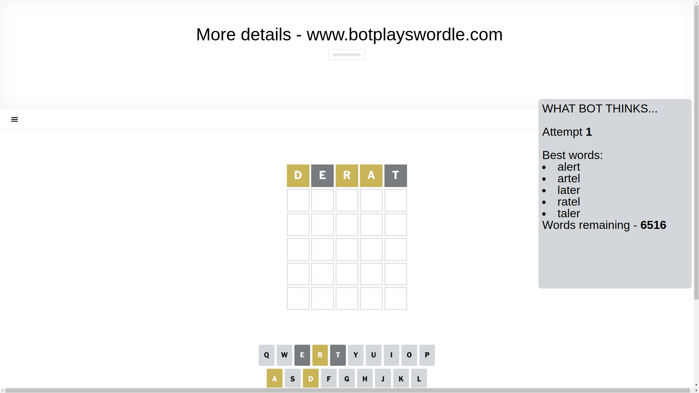
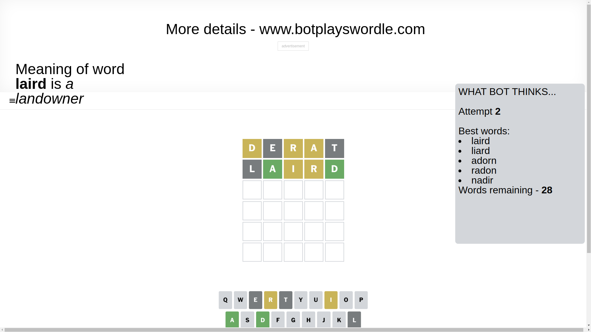
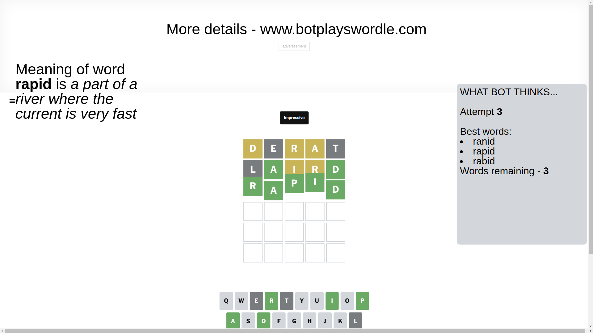

# Wordle for February 12, 2025 - \#1334

## Attempt 1

This is the first attempt and we'll choose a random word to start with.

Let's start with word `derat`

Attempt for `derat` gives us 0 correct letters, 3 present letters and 2 wrong letters.

If we look into details, we can see that:

Letter `d` is on a different spot - this means that it cannot be at position 1

Letter `e` is not present in the word and we will not use it any more

Letter `r` is on a different spot - this means that it cannot be at position 3

Letter `a` is on a different spot - this means that it cannot be at position 4

Letter `t` is not present in the word and we will not use it any more

Some letters are missing (like `e`, `t`) but it's also important piece of information

Word should contain letters `[d r a]`

That was a great guess that limited number of remaining words

## Attempt 2

Right now we have 28 words to choose from and best of them seem to be `[laird liard adorn radon nadir]`

So far we know that possible letters are:

At position 1: `[a b c f g h i j k l m n o p q r s u v w x y z]`

At position 2: `[a b c d f g h i j k l m n o p q r s u v w x y z]`

At position 3: `[a b c d f g h i j k l m n o p q s u v w x y z]`

At position 4: `[b c d f g h i j k l m n o p q r s u v w x y z]`

At position 5: `[a b c d f g h i j k l m n o p q r s u v w x y z]`

Next guess is `laird`, let's see what it gives us

Attempt for `laird` gives us 2 correct letters, 2 present letters and 1 wrong letters.

If we look into details, we can see that:

Letter `l` is not present in the word and we will not use it any more

Letter `a` should be at position 2

Letter `i` is on a different spot - this means that it cannot be at position 3

Letter `r` is on a different spot - this means that it cannot be at position 4

Letter `d` should be at position 5

We got information about the correct letters and it should make next attempt easier

Some letters are missing (like `l`) but it's also important piece of information

Word should contain letters `[d r a i]`

That was a great guess that limited number of remaining words

## Attempt 3

Right now we have 3 words to choose from and best of them seem to be `[ranid rapid rabid]`

So far we know that possible letters are:

At position 1: `[a b c f g h i j k m n o p q r s u v w x y z]`

At position 2: `[a]`

At position 3: `[a b c d f g h j k m n o p q s u v w x y z]`

At position 4: `[b c d f g h i j k m n o p q s u v w x y z]`

At position 5: `[d]`

Next guess is `rapid`, let's see what it gives us

That's the correct answer! The word is `rapid`!

## Conclusion

Today's word is `rapid` and it took 3 attempts to guess it

