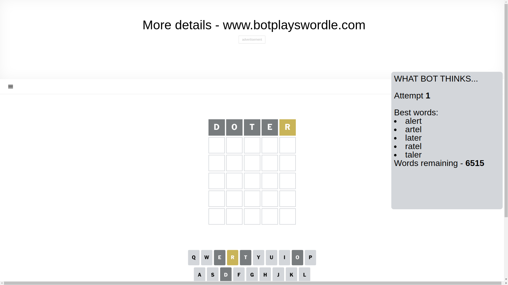
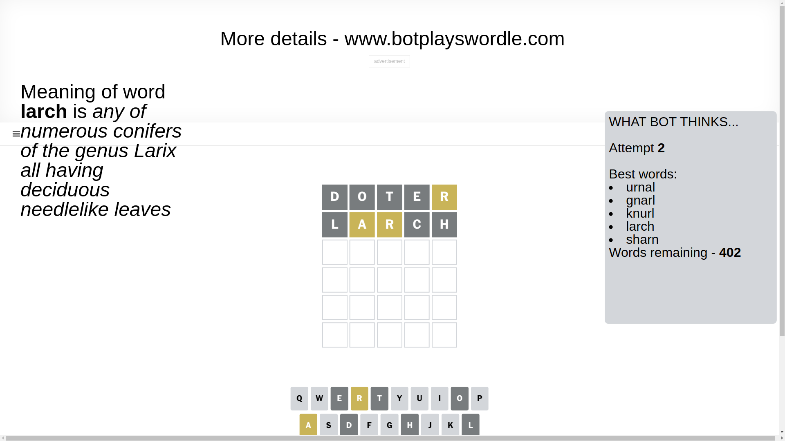
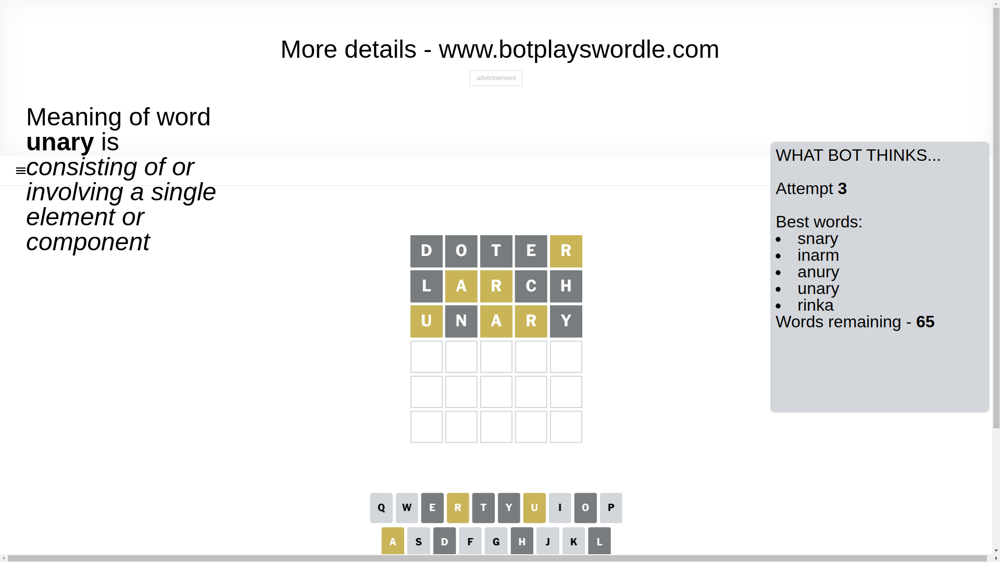
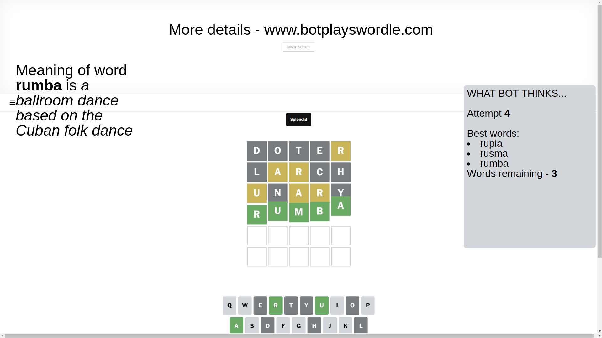

# Wordle for February 13, 2025 - \#1335

## Attempt 1

This is the first attempt and we'll choose a random word to start with.

Let's start with word `doter`

Attempt for `doter` gives us 0 correct letters, 1 present letters and 4 wrong letters.

If we look into details, we can see that:

Letter `d` is not present in the word and we will not use it any more

Letter `o` is not present in the word and we will not use it any more

Letter `t` is not present in the word and we will not use it any more

Letter `e` is not present in the word and we will not use it any more

Letter `r` is on a different spot - this means that it cannot be at position 5

Some letters are missing (like `d`, `o`, `t`, `e`) but it's also important piece of information

Word should contain letters `[r]`

That was a great guess that limited number of remaining words

## Attempt 2

Right now we have 402 words to choose from and best of them seem to be `[urnal gnarl knurl larch sharn]`

So far we know that possible letters are:

At position 1: `[a b c f g h i j k l m n p q r s u v w x y z]`

At position 2: `[a b c f g h i j k l m n p q r s u v w x y z]`

At position 3: `[a b c f g h i j k l m n p q r s u v w x y z]`

At position 4: `[a b c f g h i j k l m n p q r s u v w x y z]`

At position 5: `[a b c f g h i j k l m n p q s u v w x y z]`

Next guess is `larch`, let's see what it gives us

Attempt for `larch` gives us 0 correct letters, 2 present letters and 3 wrong letters.

If we look into details, we can see that:

Letter `l` is not present in the word and we will not use it any more

Letter `a` is on a different spot - this means that it cannot be at position 2

Letter `r` is on a different spot - this means that it cannot be at position 3

Letter `c` is not present in the word and we will not use it any more

Letter `h` is not present in the word and we will not use it any more

Some letters are missing (like `l`, `c`, `h`) but it's also important piece of information

Word should contain letters `[r a]`

Not a bad guess in general

## Attempt 3

Right now we have 65 words to choose from and best of them seem to be `[snary inarm anury unary rinka]`

So far we know that possible letters are:

At position 1: `[a b f g i j k m n p q r s u v w x y z]`

At position 2: `[b f g i j k m n p q r s u v w x y z]`

At position 3: `[a b f g i j k m n p q s u v w x y z]`

At position 4: `[a b f g i j k m n p q r s u v w x y z]`

At position 5: `[a b f g i j k m n p q s u v w x y z]`

Next guess is `unary`, let's see what it gives us

Attempt for `unary` gives us 0 correct letters, 3 present letters and 2 wrong letters.

If we look into details, we can see that:

Letter `u` is on a different spot - this means that it cannot be at position 1

Letter `n` is not present in the word and we will not use it any more

Letter `a` is on a different spot - this means that it cannot be at position 3

Letter `r` is on a different spot - this means that it cannot be at position 4

Letter `y` is not present in the word and we will not use it any more

Some letters are missing (like `n`, `y`) but it's also important piece of information

Word should contain letters `[r a u]`

That was a great guess that limited number of remaining words

## Attempt 4

Right now we have 3 words to choose from and best of them seem to be `[rupia rusma rumba]`

So far we know that possible letters are:

At position 1: `[a b f g i j k m p q r s v w x z]`

At position 2: `[b f g i j k m p q r s u v w x z]`

At position 3: `[b f g i j k m p q s u v w x z]`

At position 4: `[a b f g i j k m p q s u v w x z]`

At position 5: `[a b f g i j k m p q s u v w x z]`

Next guess is `rumba`, let's see what it gives us

That's the correct answer! The word is `rumba`!

## Conclusion

Today's word is `rumba` and it took 4 attempts to guess it

