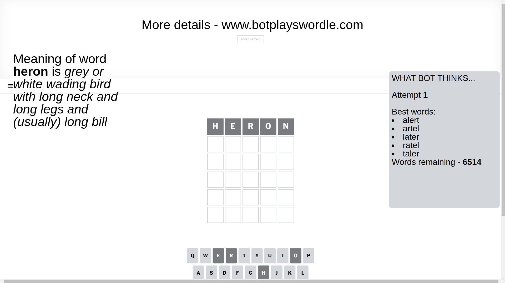
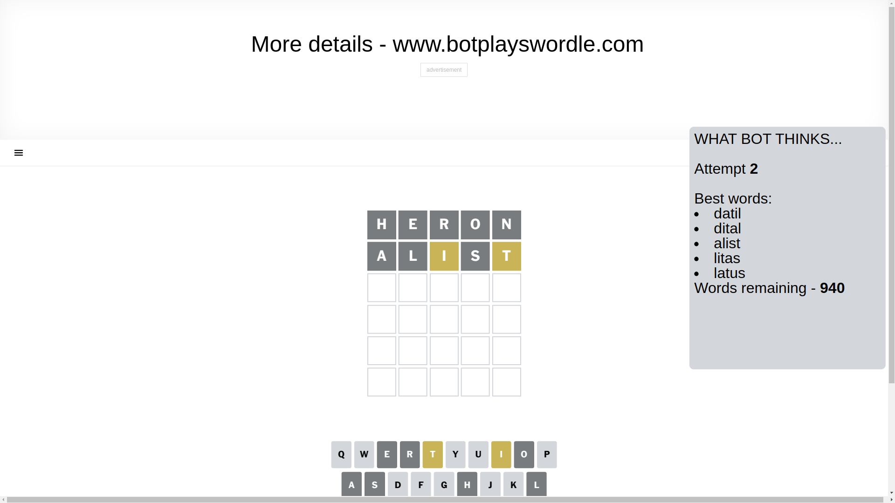
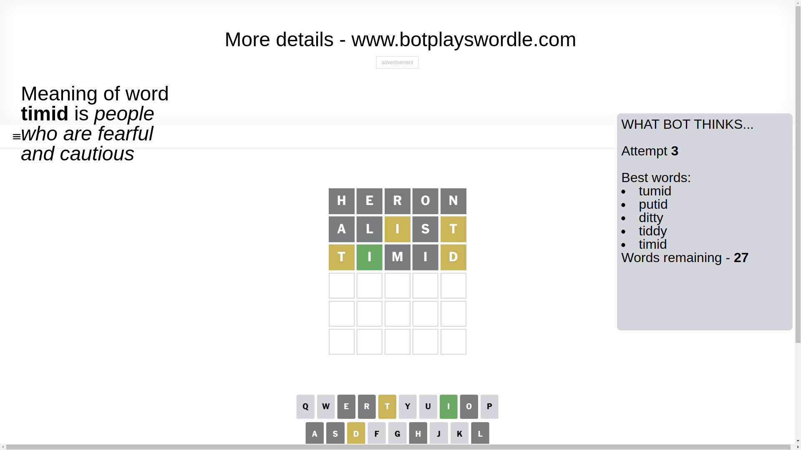
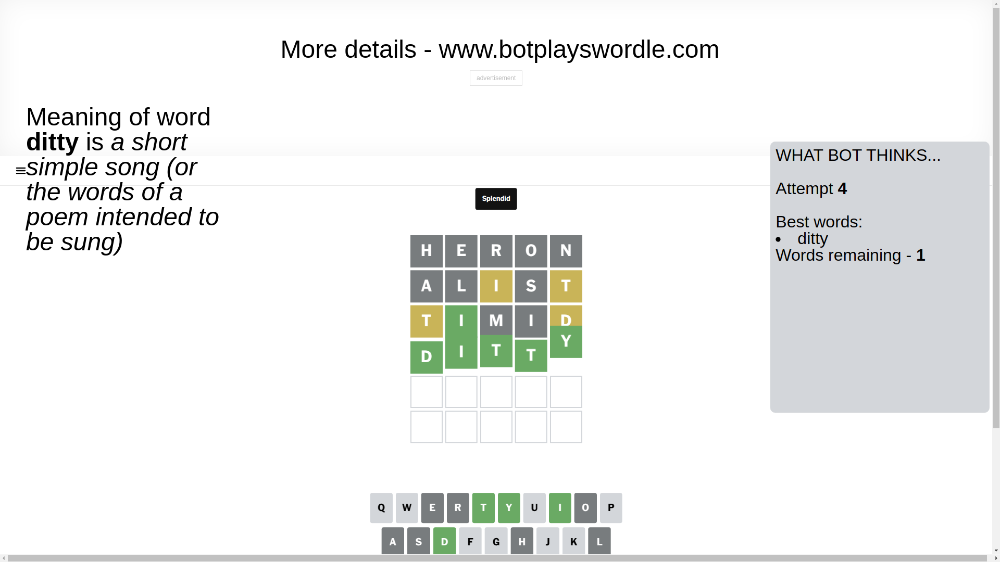

# Wordle for February 14, 2025 - \#1336

## Attempt 1

This is the first attempt and we'll choose a random word to start with.

Let's start with word `heron`

Attempt for `heron` gives us 0 correct letters, 0 present letters and 5 wrong letters.

If we look into details, we can see that:

Letter `h` is not present in the word and we will not use it any more

Letter `e` is not present in the word and we will not use it any more

Letter `r` is not present in the word and we will not use it any more

Letter `o` is not present in the word and we will not use it any more

Letter `n` is not present in the word and we will not use it any more

Some letters are missing (like `h`, `e`, `r`, `o`, `n`) but it's also important piece of information

So far we don't know any of the letters!

Not a bad guess in general

## Attempt 2

Right now we have 940 words to choose from and best of them seem to be `[datil dital alist litas latus]`

So far we know that possible letters are:

At position 1: `[a b c d f g i j k l m p q s t u v w x y z]`

At position 2: `[a b c d f g i j k l m p q s t u v w x y z]`

At position 3: `[a b c d f g i j k l m p q s t u v w x y z]`

At position 4: `[a b c d f g i j k l m p q s t u v w x y z]`

At position 5: `[a b c d f g i j k l m p q s t u v w x y z]`

Next guess is `alist`, let's see what it gives us

Attempt for `alist` gives us 0 correct letters, 2 present letters and 3 wrong letters.

If we look into details, we can see that:

Letter `a` is not present in the word and we will not use it any more

Letter `l` is not present in the word and we will not use it any more

Letter `i` is on a different spot - this means that it cannot be at position 3

Letter `s` is not present in the word and we will not use it any more

Letter `t` is on a different spot - this means that it cannot be at position 5

Some letters are missing (like `a`, `l`, `s`) but it's also important piece of information

Word should contain letters `[i t]`

That was a great guess that limited number of remaining words

## Attempt 3

Right now we have 27 words to choose from and best of them seem to be `[tumid putid ditty tiddy timid]`

So far we know that possible letters are:

At position 1: `[b c d f g i j k m p q t u v w x y z]`

At position 2: `[b c d f g i j k m p q t u v w x y z]`

At position 3: `[b c d f g j k m p q t u v w x y z]`

At position 4: `[b c d f g i j k m p q t u v w x y z]`

At position 5: `[b c d f g i j k m p q u v w x y z]`

Next guess is `timid`, let's see what it gives us

Attempt for `timid` gives us 1 correct letters, 2 present letters and 2 wrong letters.

If we look into details, we can see that:

Letter `t` is on a different spot - this means that it cannot be at position 1

Letter `i` should be at position 2

Letter `m` is not present in the word and we will not use it any more

Letter `i` is not present in the word and we will not use it any more

Letter `d` is on a different spot - this means that it cannot be at position 5

We got information about the correct letters and it should make next attempt easier

Some letters are missing (like `m`, `i`) but it's also important piece of information

Word should contain letters `[i t d]`

That was a great guess that limited number of remaining words

## Attempt 4

Right now we have 1 words to choose from and best of them seem to be `[ditty]`

So far we know that possible letters are:

At position 1: `[b c d f g j k p q u v w x y z]`

At position 2: `[i]`

At position 3: `[b c d f g j k p q t u v w x y z]`

At position 4: `[b c d f g j k p q t u v w x y z]`

At position 5: `[b c f g j k p q u v w x y z]`

It must be `ditty`

That's the correct answer! The word is `ditty`!

## Conclusion

Today's word is `ditty` and it took 4 attempts to guess it

