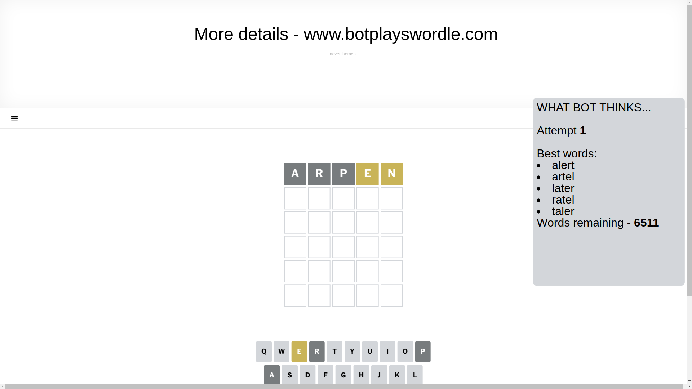
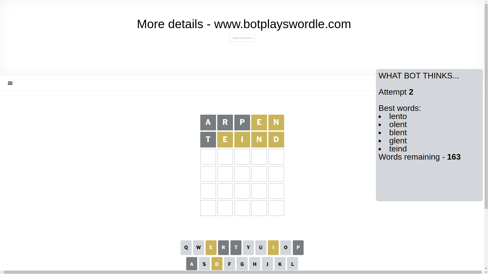
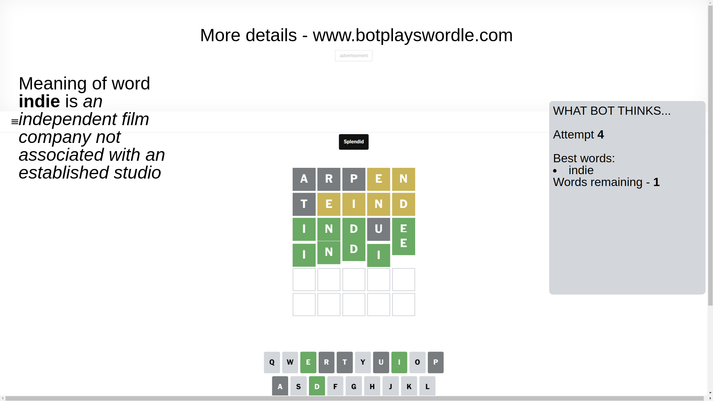

# Wordle for February 18, 2025 - \#1340

## Attempt 1

This is the first attempt and we'll choose a random word to start with.

Let's start with word `arpen`

Attempt for `arpen` gives us 0 correct letters, 2 present letters and 3 wrong letters.

If we look into details, we can see that:

Letter `a` is not present in the word and we will not use it any more

Letter `r` is not present in the word and we will not use it any more

Letter `p` is not present in the word and we will not use it any more

Letter `e` is on a different spot - this means that it cannot be at position 4

Letter `n` is on a different spot - this means that it cannot be at position 5

Some letters are missing (like `a`, `r`, `p`) but it's also important piece of information

Word should contain letters `[e n]`

That was a great guess that limited number of remaining words

## Attempt 2

Right now we have 163 words to choose from and best of them seem to be `[lento olent blent glent teind]`

So far we know that possible letters are:

At position 1: `[b c d e f g h i j k l m n o q s t u v w x y z]`

At position 2: `[b c d e f g h i j k l m n o q s t u v w x y z]`

At position 3: `[b c d e f g h i j k l m n o q s t u v w x y z]`

At position 4: `[b c d f g h i j k l m n o q s t u v w x y z]`

At position 5: `[b c d e f g h i j k l m o q s t u v w x y z]`

Next guess is `teind`, let's see what it gives us

Attempt for `teind` gives us 0 correct letters, 4 present letters and 1 wrong letters.

If we look into details, we can see that:

Letter `t` is not present in the word and we will not use it any more

Letter `e` is on a different spot - this means that it cannot be at position 2

Letter `i` is on a different spot - this means that it cannot be at position 3

Letter `n` is on a different spot - this means that it cannot be at position 4

Letter `d` is on a different spot - this means that it cannot be at position 5

Some letters are missing (like `t`) but it's also important piece of information

Word should contain letters `[e n i d]`

That was a great guess that limited number of remaining words

## Attempt 3

Right now we have 4 words to choose from and best of them seem to be `[indue dinge nidge indie]`

So far we know that possible letters are:

At position 1: `[b c d e f g h i j k l m n o q s u v w x y z]`

At position 2: `[b c d f g h i j k l m n o q s u v w x y z]`

At position 3: `[b c d e f g h j k l m n o q s u v w x y z]`

At position 4: `[b c d f g h i j k l m o q s u v w x y z]`

At position 5: `[b c e f g h i j k l m o q s u v w x y z]`

Next guess is `indue`, let's see what it gives us

Attempt for `indue` gives us 4 correct letters, 0 present letters and 1 wrong letters.

If we look into details, we can see that:

Letter `i` should be at position 1

Letter `n` should be at position 2

Letter `d` should be at position 3

Letter `u` is not present in the word and we will not use it any more

Letter `e` should be at position 5

We got information about the correct letters and it should make next attempt easier

Some letters are missing (like `u`) but it's also important piece of information

Word should contain letters `[e n i d]`

Could be a better guess

## Attempt 4

Right now we have 1 words to choose from and best of them seem to be `[indie]`

So far we know that possible letters are:

At position 1: `[i]`

At position 2: `[n]`

At position 3: `[d]`

At position 4: `[b c d f g h i j k l m o q s v w x y z]`

At position 5: `[e]`

It must be `indie`

That's the correct answer! The word is `indie`!

## Conclusion

Today's word is `indie` and it took 4 attempts to guess it

