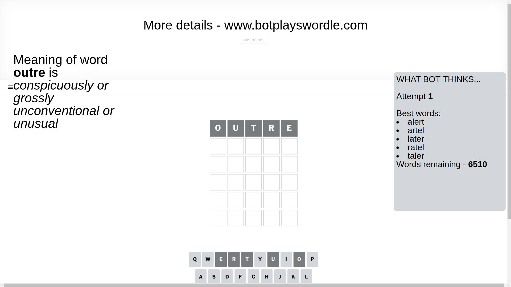
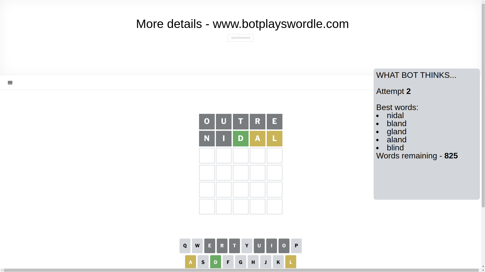
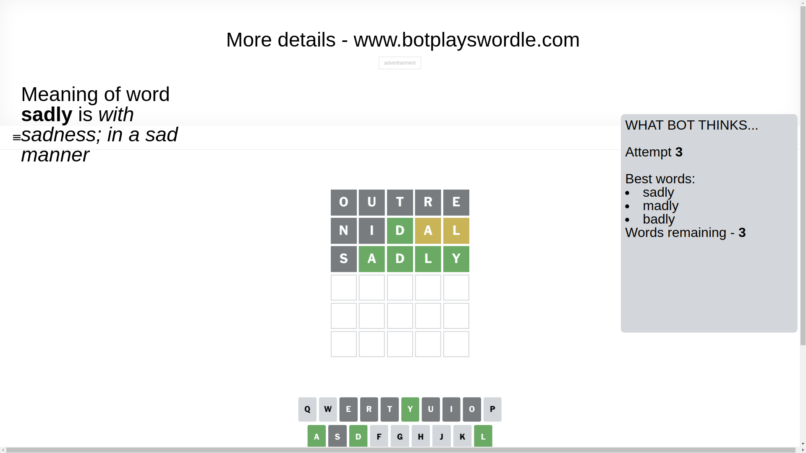
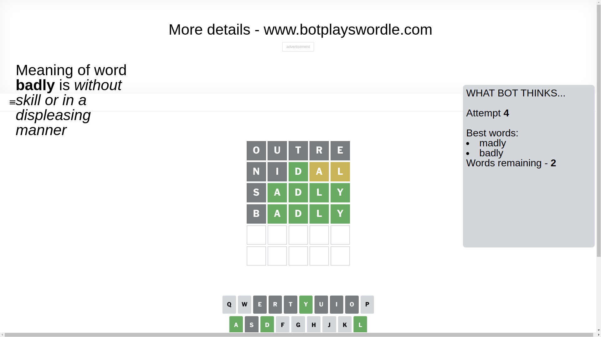
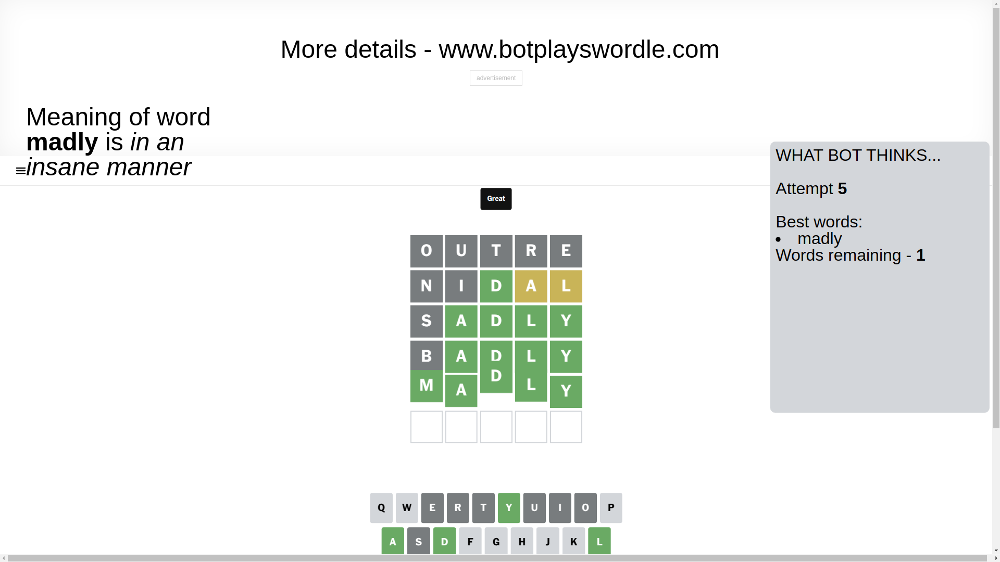

# Wordle for February 19, 2025 - \#1341

## Attempt 1

This is the first attempt and we'll choose a random word to start with.

Let's start with word `outre`

Attempt for `outre` gives us 0 correct letters, 0 present letters and 5 wrong letters.

If we look into details, we can see that:

Letter `o` is not present in the word and we will not use it any more

Letter `u` is not present in the word and we will not use it any more

Letter `t` is not present in the word and we will not use it any more

Letter `r` is not present in the word and we will not use it any more

Letter `e` is not present in the word and we will not use it any more

Some letters are missing (like `o`, `u`, `t`, `r`, `e`) but it's also important piece of information

So far we don't know any of the letters!

Not a bad guess in general

## Attempt 2

Right now we have 825 words to choose from and best of them seem to be `[nidal bland gland aland blind]`

So far we know that possible letters are:

At position 1: `[a b c d f g h i j k l m n p q s v w x y z]`

At position 2: `[a b c d f g h i j k l m n p q s v w x y z]`

At position 3: `[a b c d f g h i j k l m n p q s v w x y z]`

At position 4: `[a b c d f g h i j k l m n p q s v w x y z]`

At position 5: `[a b c d f g h i j k l m n p q s v w x y z]`

Next guess is `nidal`, let's see what it gives us

Attempt for `nidal` gives us 1 correct letters, 2 present letters and 2 wrong letters.

If we look into details, we can see that:

Letter `n` is not present in the word and we will not use it any more

Letter `i` is not present in the word and we will not use it any more

Letter `d` should be at position 3

Letter `a` is on a different spot - this means that it cannot be at position 4

Letter `l` is on a different spot - this means that it cannot be at position 5

We got information about the correct letters and it should make next attempt easier

Some letters are missing (like `n`, `i`) but it's also important piece of information

Word should contain letters `[d a l]`

That was a great guess that limited number of remaining words

## Attempt 3

Right now we have 3 words to choose from and best of them seem to be `[sadly madly badly]`

So far we know that possible letters are:

At position 1: `[a b c d f g h j k l m p q s v w x y z]`

At position 2: `[a b c d f g h j k l m p q s v w x y z]`

At position 3: `[d]`

At position 4: `[b c d f g h j k l m p q s v w x y z]`

At position 5: `[a b c d f g h j k m p q s v w x y z]`

Next guess is `sadly`, let's see what it gives us

Attempt for `sadly` gives us 4 correct letters, 0 present letters and 1 wrong letters.

If we look into details, we can see that:

Letter `s` is not present in the word and we will not use it any more

Letter `a` should be at position 2

Letter `l` should be at position 4

Letter `y` should be at position 5

We got information about the correct letters and it should make next attempt easier

Some letters are missing (like `s`) but it's also important piece of information

Word should contain letters `[d a l y]`

This was a waste, almost no valuable information...

## Attempt 4

Right now we have 2 words to choose from and best of them seem to be `[madly badly]`

So far we know that possible letters are:

At position 1: `[a b c d f g h j k l m p q v w x y z]`

At position 2: `[a]`

At position 3: `[d]`

At position 4: `[l]`

At position 5: `[y]`

Next guess is `badly`, let's see what it gives us

Attempt for `badly` gives us 4 correct letters, 0 present letters and 1 wrong letters.

If we look into details, we can see that:

Letter `b` is not present in the word and we will not use it any more

Some letters are missing (like `b`) but it's also important piece of information

Word should contain letters `[d a l y]`

This was a waste, almost no valuable information...

## Attempt 5

Right now we have 1 words to choose from and best of them seem to be `[madly]`

So far we know that possible letters are:

At position 1: `[a c d f g h j k l m p q v w x y z]`

At position 2: `[a]`

At position 3: `[d]`

At position 4: `[l]`

At position 5: `[y]`

It must be `madly`

That's the correct answer! The word is `madly`!

## Conclusion

Today's word is `madly` and it took 5 attempts to guess it

