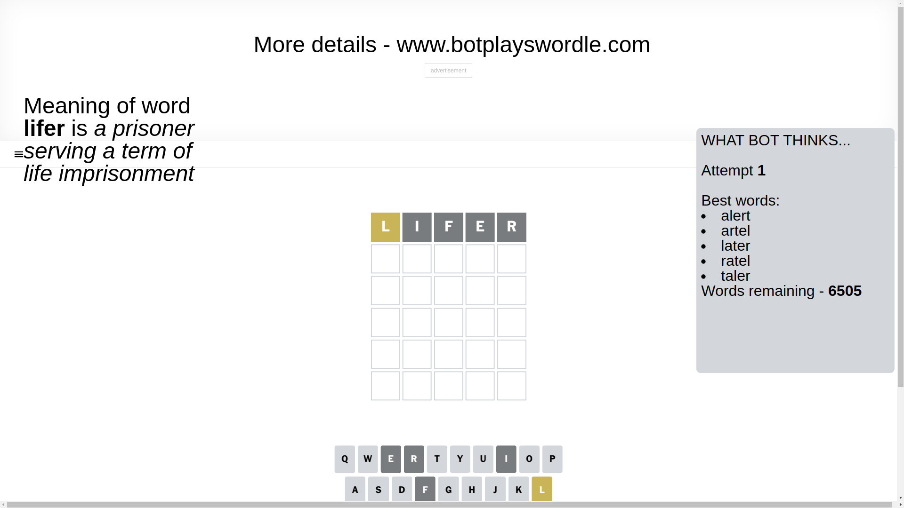
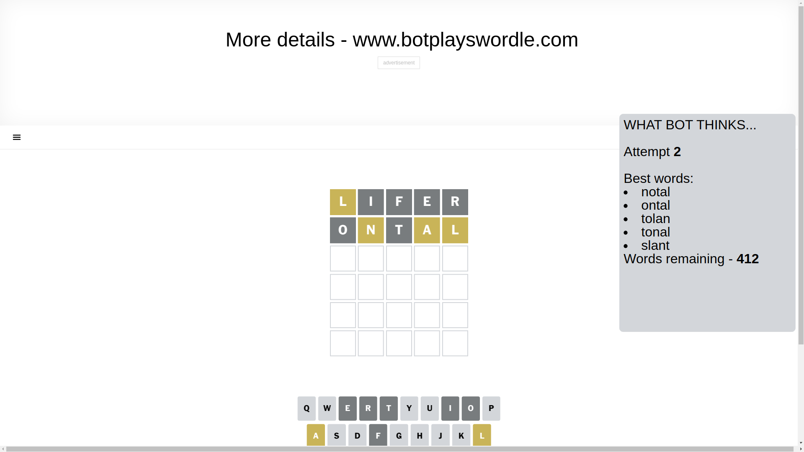
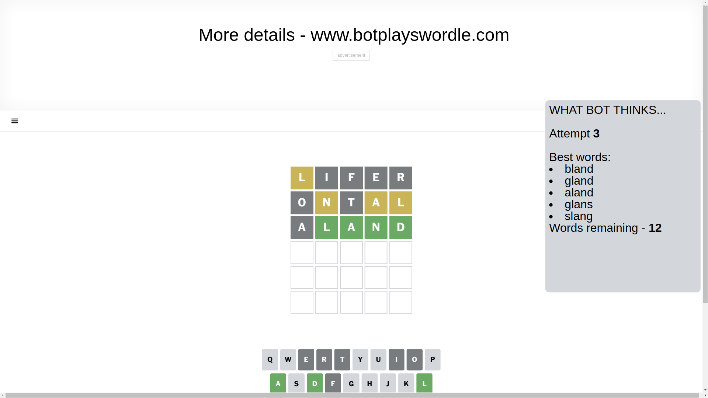
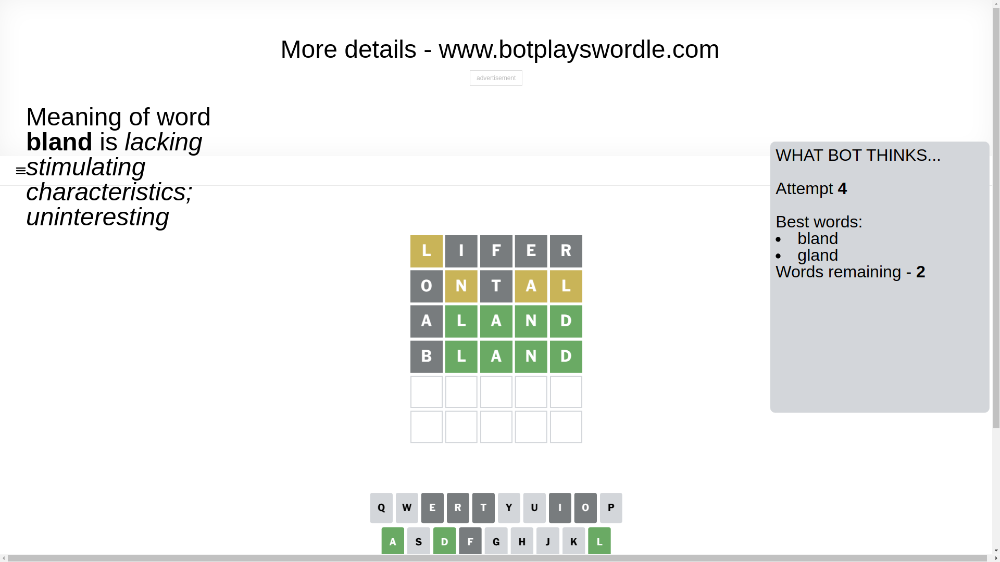
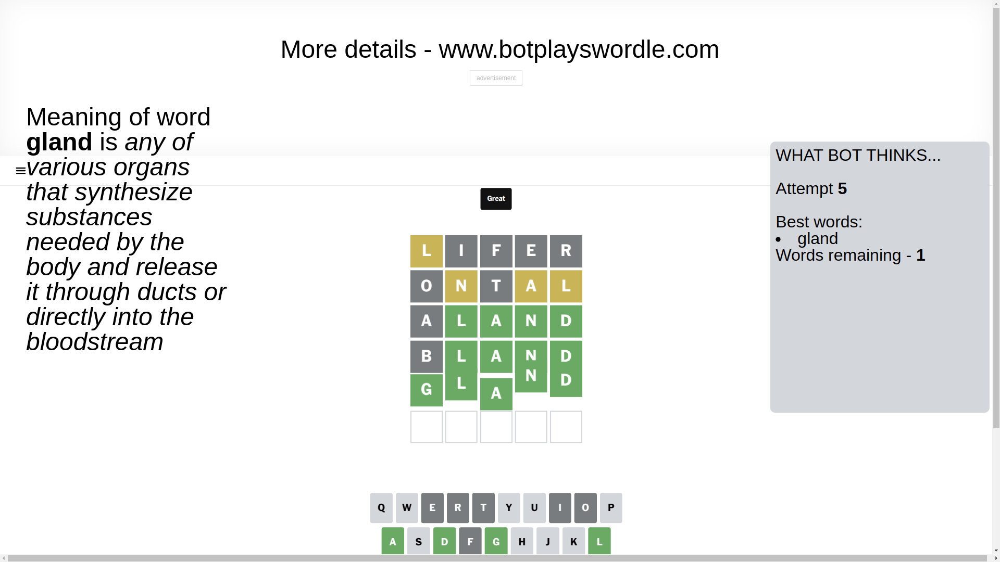

# Wordle for February 24, 2025 - \#1346

## Attempt 1

This is the first attempt and we'll choose a random word to start with.

Let's start with word `lifer`

Attempt for `lifer` gives us 0 correct letters, 1 present letters and 4 wrong letters.

If we look into details, we can see that:

Letter `l` is on a different spot - this means that it cannot be at position 1

Letter `i` is not present in the word and we will not use it any more

Letter `f` is not present in the word and we will not use it any more

Letter `e` is not present in the word and we will not use it any more

Letter `r` is not present in the word and we will not use it any more

Some letters are missing (like `i`, `f`, `e`, `r`) but it's also important piece of information

Word should contain letters `[l]`

That was a great guess that limited number of remaining words

## Attempt 2

Right now we have 412 words to choose from and best of them seem to be `[notal ontal tolan tonal slant]`

So far we know that possible letters are:

At position 1: `[a b c d g h j k m n o p q s t u v w x y z]`

At position 2: `[a b c d g h j k l m n o p q s t u v w x y z]`

At position 3: `[a b c d g h j k l m n o p q s t u v w x y z]`

At position 4: `[a b c d g h j k l m n o p q s t u v w x y z]`

At position 5: `[a b c d g h j k l m n o p q s t u v w x y z]`

Next guess is `ontal`, let's see what it gives us

Attempt for `ontal` gives us 0 correct letters, 3 present letters and 2 wrong letters.

If we look into details, we can see that:

Letter `o` is not present in the word and we will not use it any more

Letter `n` is on a different spot - this means that it cannot be at position 2

Letter `t` is not present in the word and we will not use it any more

Letter `a` is on a different spot - this means that it cannot be at position 4

Letter `l` is on a different spot - this means that it cannot be at position 5

Some letters are missing (like `o`, `t`) but it's also important piece of information

Word should contain letters `[l n a]`

That was a great guess that limited number of remaining words

## Attempt 3

Right now we have 12 words to choose from and best of them seem to be `[bland gland aland glans slang]`

So far we know that possible letters are:

At position 1: `[a b c d g h j k m n p q s u v w x y z]`

At position 2: `[a b c d g h j k l m p q s u v w x y z]`

At position 3: `[a b c d g h j k l m n p q s u v w x y z]`

At position 4: `[b c d g h j k l m n p q s u v w x y z]`

At position 5: `[a b c d g h j k m n p q s u v w x y z]`

Next guess is `aland`, let's see what it gives us

Attempt for `aland` gives us 4 correct letters, 0 present letters and 1 wrong letters.

If we look into details, we can see that:

Letter `a` is not present in the word and we will not use it any more

Letter `l` should be at position 2

Letter `a` should be at position 3

Letter `n` should be at position 4

Letter `d` should be at position 5

We got information about the correct letters and it should make next attempt easier

Some letters are missing (like `a`) but it's also important piece of information

Word should contain letters `[l n a d]`

Not a bad guess in general

## Attempt 4

Right now we have 2 words to choose from and best of them seem to be `[bland gland]`

So far we know that possible letters are:

At position 1: `[b c d g h j k m n p q s u v w x y z]`

At position 2: `[l]`

At position 3: `[a]`

At position 4: `[n]`

At position 5: `[d]`

Next guess is `bland`, let's see what it gives us

Attempt for `bland` gives us 4 correct letters, 0 present letters and 1 wrong letters.

If we look into details, we can see that:

Letter `b` is not present in the word and we will not use it any more

Some letters are missing (like `b`) but it's also important piece of information

Word should contain letters `[l n a d]`

This was a waste, almost no valuable information...

## Attempt 5

Right now we have 1 words to choose from and best of them seem to be `[gland]`

So far we know that possible letters are:

At position 1: `[c d g h j k m n p q s u v w x y z]`

At position 2: `[l]`

At position 3: `[a]`

At position 4: `[n]`

At position 5: `[d]`

It must be `gland`

That's the correct answer! The word is `gland`!

## Conclusion

Today's word is `gland` and it took 5 attempts to guess it

