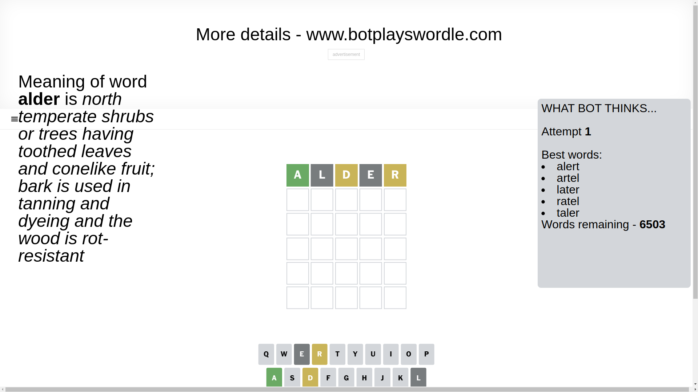
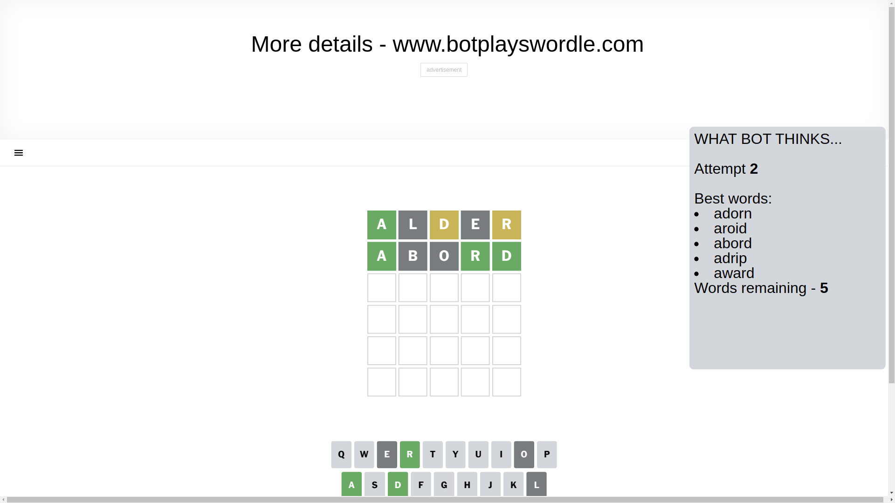
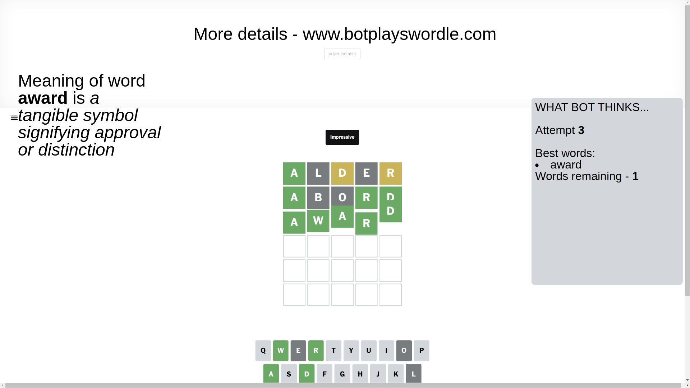

# Wordle for February 26, 2025 - \#1348

## Attempt 1

This is the first attempt and we'll choose a random word to start with.

Let's start with word `alder`

Attempt for `alder` gives us 1 correct letters, 2 present letters and 2 wrong letters.

If we look into details, we can see that:

Letter `a` should be at position 1

Letter `l` is not present in the word and we will not use it any more

Letter `d` is on a different spot - this means that it cannot be at position 3

Letter `e` is not present in the word and we will not use it any more

Letter `r` is on a different spot - this means that it cannot be at position 5

We got information about the correct letters and it should make next attempt easier

Some letters are missing (like `l`, `e`) but it's also important piece of information

Word should contain letters `[a d r]`

That was a great guess that limited number of remaining words

## Attempt 2

Right now we have 5 words to choose from and best of them seem to be `[adorn aroid abord adrip award]`

So far we know that possible letters are:

At position 1: `[a]`

At position 2: `[a b c d f g h i j k m n o p q r s t u v w x y z]`

At position 3: `[a b c f g h i j k m n o p q r s t u v w x y z]`

At position 4: `[a b c d f g h i j k m n o p q r s t u v w x y z]`

At position 5: `[a b c d f g h i j k m n o p q s t u v w x y z]`

Next guess is `abord`, let's see what it gives us

Attempt for `abord` gives us 3 correct letters, 0 present letters and 2 wrong letters.

If we look into details, we can see that:

Letter `b` is not present in the word and we will not use it any more

Letter `o` is not present in the word and we will not use it any more

Letter `r` should be at position 4

Letter `d` should be at position 5

We got information about the correct letters and it should make next attempt easier

Some letters are missing (like `b`, `o`) but it's also important piece of information

Word should contain letters `[a d r]`

Not a bad guess in general

## Attempt 3

Right now we have 1 words to choose from and best of them seem to be `[award]`

So far we know that possible letters are:

At position 1: `[a]`

At position 2: `[a c d f g h i j k m n p q r s t u v w x y z]`

At position 3: `[a c f g h i j k m n p q r s t u v w x y z]`

At position 4: `[r]`

At position 5: `[d]`

It must be `award`

That's the correct answer! The word is `award`!

## Conclusion

Today's word is `award` and it took 3 attempts to guess it

