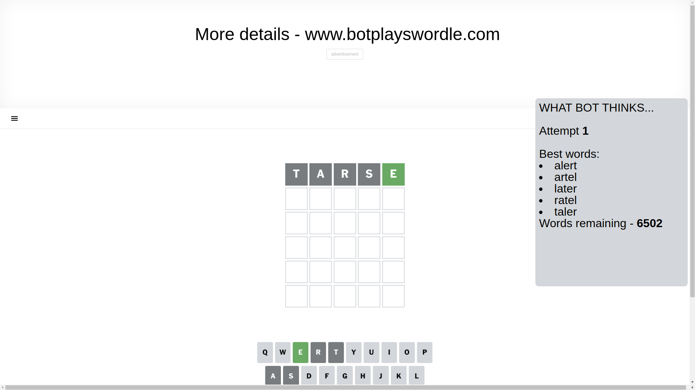
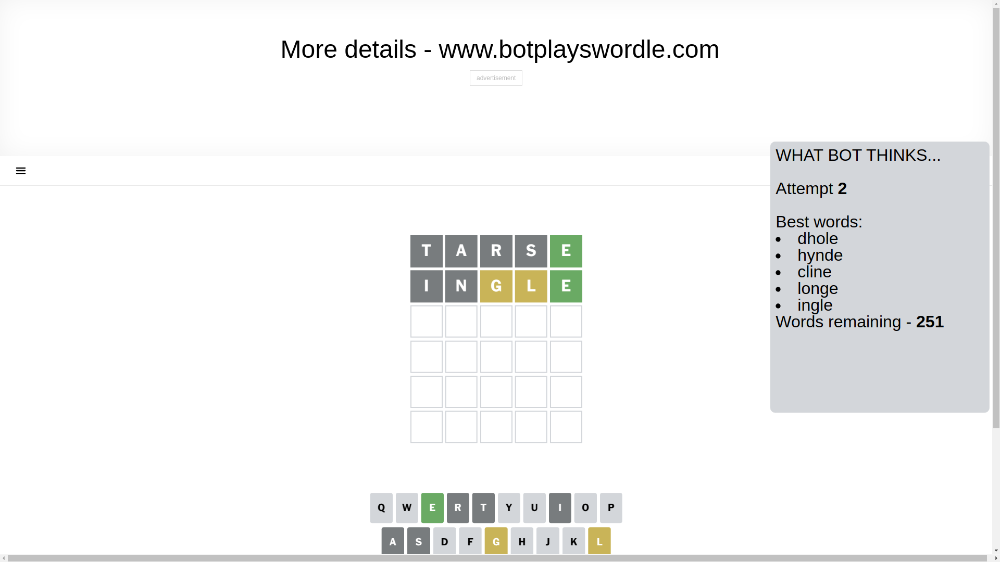
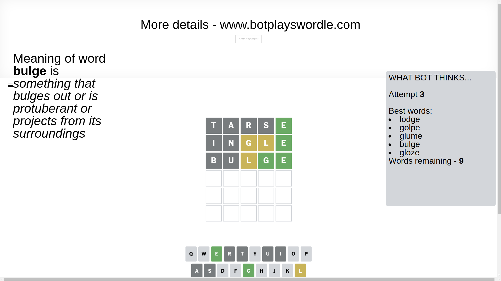
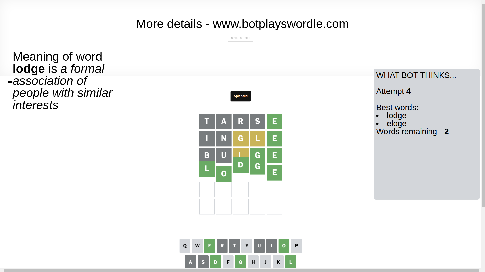

# Wordle for February 27, 2025 - \#1349

## Attempt 1

This is the first attempt and we'll choose a random word to start with.

Let's start with word `tarse`

Attempt for `tarse` gives us 1 correct letters, 0 present letters and 4 wrong letters.

If we look into details, we can see that:

Letter `t` is not present in the word and we will not use it any more

Letter `a` is not present in the word and we will not use it any more

Letter `r` is not present in the word and we will not use it any more

Letter `s` is not present in the word and we will not use it any more

Letter `e` should be at position 5

We got information about the correct letters and it should make next attempt easier

Some letters are missing (like `t`, `a`, `r`, `s`) but it's also important piece of information

Word should contain letters `[e]`

That was a great guess that limited number of remaining words

## Attempt 2

Right now we have 251 words to choose from and best of them seem to be `[dhole hynde cline longe ingle]`

So far we know that possible letters are:

At position 1: `[b c d e f g h i j k l m n o p q u v w x y z]`

At position 2: `[b c d e f g h i j k l m n o p q u v w x y z]`

At position 3: `[b c d e f g h i j k l m n o p q u v w x y z]`

At position 4: `[b c d e f g h i j k l m n o p q u v w x y z]`

At position 5: `[e]`

Next guess is `ingle`, let's see what it gives us

Attempt for `ingle` gives us 1 correct letters, 2 present letters and 2 wrong letters.

If we look into details, we can see that:

Letter `i` is not present in the word and we will not use it any more

Letter `n` is not present in the word and we will not use it any more

Letter `g` is on a different spot - this means that it cannot be at position 3

Letter `l` is on a different spot - this means that it cannot be at position 4

Some letters are missing (like `i`, `n`) but it's also important piece of information

Word should contain letters `[e g l]`

That was a great guess that limited number of remaining words

## Attempt 3

Right now we have 9 words to choose from and best of them seem to be `[lodge golpe glume bulge gloze]`

So far we know that possible letters are:

At position 1: `[b c d e f g h j k l m o p q u v w x y z]`

At position 2: `[b c d e f g h j k l m o p q u v w x y z]`

At position 3: `[b c d e f h j k l m o p q u v w x y z]`

At position 4: `[b c d e f g h j k m o p q u v w x y z]`

At position 5: `[e]`

Next guess is `bulge`, let's see what it gives us

Attempt for `bulge` gives us 2 correct letters, 1 present letters and 2 wrong letters.

If we look into details, we can see that:

Letter `b` is not present in the word and we will not use it any more

Letter `u` is not present in the word and we will not use it any more

Letter `l` is on a different spot - this means that it cannot be at position 3

Letter `g` should be at position 4

We got information about the correct letters and it should make next attempt easier

Some letters are missing (like `b`, `u`) but it's also important piece of information

Word should contain letters `[e g l]`

Not a bad guess in general

## Attempt 4

Right now we have 2 words to choose from and best of them seem to be `[lodge eloge]`

So far we know that possible letters are:

At position 1: `[c d e f g h j k l m o p q v w x y z]`

At position 2: `[c d e f g h j k l m o p q v w x y z]`

At position 3: `[c d e f h j k m o p q v w x y z]`

At position 4: `[g]`

At position 5: `[e]`

Next guess is `lodge`, let's see what it gives us

That's the correct answer! The word is `lodge`!

## Conclusion

Today's word is `lodge` and it took 4 attempts to guess it

