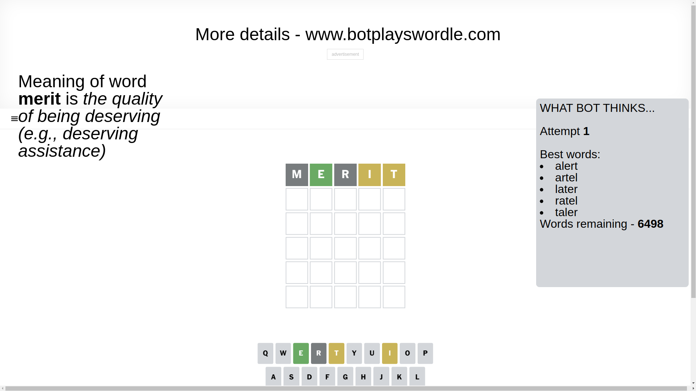
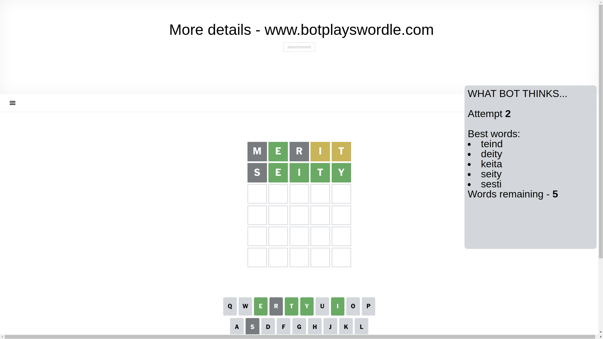
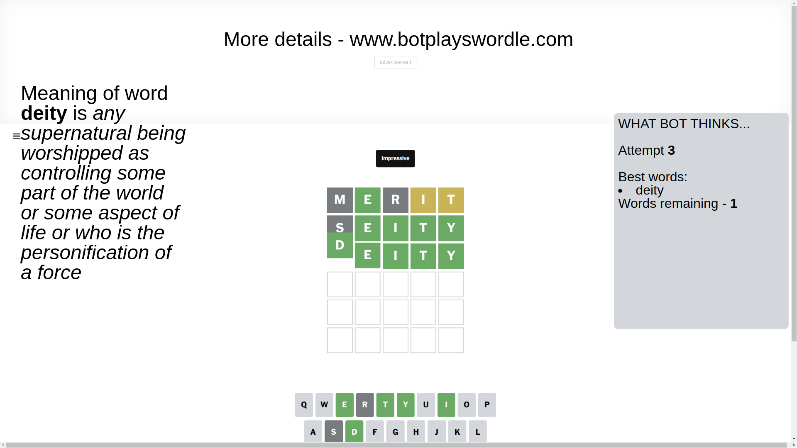

# Wordle for March 2, 2025 - \#1352

## Attempt 1

This is the first attempt and we'll choose a random word to start with.

Let's start with word `merit`

Attempt for `merit` gives us 1 correct letters, 2 present letters and 2 wrong letters.

If we look into details, we can see that:

Letter `m` is not present in the word and we will not use it any more

Letter `e` should be at position 2

Letter `r` is not present in the word and we will not use it any more

Letter `i` is on a different spot - this means that it cannot be at position 4

Letter `t` is on a different spot - this means that it cannot be at position 5

We got information about the correct letters and it should make next attempt easier

Some letters are missing (like `m`, `r`) but it's also important piece of information

Word should contain letters `[e i t]`

That was a great guess that limited number of remaining words

## Attempt 2

Right now we have 5 words to choose from and best of them seem to be `[teind deity keita seity sesti]`

So far we know that possible letters are:

At position 1: `[a b c d e f g h i j k l n o p q s t u v w x y z]`

At position 2: `[e]`

At position 3: `[a b c d e f g h i j k l n o p q s t u v w x y z]`

At position 4: `[a b c d e f g h j k l n o p q s t u v w x y z]`

At position 5: `[a b c d e f g h i j k l n o p q s u v w x y z]`

Next guess is `seity`, let's see what it gives us

Attempt for `seity` gives us 4 correct letters, 0 present letters and 1 wrong letters.

If we look into details, we can see that:

Letter `s` is not present in the word and we will not use it any more

Letter `i` should be at position 3

Letter `t` should be at position 4

Letter `y` should be at position 5

We got information about the correct letters and it should make next attempt easier

Some letters are missing (like `s`) but it's also important piece of information

Word should contain letters `[e i t y]`

Not a bad guess in general

## Attempt 3

Right now we have 1 words to choose from and best of them seem to be `[deity]`

So far we know that possible letters are:

At position 1: `[a b c d e f g h i j k l n o p q t u v w x y z]`

At position 2: `[e]`

At position 3: `[i]`

At position 4: `[t]`

At position 5: `[y]`

It must be `deity`

That's the correct answer! The word is `deity`!

## Conclusion

Today's word is `deity` and it took 3 attempts to guess it

