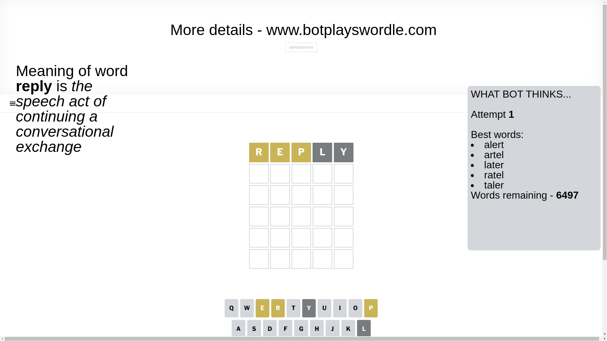
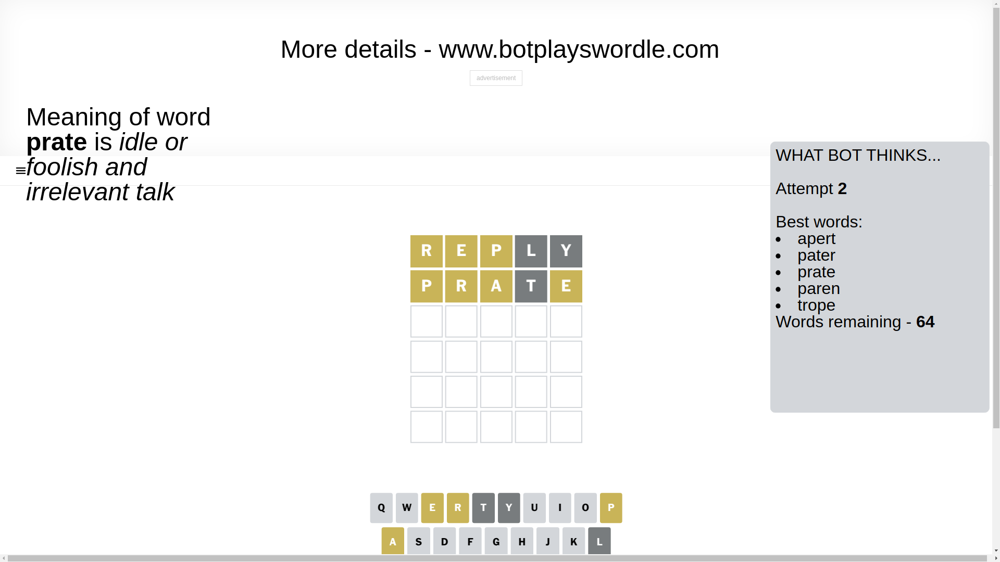
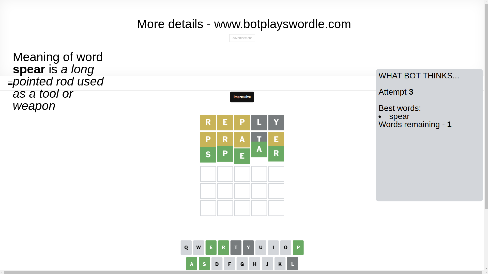

# Wordle for March 3, 2025 - \#1353

## Attempt 1

This is the first attempt and we'll choose a random word to start with.

Let's start with word `reply`

Attempt for `reply` gives us 0 correct letters, 3 present letters and 2 wrong letters.

If we look into details, we can see that:

Letter `r` is on a different spot - this means that it cannot be at position 1

Letter `e` is on a different spot - this means that it cannot be at position 2

Letter `p` is on a different spot - this means that it cannot be at position 3

Letter `l` is not present in the word and we will not use it any more

Letter `y` is not present in the word and we will not use it any more

Some letters are missing (like `l`, `y`) but it's also important piece of information

Word should contain letters `[r e p]`

That was a great guess that limited number of remaining words

## Attempt 2

Right now we have 64 words to choose from and best of them seem to be `[apert pater prate paren trope]`

So far we know that possible letters are:

At position 1: `[a b c d e f g h i j k m n o p q s t u v w x z]`

At position 2: `[a b c d f g h i j k m n o p q r s t u v w x z]`

At position 3: `[a b c d e f g h i j k m n o q r s t u v w x z]`

At position 4: `[a b c d e f g h i j k m n o p q r s t u v w x z]`

At position 5: `[a b c d e f g h i j k m n o p q r s t u v w x z]`

Next guess is `prate`, let's see what it gives us

Attempt for `prate` gives us 0 correct letters, 4 present letters and 1 wrong letters.

If we look into details, we can see that:

Letter `p` is on a different spot - this means that it cannot be at position 1

Letter `r` is on a different spot - this means that it cannot be at position 2

Letter `a` is on a different spot - this means that it cannot be at position 3

Letter `t` is not present in the word and we will not use it any more

Letter `e` is on a different spot - this means that it cannot be at position 5

Some letters are missing (like `t`) but it's also important piece of information

Word should contain letters `[r e p a]`

That was a great guess that limited number of remaining words

## Attempt 3

Right now we have 1 words to choose from and best of them seem to be `[spear]`

So far we know that possible letters are:

At position 1: `[a b c d e f g h i j k m n o q s u v w x z]`

At position 2: `[a b c d f g h i j k m n o p q s u v w x z]`

At position 3: `[b c d e f g h i j k m n o q r s u v w x z]`

At position 4: `[a b c d e f g h i j k m n o p q r s u v w x z]`

At position 5: `[a b c d f g h i j k m n o p q r s u v w x z]`

It must be `spear`

That's the correct answer! The word is `spear`!

## Conclusion

Today's word is `spear` and it took 3 attempts to guess it

