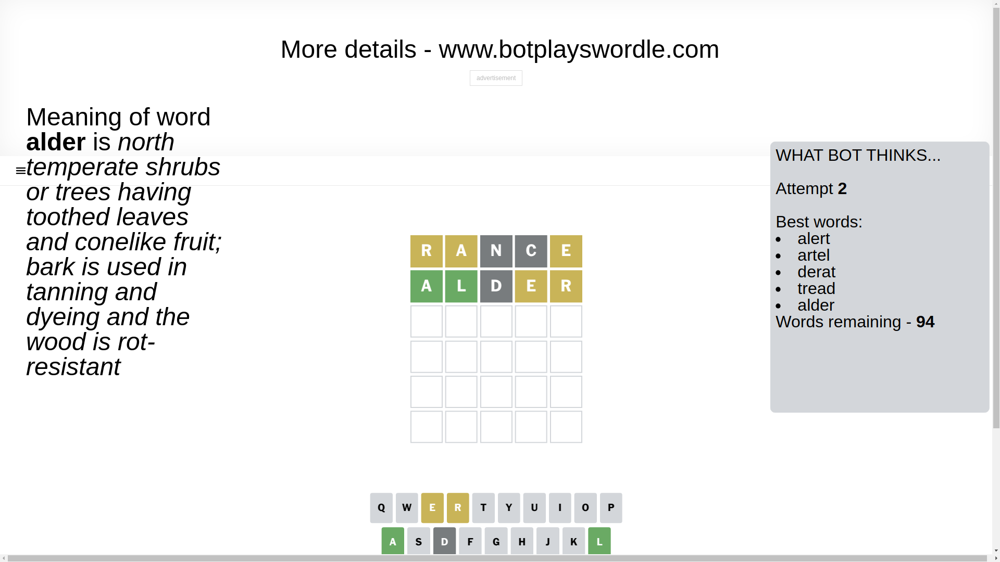

# Wordle for March 6, 2025 - \#1356

## Attempt 1

This is the first attempt and we'll choose a random word to start with.

Let's start with word `rance`

Attempt for `rance` gives us 0 correct letters, 3 present letters and 2 wrong letters.

If we look into details, we can see that:

Letter `r` is on a different spot - this means that it cannot be at position 1

Letter `a` is on a different spot - this means that it cannot be at position 2

Letter `n` is not present in the word and we will not use it any more

Letter `c` is not present in the word and we will not use it any more

Letter `e` is on a different spot - this means that it cannot be at position 5

Some letters are missing (like `n`, `c`) but it's also important piece of information

Word should contain letters `[r a e]`

That was a great guess that limited number of remaining words

## Attempt 2

Right now we have 94 words to choose from and best of them seem to be `[alert artel derat tread alder]`

So far we know that possible letters are:

At position 1: `[a b d e f g h i j k l m o p q s t u v w x y z]`

At position 2: `[b d e f g h i j k l m o p q r s t u v w x y z]`

At position 3: `[a b d e f g h i j k l m o p q r s t u v w x y z]`

At position 4: `[a b d e f g h i j k l m o p q r s t u v w x y z]`

At position 5: `[a b d f g h i j k l m o p q r s t u v w x y z]`

Next guess is `alder`, let's see what it gives us

Attempt for `alder` gives us 2 correct letters, 2 present letters and 1 wrong letters.

If we look into details, we can see that:

Letter `a` should be at position 1

Letter `l` should be at position 2

Letter `d` is not present in the word and we will not use it any more

Letter `e` is on a different spot - this means that it cannot be at position 4

Letter `r` is on a different spot - this means that it cannot be at position 5

We got information about the correct letters and it should make next attempt easier

Some letters are missing (like `d`) but it's also important piece of information

Word should contain letters `[r a e l]`

That was a great guess that limited number of remaining words

## Attempt 3

Right now we have 1 words to choose from and best of them seem to be `[alert]`

So far we know that possible letters are:

At position 1: `[a]`

At position 2: `[l]`

At position 3: `[a b e f g h i j k l m o p q r s t u v w x y z]`

At position 4: `[a b f g h i j k l m o p q r s t u v w x y z]`

At position 5: `[a b f g h i j k l m o p q s t u v w x y z]`

It must be `alert`

That's the correct answer! The word is `alert`!

## Conclusion

Today's word is `alert` and it took 3 attempts to guess it

