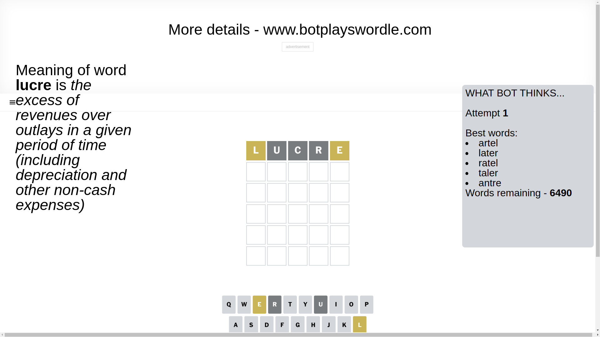
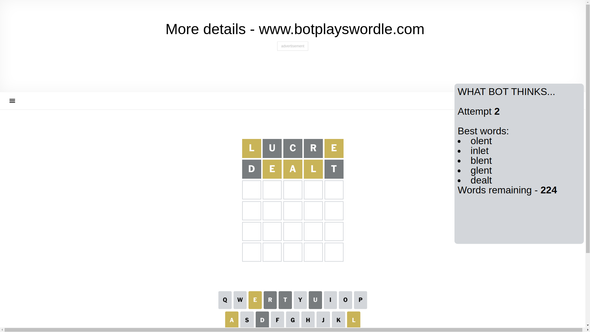
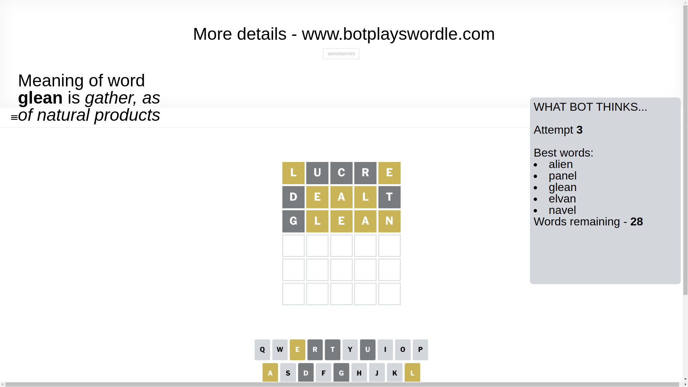
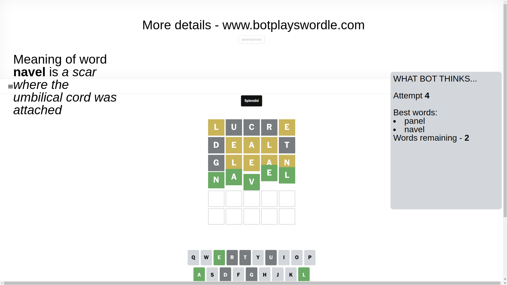

# Wordle for March 8, 2025 - \#1358

## Attempt 1

This is the first attempt and we'll choose a random word to start with.

Let's start with word `lucre`

Attempt for `lucre` gives us 0 correct letters, 2 present letters and 3 wrong letters.

If we look into details, we can see that:

Letter `l` is on a different spot - this means that it cannot be at position 1

Letter `u` is not present in the word and we will not use it any more

Letter `c` is not present in the word and we will not use it any more

Letter `r` is not present in the word and we will not use it any more

Letter `e` is on a different spot - this means that it cannot be at position 5

Some letters are missing (like `u`, `c`, `r`) but it's also important piece of information

Word should contain letters `[l e]`

That was a great guess that limited number of remaining words

## Attempt 2

Right now we have 224 words to choose from and best of them seem to be `[olent inlet blent glent dealt]`

So far we know that possible letters are:

At position 1: `[a b d e f g h i j k m n o p q s t v w x y z]`

At position 2: `[a b d e f g h i j k l m n o p q s t v w x y z]`

At position 3: `[a b d e f g h i j k l m n o p q s t v w x y z]`

At position 4: `[a b d e f g h i j k l m n o p q s t v w x y z]`

At position 5: `[a b d f g h i j k l m n o p q s t v w x y z]`

Next guess is `dealt`, let's see what it gives us

Attempt for `dealt` gives us 0 correct letters, 3 present letters and 2 wrong letters.

If we look into details, we can see that:

Letter `d` is not present in the word and we will not use it any more

Letter `e` is on a different spot - this means that it cannot be at position 2

Letter `a` is on a different spot - this means that it cannot be at position 3

Letter `l` is on a different spot - this means that it cannot be at position 4

Letter `t` is not present in the word and we will not use it any more

Some letters are missing (like `d`, `t`) but it's also important piece of information

Word should contain letters `[l e a]`

Not a bad guess in general

## Attempt 3

Right now we have 28 words to choose from and best of them seem to be `[alien panel glean elvan navel]`

So far we know that possible letters are:

At position 1: `[a b e f g h i j k m n o p q s v w x y z]`

At position 2: `[a b f g h i j k l m n o p q s v w x y z]`

At position 3: `[b e f g h i j k l m n o p q s v w x y z]`

At position 4: `[a b e f g h i j k m n o p q s v w x y z]`

At position 5: `[a b f g h i j k l m n o p q s v w x y z]`

Next guess is `glean`, let's see what it gives us

Attempt for `glean` gives us 0 correct letters, 4 present letters and 1 wrong letters.

If we look into details, we can see that:

Letter `g` is not present in the word and we will not use it any more

Letter `l` is on a different spot - this means that it cannot be at position 2

Letter `e` is on a different spot - this means that it cannot be at position 3

Letter `a` is on a different spot - this means that it cannot be at position 4

Letter `n` is on a different spot - this means that it cannot be at position 5

Some letters are missing (like `g`) but it's also important piece of information

Word should contain letters `[l e a n]`

That was a great guess that limited number of remaining words

## Attempt 4

Right now we have 2 words to choose from and best of them seem to be `[panel navel]`

So far we know that possible letters are:

At position 1: `[a b e f h i j k m n o p q s v w x y z]`

At position 2: `[a b f h i j k m n o p q s v w x y z]`

At position 3: `[b f h i j k l m n o p q s v w x y z]`

At position 4: `[b e f h i j k m n o p q s v w x y z]`

At position 5: `[a b f h i j k l m o p q s v w x y z]`

Next guess is `navel`, let's see what it gives us

That's the correct answer! The word is `navel`!

## Conclusion

Today's word is `navel` and it took 4 attempts to guess it

