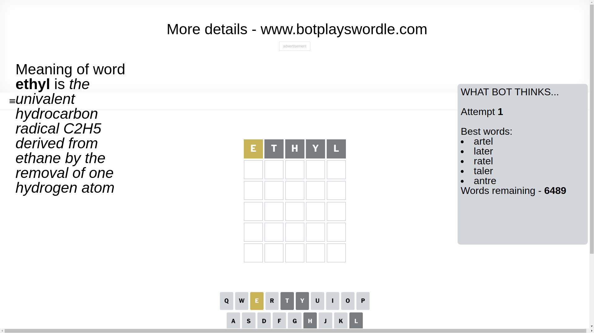
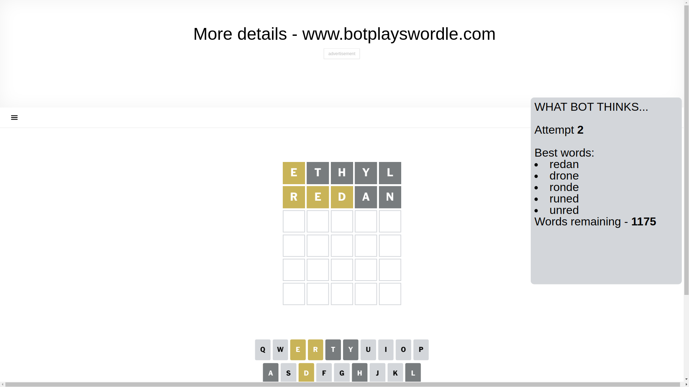
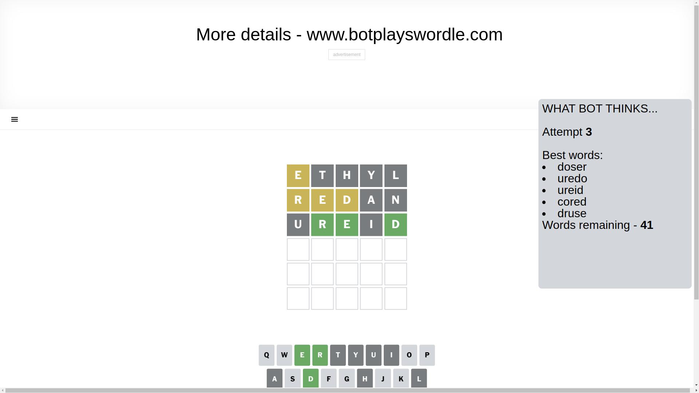
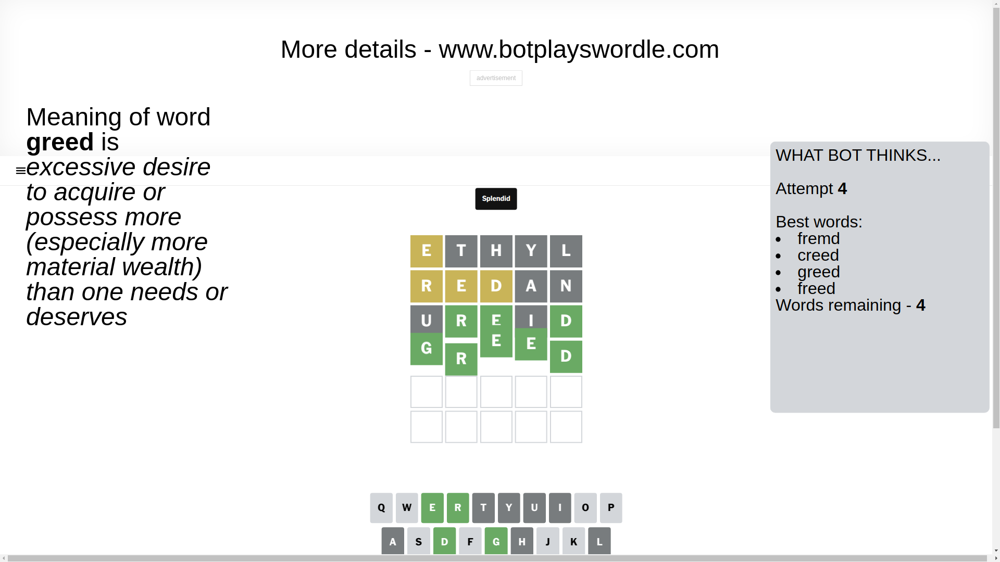

# Wordle for March 9, 2025 - \#1359

## Attempt 1

This is the first attempt and we'll choose a random word to start with.

Let's start with word `ethyl`

Attempt for `ethyl` gives us 0 correct letters, 1 present letters and 4 wrong letters.

If we look into details, we can see that:

Letter `e` is on a different spot - this means that it cannot be at position 1

Letter `t` is not present in the word and we will not use it any more

Letter `h` is not present in the word and we will not use it any more

Letter `y` is not present in the word and we will not use it any more

Letter `l` is not present in the word and we will not use it any more

Some letters are missing (like `t`, `h`, `y`, `l`) but it's also important piece of information

Word should contain letters `[e]`

Not a bad guess in general

## Attempt 2

Right now we have 1175 words to choose from and best of them seem to be `[redan drone ronde runed unred]`

So far we know that possible letters are:

At position 1: `[a b c d f g i j k m n o p q r s u v w x z]`

At position 2: `[a b c d e f g i j k m n o p q r s u v w x z]`

At position 3: `[a b c d e f g i j k m n o p q r s u v w x z]`

At position 4: `[a b c d e f g i j k m n o p q r s u v w x z]`

At position 5: `[a b c d e f g i j k m n o p q r s u v w x z]`

Next guess is `redan`, let's see what it gives us

Attempt for `redan` gives us 0 correct letters, 3 present letters and 2 wrong letters.

If we look into details, we can see that:

Letter `r` is on a different spot - this means that it cannot be at position 1

Letter `e` is on a different spot - this means that it cannot be at position 2

Letter `d` is on a different spot - this means that it cannot be at position 3

Letter `a` is not present in the word and we will not use it any more

Letter `n` is not present in the word and we will not use it any more

Some letters are missing (like `a`, `n`) but it's also important piece of information

Word should contain letters `[e r d]`

That was a great guess that limited number of remaining words

## Attempt 3

Right now we have 41 words to choose from and best of them seem to be `[doser uredo ureid cored druse]`

So far we know that possible letters are:

At position 1: `[b c d f g i j k m o p q s u v w x z]`

At position 2: `[b c d f g i j k m o p q r s u v w x z]`

At position 3: `[b c e f g i j k m o p q r s u v w x z]`

At position 4: `[b c d e f g i j k m o p q r s u v w x z]`

At position 5: `[b c d e f g i j k m o p q r s u v w x z]`

Next guess is `ureid`, let's see what it gives us

Attempt for `ureid` gives us 3 correct letters, 0 present letters and 2 wrong letters.

If we look into details, we can see that:

Letter `u` is not present in the word and we will not use it any more

Letter `r` should be at position 2

Letter `e` should be at position 3

Letter `i` is not present in the word and we will not use it any more

Letter `d` should be at position 5

We got information about the correct letters and it should make next attempt easier

Some letters are missing (like `u`, `i`) but it's also important piece of information

Word should contain letters `[e r d]`

That was a great guess that limited number of remaining words

## Attempt 4

Right now we have 4 words to choose from and best of them seem to be `[fremd creed greed freed]`

So far we know that possible letters are:

At position 1: `[b c d f g j k m o p q s v w x z]`

At position 2: `[r]`

At position 3: `[e]`

At position 4: `[b c d e f g j k m o p q r s v w x z]`

At position 5: `[d]`

Next guess is `greed`, let's see what it gives us

That's the correct answer! The word is `greed`!

## Conclusion

Today's word is `greed` and it took 4 attempts to guess it

