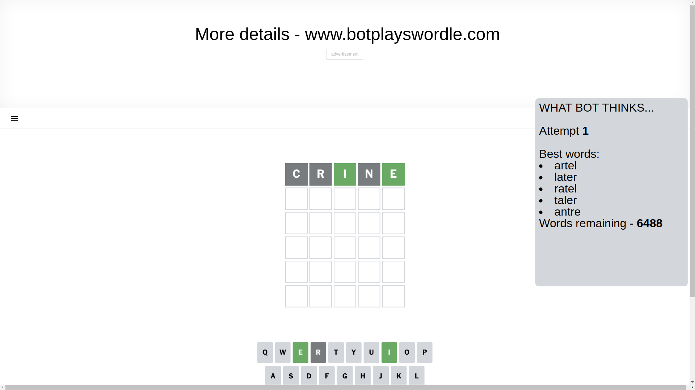
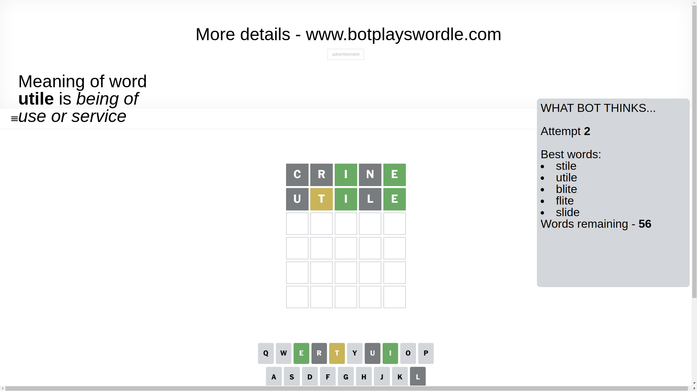
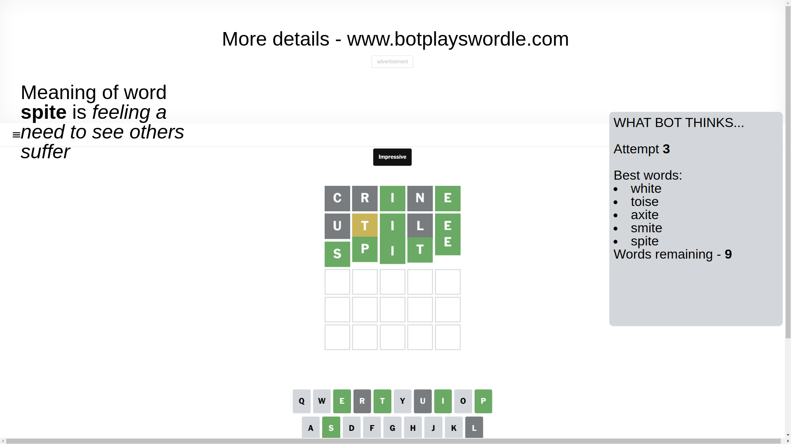

# Wordle for March 10, 2025 - \#1360

## Attempt 1

This is the first attempt and we'll choose a random word to start with.

Let's start with word `crine`

Attempt for `crine` gives us 2 correct letters, 0 present letters and 3 wrong letters.

If we look into details, we can see that:

Letter `c` is not present in the word and we will not use it any more

Letter `r` is not present in the word and we will not use it any more

Letter `i` should be at position 3

Letter `n` is not present in the word and we will not use it any more

Letter `e` should be at position 5

We got information about the correct letters and it should make next attempt easier

Some letters are missing (like `c`, `r`, `n`) but it's also important piece of information

Word should contain letters `[i e]`

That was a great guess that limited number of remaining words

## Attempt 2

Right now we have 56 words to choose from and best of them seem to be `[stile utile blite flite slide]`

So far we know that possible letters are:

At position 1: `[a b d e f g h i j k l m o p q s t u v w x y z]`

At position 2: `[a b d e f g h i j k l m o p q s t u v w x y z]`

At position 3: `[i]`

At position 4: `[a b d e f g h i j k l m o p q s t u v w x y z]`

At position 5: `[e]`

Next guess is `utile`, let's see what it gives us

Attempt for `utile` gives us 2 correct letters, 1 present letters and 2 wrong letters.

If we look into details, we can see that:

Letter `u` is not present in the word and we will not use it any more

Letter `t` is on a different spot - this means that it cannot be at position 2

Letter `l` is not present in the word and we will not use it any more

Some letters are missing (like `u`, `l`) but it's also important piece of information

Word should contain letters `[i e t]`

Not a bad guess in general

## Attempt 3

Right now we have 9 words to choose from and best of them seem to be `[white toise axite smite spite]`

So far we know that possible letters are:

At position 1: `[a b d e f g h i j k m o p q s t v w x y z]`

At position 2: `[a b d e f g h i j k m o p q s v w x y z]`

At position 3: `[i]`

At position 4: `[a b d e f g h i j k m o p q s t v w x y z]`

At position 5: `[e]`

Next guess is `spite`, let's see what it gives us

That's the correct answer! The word is `spite`!

## Conclusion

Today's word is `spite` and it took 3 attempts to guess it

