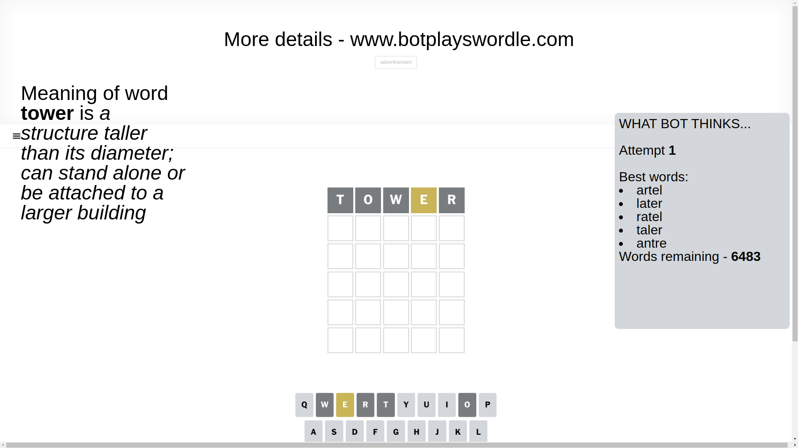
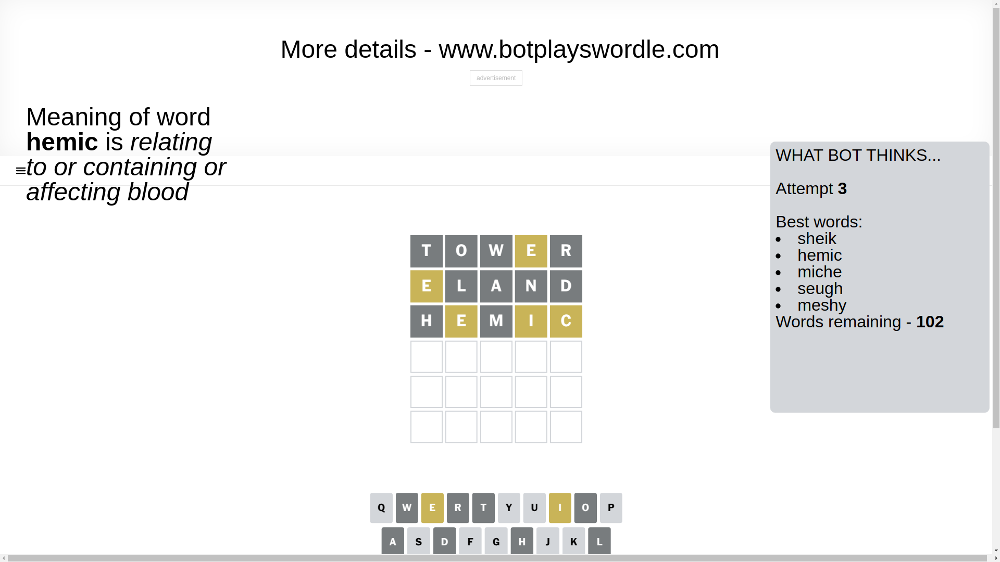
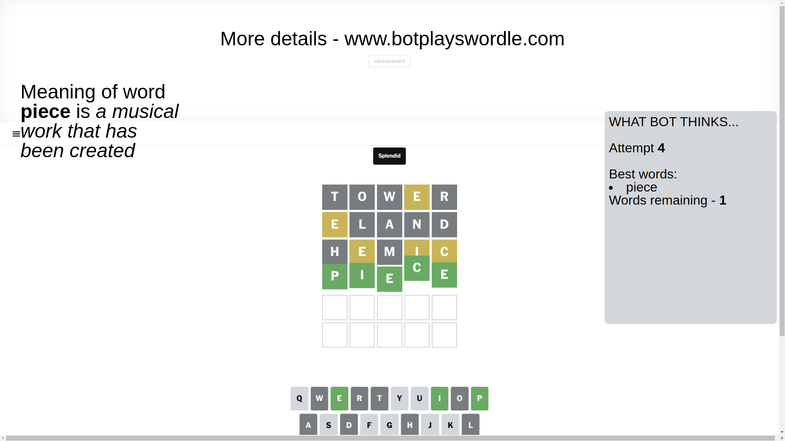

# Wordle for March 14, 2025 - \#1364

## Attempt 1

This is the first attempt and we'll choose a random word to start with.

Let's start with word `tower`

Attempt for `tower` gives us 0 correct letters, 1 present letters and 4 wrong letters.

If we look into details, we can see that:

Letter `t` is not present in the word and we will not use it any more

Letter `o` is not present in the word and we will not use it any more

Letter `w` is not present in the word and we will not use it any more

Letter `e` is on a different spot - this means that it cannot be at position 4

Letter `r` is not present in the word and we will not use it any more

Some letters are missing (like `t`, `o`, `w`, `r`) but it's also important piece of information

Word should contain letters `[e]`

That was a great guess that limited number of remaining words

## Attempt 2

Right now we have 653 words to choose from and best of them seem to be `[eland eldin blend neeld heald]`

So far we know that possible letters are:

At position 1: `[a b c d e f g h i j k l m n p q s u v x y z]`

At position 2: `[a b c d e f g h i j k l m n p q s u v x y z]`

At position 3: `[a b c d e f g h i j k l m n p q s u v x y z]`

At position 4: `[a b c d f g h i j k l m n p q s u v x y z]`

At position 5: `[a b c d e f g h i j k l m n p q s u v x y z]`

Next guess is `eland`, let's see what it gives us

Attempt for `eland` gives us 0 correct letters, 1 present letters and 4 wrong letters.

If we look into details, we can see that:

Letter `e` is on a different spot - this means that it cannot be at position 1

Letter `l` is not present in the word and we will not use it any more

Letter `a` is not present in the word and we will not use it any more

Letter `n` is not present in the word and we will not use it any more

Letter `d` is not present in the word and we will not use it any more

Some letters are missing (like `l`, `a`, `n`, `d`) but it's also important piece of information

Word should contain letters `[e]`

Not a bad guess in general

## Attempt 3

Right now we have 102 words to choose from and best of them seem to be `[sheik hemic miche seugh meshy]`

So far we know that possible letters are:

At position 1: `[b c f g h i j k m p q s u v x y z]`

At position 2: `[b c e f g h i j k m p q s u v x y z]`

At position 3: `[b c e f g h i j k m p q s u v x y z]`

At position 4: `[b c f g h i j k m p q s u v x y z]`

At position 5: `[b c e f g h i j k m p q s u v x y z]`

Next guess is `hemic`, let's see what it gives us

Attempt for `hemic` gives us 0 correct letters, 3 present letters and 2 wrong letters.

If we look into details, we can see that:

Letter `h` is not present in the word and we will not use it any more

Letter `e` is on a different spot - this means that it cannot be at position 2

Letter `m` is not present in the word and we will not use it any more

Letter `i` is on a different spot - this means that it cannot be at position 4

Letter `c` is on a different spot - this means that it cannot be at position 5

Some letters are missing (like `h`, `m`) but it's also important piece of information

Word should contain letters `[e i c]`

That was a great guess that limited number of remaining words

## Attempt 4

Right now we have 1 words to choose from and best of them seem to be `[piece]`

So far we know that possible letters are:

At position 1: `[b c f g i j k p q s u v x y z]`

At position 2: `[b c f g i j k p q s u v x y z]`

At position 3: `[b c e f g i j k p q s u v x y z]`

At position 4: `[b c f g j k p q s u v x y z]`

At position 5: `[b e f g i j k p q s u v x y z]`

It must be `piece`

That's the correct answer! The word is `piece`!

## Conclusion

Today's word is `piece` and it took 4 attempts to guess it

