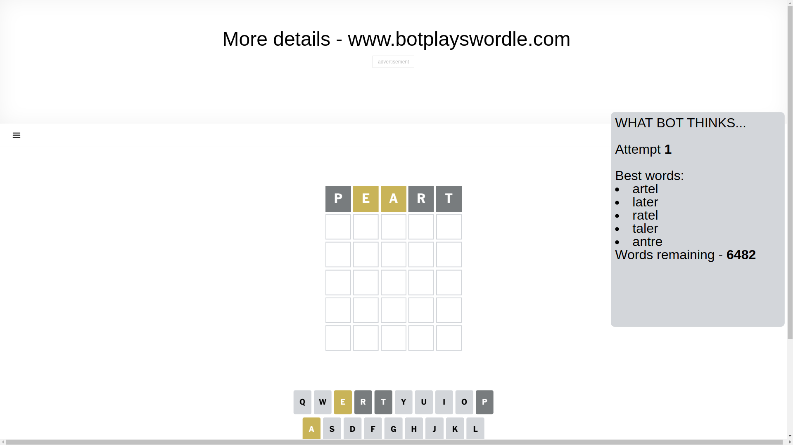
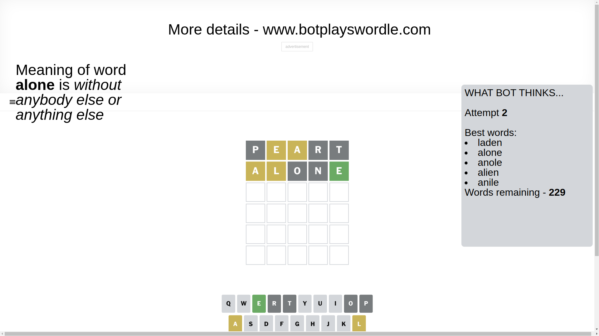
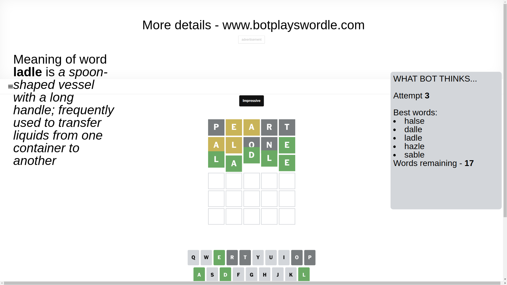

# Wordle for March 15, 2025 - \#1365

## Attempt 1

This is the first attempt and we'll choose a random word to start with.

Let's start with word `peart`

Attempt for `peart` gives us 0 correct letters, 2 present letters and 3 wrong letters.

If we look into details, we can see that:

Letter `p` is not present in the word and we will not use it any more

Letter `e` is on a different spot - this means that it cannot be at position 2

Letter `a` is on a different spot - this means that it cannot be at position 3

Letter `r` is not present in the word and we will not use it any more

Letter `t` is not present in the word and we will not use it any more

Some letters are missing (like `p`, `r`, `t`) but it's also important piece of information

Word should contain letters `[e a]`

That was a great guess that limited number of remaining words

## Attempt 2

Right now we have 229 words to choose from and best of them seem to be `[laden alone anole alien anile]`

So far we know that possible letters are:

At position 1: `[a b c d e f g h i j k l m n o q s u v w x y z]`

At position 2: `[a b c d f g h i j k l m n o q s u v w x y z]`

At position 3: `[b c d e f g h i j k l m n o q s u v w x y z]`

At position 4: `[a b c d e f g h i j k l m n o q s u v w x y z]`

At position 5: `[a b c d e f g h i j k l m n o q s u v w x y z]`

Next guess is `alone`, let's see what it gives us

Attempt for `alone` gives us 1 correct letters, 2 present letters and 2 wrong letters.

If we look into details, we can see that:

Letter `a` is on a different spot - this means that it cannot be at position 1

Letter `l` is on a different spot - this means that it cannot be at position 2

Letter `o` is not present in the word and we will not use it any more

Letter `n` is not present in the word and we will not use it any more

Letter `e` should be at position 5

We got information about the correct letters and it should make next attempt easier

Some letters are missing (like `o`, `n`) but it's also important piece of information

Word should contain letters `[e a l]`

That was a great guess that limited number of remaining words

## Attempt 3

Right now we have 17 words to choose from and best of them seem to be `[halse dalle ladle hazle sable]`

So far we know that possible letters are:

At position 1: `[b c d e f g h i j k l m q s u v w x y z]`

At position 2: `[a b c d f g h i j k m q s u v w x y z]`

At position 3: `[b c d e f g h i j k l m q s u v w x y z]`

At position 4: `[a b c d e f g h i j k l m q s u v w x y z]`

At position 5: `[e]`

Next guess is `ladle`, let's see what it gives us

That's the correct answer! The word is `ladle`!

To be honest that was a pretty lucky guess, but it worked out well.

## Conclusion

Today's word is `ladle` and it took 3 attempts to guess it

