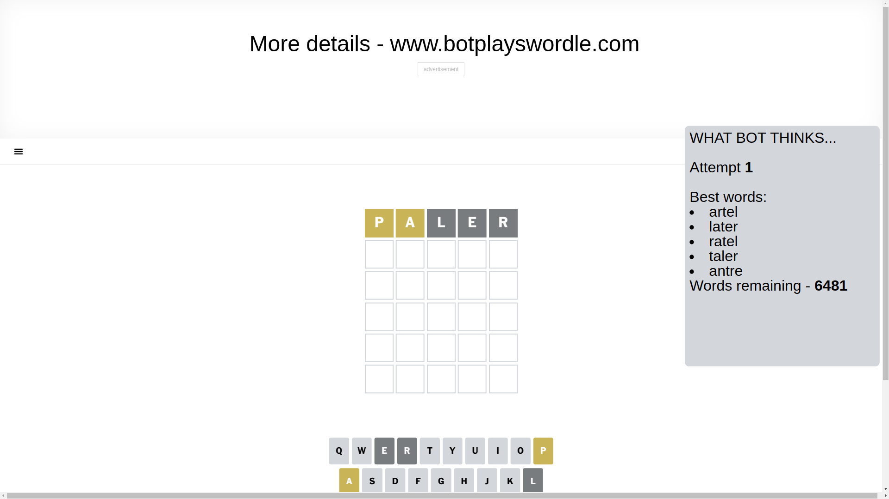
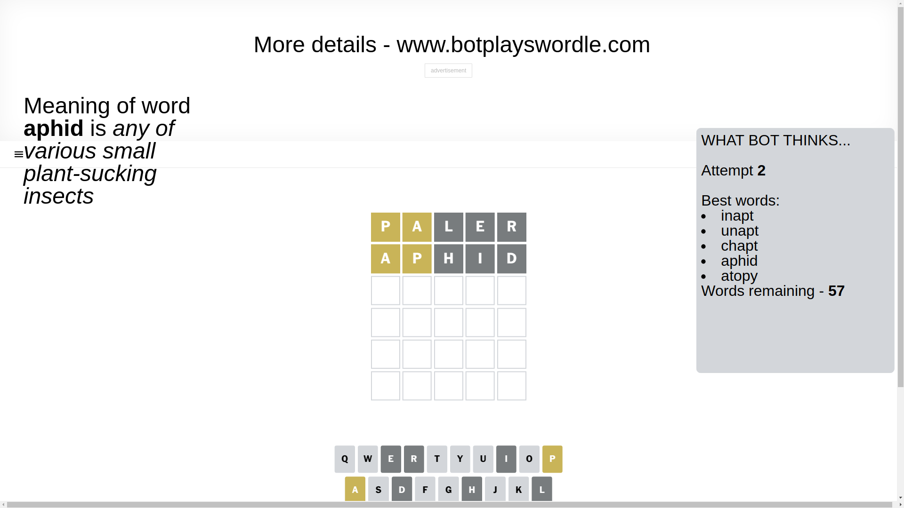
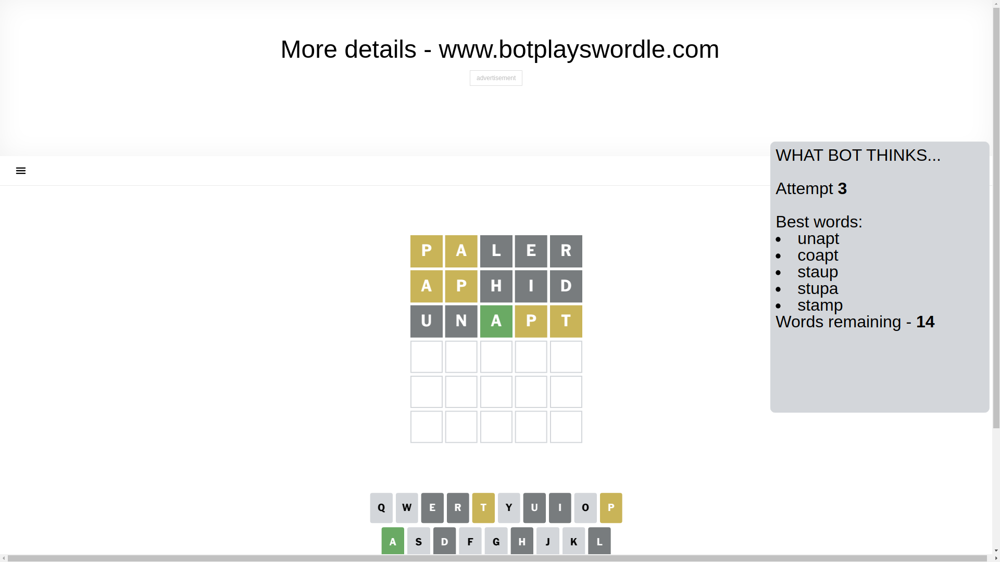
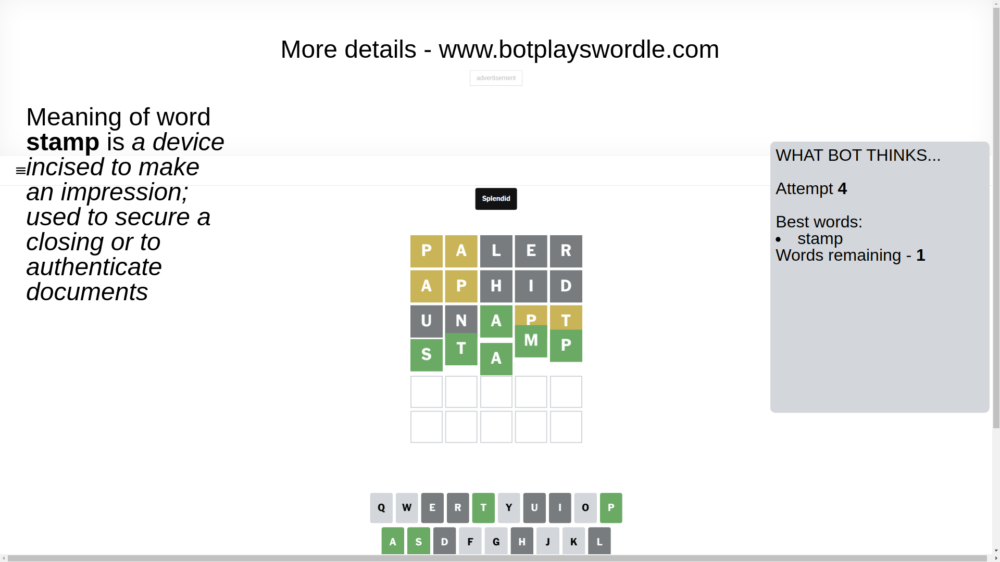

# Wordle for March 16, 2025 - \#1366

## Attempt 1

This is the first attempt and we'll choose a random word to start with.

Let's start with word `paler`

Attempt for `paler` gives us 0 correct letters, 2 present letters and 3 wrong letters.

If we look into details, we can see that:

Letter `p` is on a different spot - this means that it cannot be at position 1

Letter `a` is on a different spot - this means that it cannot be at position 2

Letter `l` is not present in the word and we will not use it any more

Letter `e` is not present in the word and we will not use it any more

Letter `r` is not present in the word and we will not use it any more

Some letters are missing (like `l`, `e`, `r`) but it's also important piece of information

Word should contain letters `[p a]`

That was a great guess that limited number of remaining words

## Attempt 2

Right now we have 57 words to choose from and best of them seem to be `[inapt unapt chapt aphid atopy]`

So far we know that possible letters are:

At position 1: `[a b c d f g h i j k m n o q s t u v w x y z]`

At position 2: `[b c d f g h i j k m n o p q s t u v w x y z]`

At position 3: `[a b c d f g h i j k m n o p q s t u v w x y z]`

At position 4: `[a b c d f g h i j k m n o p q s t u v w x y z]`

At position 5: `[a b c d f g h i j k m n o p q s t u v w x y z]`

Next guess is `aphid`, let's see what it gives us

Attempt for `aphid` gives us 0 correct letters, 2 present letters and 3 wrong letters.

If we look into details, we can see that:

Letter `a` is on a different spot - this means that it cannot be at position 1

Letter `p` is on a different spot - this means that it cannot be at position 2

Letter `h` is not present in the word and we will not use it any more

Letter `i` is not present in the word and we will not use it any more

Letter `d` is not present in the word and we will not use it any more

Some letters are missing (like `h`, `i`, `d`) but it's also important piece of information

Word should contain letters `[p a]`

Not a bad guess in general

## Attempt 3

Right now we have 14 words to choose from and best of them seem to be `[unapt coapt staup stupa stamp]`

So far we know that possible letters are:

At position 1: `[b c f g j k m n o q s t u v w x y z]`

At position 2: `[b c f g j k m n o q s t u v w x y z]`

At position 3: `[a b c f g j k m n o p q s t u v w x y z]`

At position 4: `[a b c f g j k m n o p q s t u v w x y z]`

At position 5: `[a b c f g j k m n o p q s t u v w x y z]`

Next guess is `unapt`, let's see what it gives us

Attempt for `unapt` gives us 1 correct letters, 2 present letters and 2 wrong letters.

If we look into details, we can see that:

Letter `u` is not present in the word and we will not use it any more

Letter `n` is not present in the word and we will not use it any more

Letter `a` should be at position 3

Letter `p` is on a different spot - this means that it cannot be at position 4

Letter `t` is on a different spot - this means that it cannot be at position 5

We got information about the correct letters and it should make next attempt easier

Some letters are missing (like `u`, `n`) but it's also important piece of information

Word should contain letters `[p a t]`

That was a great guess that limited number of remaining words

## Attempt 4

Right now we have 1 words to choose from and best of them seem to be `[stamp]`

So far we know that possible letters are:

At position 1: `[b c f g j k m o q s t v w x y z]`

At position 2: `[b c f g j k m o q s t v w x y z]`

At position 3: `[a]`

At position 4: `[a b c f g j k m o q s t v w x y z]`

At position 5: `[a b c f g j k m o p q s v w x y z]`

It must be `stamp`

That's the correct answer! The word is `stamp`!

## Conclusion

Today's word is `stamp` and it took 4 attempts to guess it

