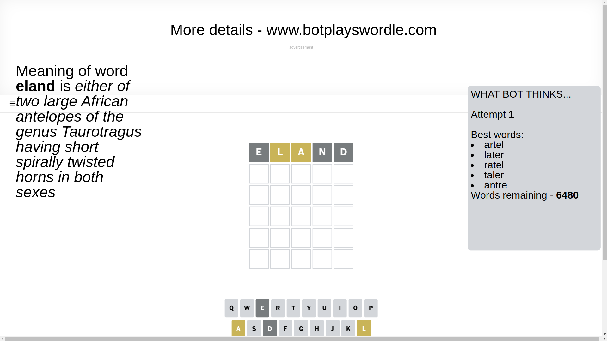
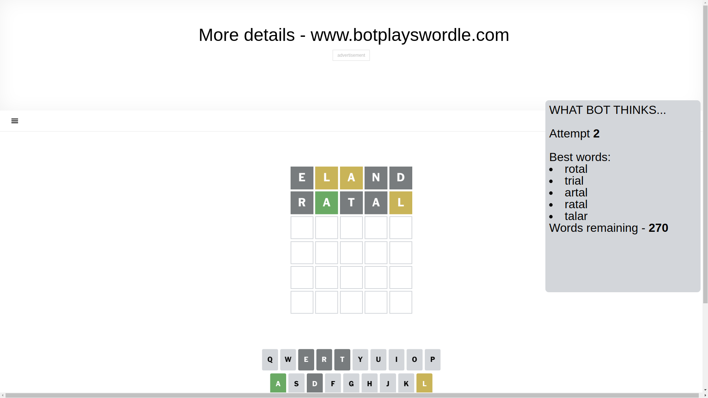
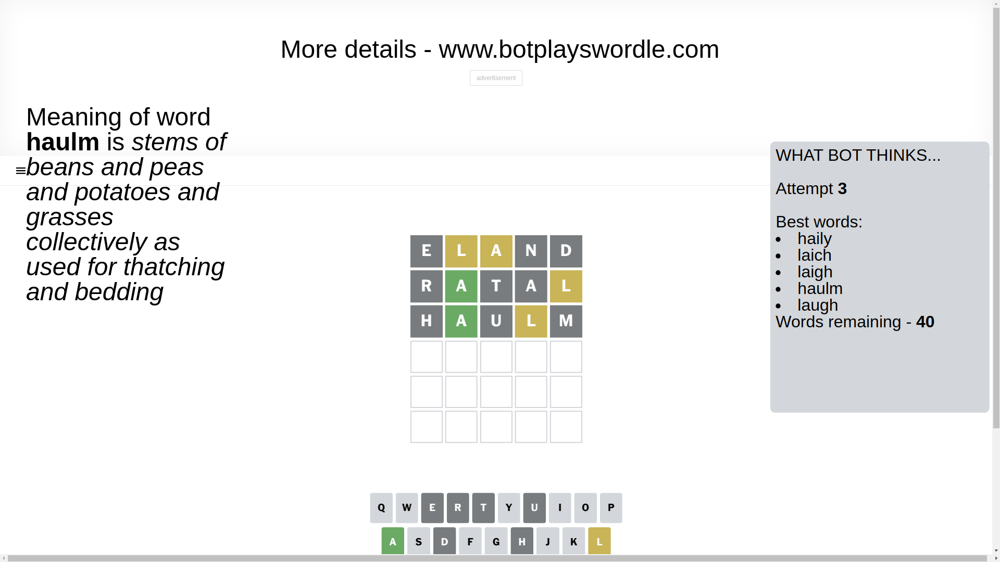
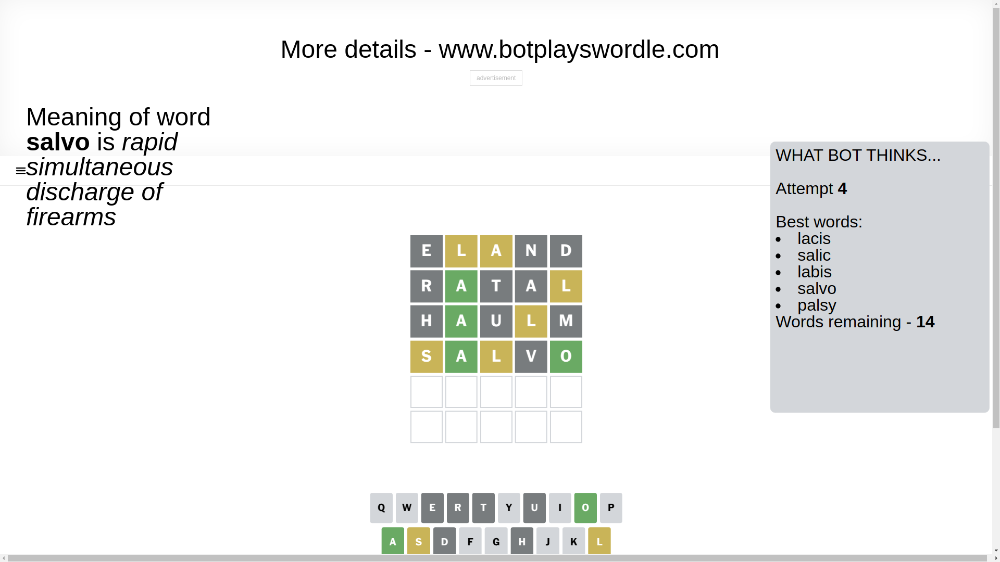
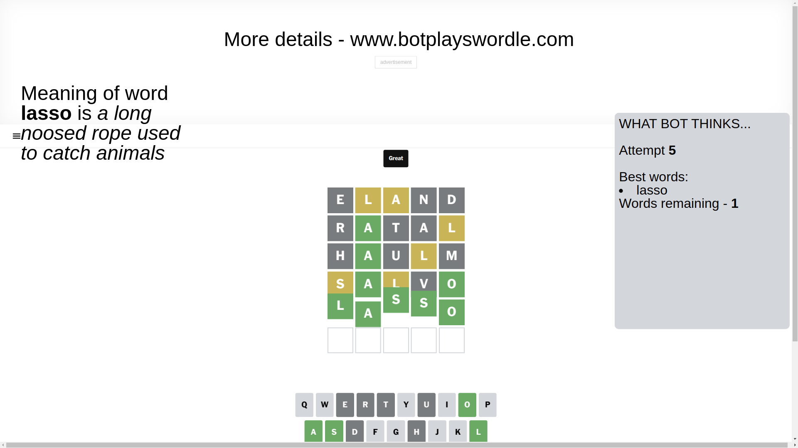

# Wordle for March 17, 2025 - \#1367

## Attempt 1

This is the first attempt and we'll choose a random word to start with.

Let's start with word `eland`

Attempt for `eland` gives us 0 correct letters, 2 present letters and 3 wrong letters.

If we look into details, we can see that:

Letter `e` is not present in the word and we will not use it any more

Letter `l` is on a different spot - this means that it cannot be at position 2

Letter `a` is on a different spot - this means that it cannot be at position 3

Letter `n` is not present in the word and we will not use it any more

Letter `d` is not present in the word and we will not use it any more

Some letters are missing (like `e`, `n`, `d`) but it's also important piece of information

Word should contain letters `[l a]`

That was a great guess that limited number of remaining words

## Attempt 2

Right now we have 270 words to choose from and best of them seem to be `[rotal trial artal ratal talar]`

So far we know that possible letters are:

At position 1: `[a b c f g h i j k l m o p q r s t u v w x y z]`

At position 2: `[a b c f g h i j k m o p q r s t u v w x y z]`

At position 3: `[b c f g h i j k l m o p q r s t u v w x y z]`

At position 4: `[a b c f g h i j k l m o p q r s t u v w x y z]`

At position 5: `[a b c f g h i j k l m o p q r s t u v w x y z]`

Next guess is `ratal`, let's see what it gives us

Attempt for `ratal` gives us 1 correct letters, 1 present letters and 3 wrong letters.

If we look into details, we can see that:

Letter `r` is not present in the word and we will not use it any more

Letter `a` should be at position 2

Letter `t` is not present in the word and we will not use it any more

Letter `a` is not present in the word and we will not use it any more

Letter `l` is on a different spot - this means that it cannot be at position 5

We got information about the correct letters and it should make next attempt easier

Some letters are missing (like `r`, `t`, `a`) but it's also important piece of information

Word should contain letters `[l a]`

Not a bad guess in general

## Attempt 3

Right now we have 40 words to choose from and best of them seem to be `[haily laich laigh haulm laugh]`

So far we know that possible letters are:

At position 1: `[b c f g h i j k l m o p q s u v w x y z]`

At position 2: `[a]`

At position 3: `[b c f g h i j k l m o p q s u v w x y z]`

At position 4: `[b c f g h i j k l m o p q s u v w x y z]`

At position 5: `[b c f g h i j k m o p q s u v w x y z]`

Next guess is `haulm`, let's see what it gives us

Attempt for `haulm` gives us 1 correct letters, 1 present letters and 3 wrong letters.

If we look into details, we can see that:

Letter `h` is not present in the word and we will not use it any more

Letter `u` is not present in the word and we will not use it any more

Letter `l` is on a different spot - this means that it cannot be at position 4

Letter `m` is not present in the word and we will not use it any more

Some letters are missing (like `h`, `u`, `m`) but it's also important piece of information

Word should contain letters `[l a]`

Could be a better guess

## Attempt 4

Right now we have 14 words to choose from and best of them seem to be `[lacis salic labis salvo palsy]`

So far we know that possible letters are:

At position 1: `[b c f g i j k l o p q s v w x y z]`

At position 2: `[a]`

At position 3: `[b c f g i j k l o p q s v w x y z]`

At position 4: `[b c f g i j k o p q s v w x y z]`

At position 5: `[b c f g i j k o p q s v w x y z]`

Next guess is `salvo`, let's see what it gives us

Attempt for `salvo` gives us 2 correct letters, 2 present letters and 1 wrong letters.

If we look into details, we can see that:

Letter `s` is on a different spot - this means that it cannot be at position 1

Letter `l` is on a different spot - this means that it cannot be at position 3

Letter `v` is not present in the word and we will not use it any more

Letter `o` should be at position 5

We got information about the correct letters and it should make next attempt easier

Some letters are missing (like `v`) but it's also important piece of information

Word should contain letters `[l a s o]`

That was a great guess that limited number of remaining words

## Attempt 5

Right now we have 1 words to choose from and best of them seem to be `[lasso]`

So far we know that possible letters are:

At position 1: `[b c f g i j k l o p q w x y z]`

At position 2: `[a]`

At position 3: `[b c f g i j k o p q s w x y z]`

At position 4: `[b c f g i j k o p q s w x y z]`

At position 5: `[o]`

It must be `lasso`

That's the correct answer! The word is `lasso`!

## Conclusion

Today's word is `lasso` and it took 5 attempts to guess it

