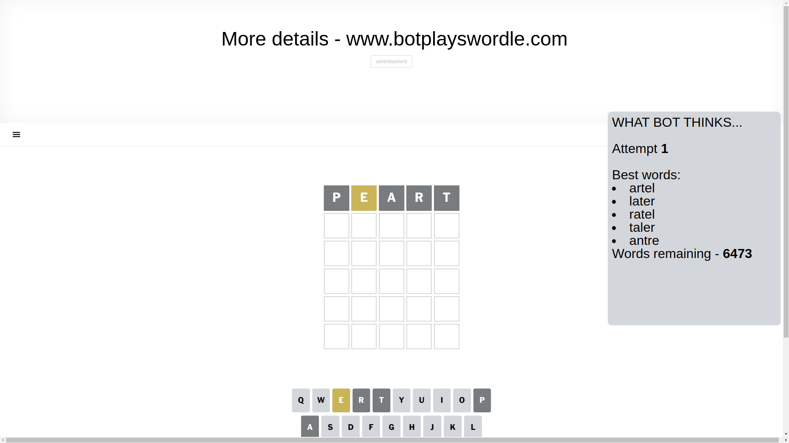
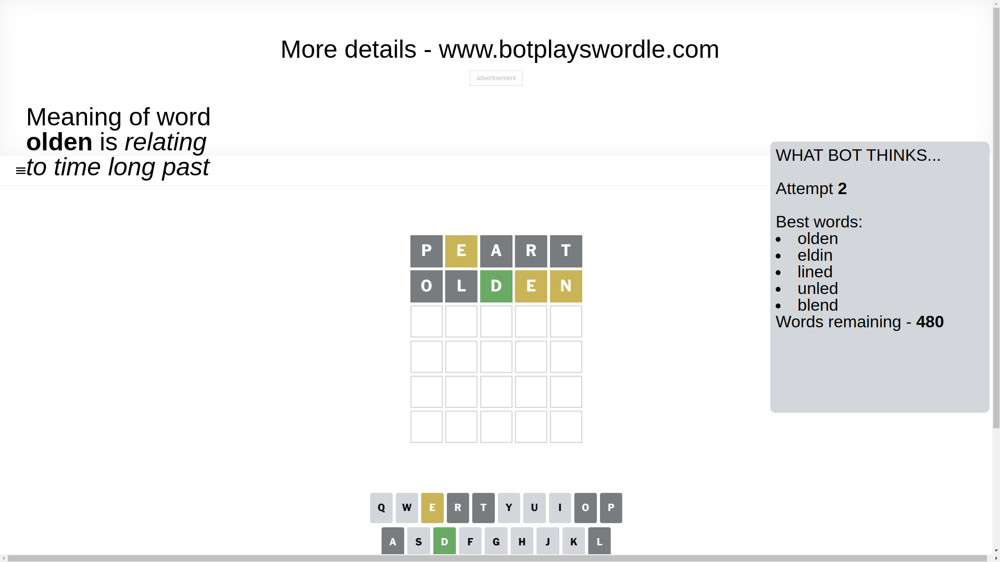
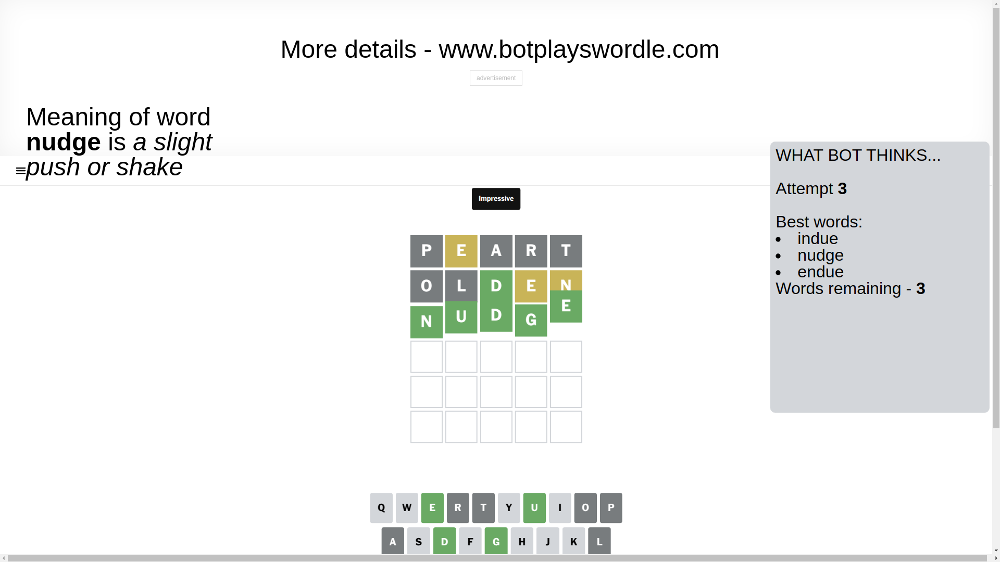

# Wordle for March 21, 2025 - \#1371

## Attempt 1

This is the first attempt and we'll choose a random word to start with.

Let's start with word `peart`

Attempt for `peart` gives us 0 correct letters, 1 present letters and 4 wrong letters.

If we look into details, we can see that:

Letter `p` is not present in the word and we will not use it any more

Letter `e` is on a different spot - this means that it cannot be at position 2

Letter `a` is not present in the word and we will not use it any more

Letter `r` is not present in the word and we will not use it any more

Letter `t` is not present in the word and we will not use it any more

Some letters are missing (like `p`, `a`, `r`, `t`) but it's also important piece of information

Word should contain letters `[e]`

That was a great guess that limited number of remaining words

## Attempt 2

Right now we have 480 words to choose from and best of them seem to be `[olden eldin lined unled blend]`

So far we know that possible letters are:

At position 1: `[b c d e f g h i j k l m n o q s u v w x y z]`

At position 2: `[b c d f g h i j k l m n o q s u v w x y z]`

At position 3: `[b c d e f g h i j k l m n o q s u v w x y z]`

At position 4: `[b c d e f g h i j k l m n o q s u v w x y z]`

At position 5: `[b c d e f g h i j k l m n o q s u v w x y z]`

Next guess is `olden`, let's see what it gives us

Attempt for `olden` gives us 1 correct letters, 2 present letters and 2 wrong letters.

If we look into details, we can see that:

Letter `o` is not present in the word and we will not use it any more

Letter `l` is not present in the word and we will not use it any more

Letter `d` should be at position 3

Letter `e` is on a different spot - this means that it cannot be at position 4

Letter `n` is on a different spot - this means that it cannot be at position 5

We got information about the correct letters and it should make next attempt easier

Some letters are missing (like `o`, `l`) but it's also important piece of information

Word should contain letters `[e d n]`

That was a great guess that limited number of remaining words

## Attempt 3

Right now we have 3 words to choose from and best of them seem to be `[indue nudge endue]`

So far we know that possible letters are:

At position 1: `[b c d e f g h i j k m n q s u v w x y z]`

At position 2: `[b c d f g h i j k m n q s u v w x y z]`

At position 3: `[d]`

At position 4: `[b c d f g h i j k m n q s u v w x y z]`

At position 5: `[b c d e f g h i j k m q s u v w x y z]`

Next guess is `nudge`, let's see what it gives us

That's the correct answer! The word is `nudge`!

## Conclusion

Today's word is `nudge` and it took 3 attempts to guess it

