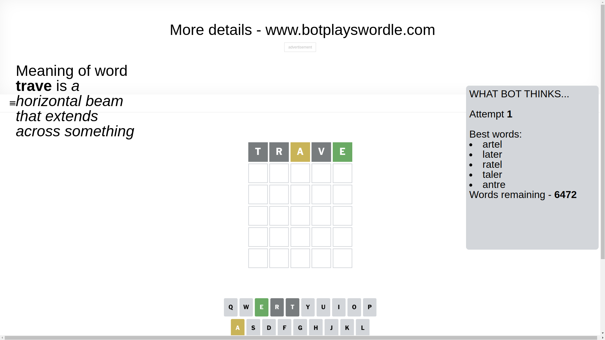
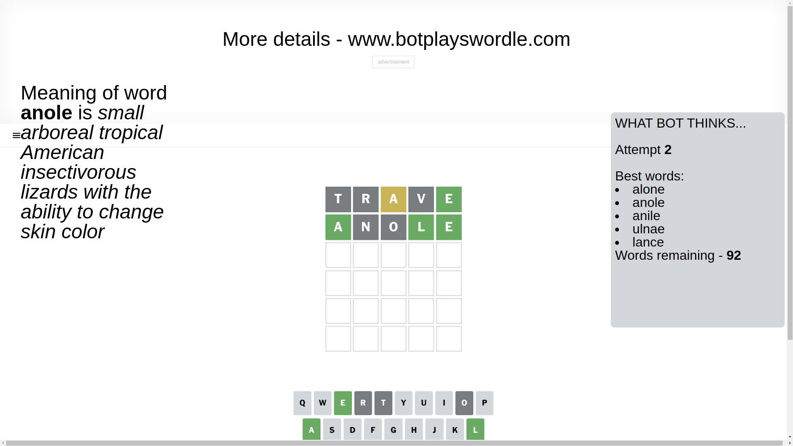
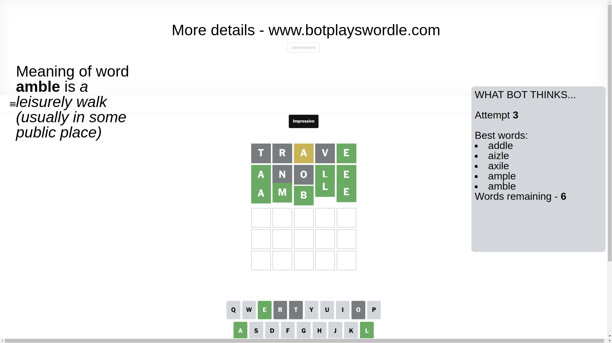

# Wordle for March 22, 2025 - \#1372

## Attempt 1

This is the first attempt and we'll choose a random word to start with.

Let's start with word `trave`

Attempt for `trave` gives us 1 correct letters, 1 present letters and 3 wrong letters.

If we look into details, we can see that:

Letter `t` is not present in the word and we will not use it any more

Letter `r` is not present in the word and we will not use it any more

Letter `a` is on a different spot - this means that it cannot be at position 3

Letter `v` is not present in the word and we will not use it any more

Letter `e` should be at position 5

We got information about the correct letters and it should make next attempt easier

Some letters are missing (like `t`, `r`, `v`) but it's also important piece of information

Word should contain letters `[a e]`

That was a great guess that limited number of remaining words

## Attempt 2

Right now we have 92 words to choose from and best of them seem to be `[alone anole anile ulnae lance]`

So far we know that possible letters are:

At position 1: `[a b c d e f g h i j k l m n o p q s u w x y z]`

At position 2: `[a b c d e f g h i j k l m n o p q s u w x y z]`

At position 3: `[b c d e f g h i j k l m n o p q s u w x y z]`

At position 4: `[a b c d e f g h i j k l m n o p q s u w x y z]`

At position 5: `[e]`

Next guess is `anole`, let's see what it gives us

Attempt for `anole` gives us 3 correct letters, 0 present letters and 2 wrong letters.

If we look into details, we can see that:

Letter `a` should be at position 1

Letter `n` is not present in the word and we will not use it any more

Letter `o` is not present in the word and we will not use it any more

Letter `l` should be at position 4

We got information about the correct letters and it should make next attempt easier

Some letters are missing (like `n`, `o`) but it's also important piece of information

Word should contain letters `[a e l]`

That was a great guess that limited number of remaining words

## Attempt 3

Right now we have 6 words to choose from and best of them seem to be `[addle aizle axile ample amble]`

So far we know that possible letters are:

At position 1: `[a]`

At position 2: `[a b c d e f g h i j k l m p q s u w x y z]`

At position 3: `[b c d e f g h i j k l m p q s u w x y z]`

At position 4: `[l]`

At position 5: `[e]`

Next guess is `amble`, let's see what it gives us

That's the correct answer! The word is `amble`!

## Conclusion

Today's word is `amble` and it took 3 attempts to guess it

