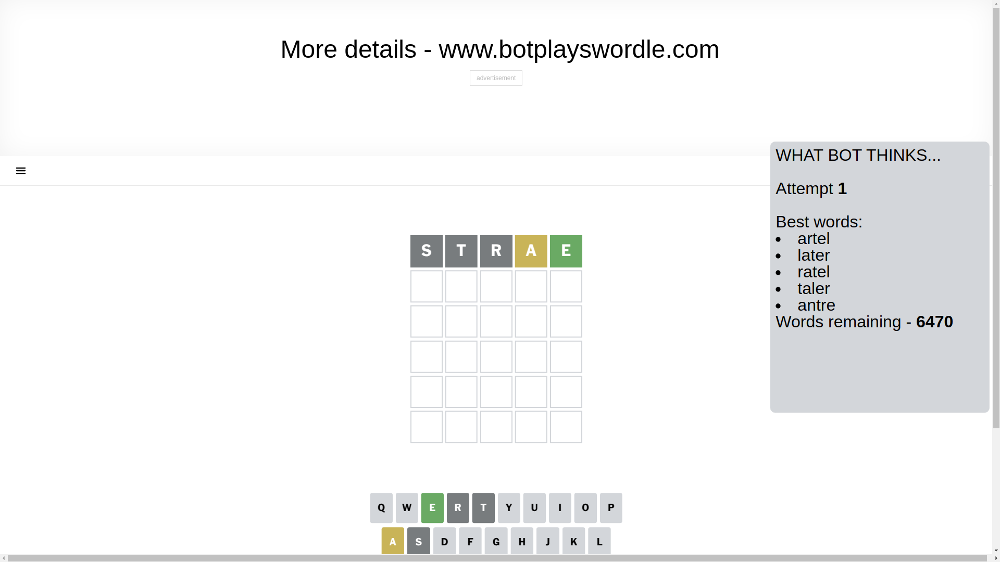
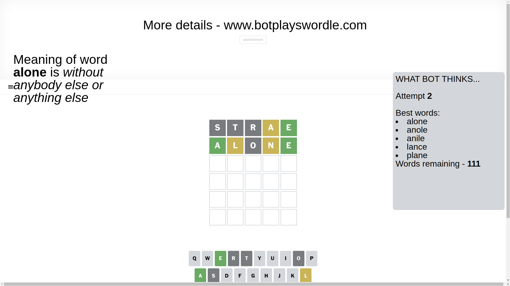
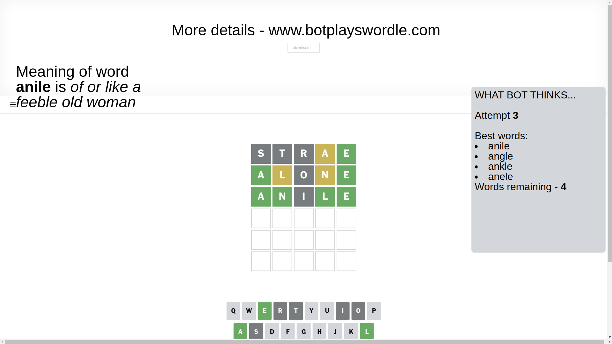
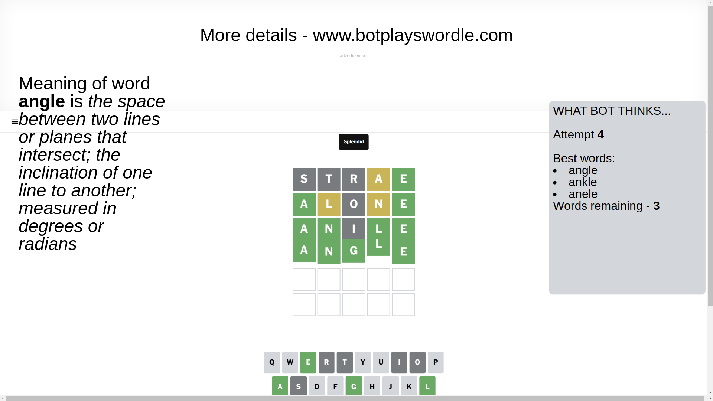

# Wordle for March 24, 2025 - \#1374

## Attempt 1

This is the first attempt and we'll choose a random word to start with.

Let's start with word `strae`

Attempt for `strae` gives us 1 correct letters, 1 present letters and 3 wrong letters.

If we look into details, we can see that:

Letter `s` is not present in the word and we will not use it any more

Letter `t` is not present in the word and we will not use it any more

Letter `r` is not present in the word and we will not use it any more

Letter `a` is on a different spot - this means that it cannot be at position 4

Letter `e` should be at position 5

We got information about the correct letters and it should make next attempt easier

Some letters are missing (like `s`, `t`, `r`) but it's also important piece of information

Word should contain letters `[a e]`

That was a great guess that limited number of remaining words

## Attempt 2

Right now we have 111 words to choose from and best of them seem to be `[alone anole anile lance plane]`

So far we know that possible letters are:

At position 1: `[a b c d e f g h i j k l m n o p q u v w x y z]`

At position 2: `[a b c d e f g h i j k l m n o p q u v w x y z]`

At position 3: `[a b c d e f g h i j k l m n o p q u v w x y z]`

At position 4: `[b c d e f g h i j k l m n o p q u v w x y z]`

At position 5: `[e]`

Next guess is `alone`, let's see what it gives us

Attempt for `alone` gives us 2 correct letters, 2 present letters and 1 wrong letters.

If we look into details, we can see that:

Letter `a` should be at position 1

Letter `l` is on a different spot - this means that it cannot be at position 2

Letter `o` is not present in the word and we will not use it any more

Letter `n` is on a different spot - this means that it cannot be at position 4

We got information about the correct letters and it should make next attempt easier

Some letters are missing (like `o`) but it's also important piece of information

Word should contain letters `[a e l n]`

That was a great guess that limited number of remaining words

## Attempt 3

Right now we have 4 words to choose from and best of them seem to be `[anile angle ankle anele]`

So far we know that possible letters are:

At position 1: `[a]`

At position 2: `[a b c d e f g h i j k m n p q u v w x y z]`

At position 3: `[a b c d e f g h i j k l m n p q u v w x y z]`

At position 4: `[b c d e f g h i j k l m p q u v w x y z]`

At position 5: `[e]`

Next guess is `anile`, let's see what it gives us

Attempt for `anile` gives us 4 correct letters, 0 present letters and 1 wrong letters.

If we look into details, we can see that:

Letter `n` should be at position 2

Letter `i` is not present in the word and we will not use it any more

Letter `l` should be at position 4

We got information about the correct letters and it should make next attempt easier

Some letters are missing (like `i`) but it's also important piece of information

Word should contain letters `[a e l n]`

This was a waste, almost no valuable information...

## Attempt 4

Right now we have 3 words to choose from and best of them seem to be `[angle ankle anele]`

So far we know that possible letters are:

At position 1: `[a]`

At position 2: `[n]`

At position 3: `[a b c d e f g h j k l m n p q u v w x y z]`

At position 4: `[l]`

At position 5: `[e]`

Next guess is `angle`, let's see what it gives us

That's the correct answer! The word is `angle`!

## Conclusion

Today's word is `angle` and it took 4 attempts to guess it

