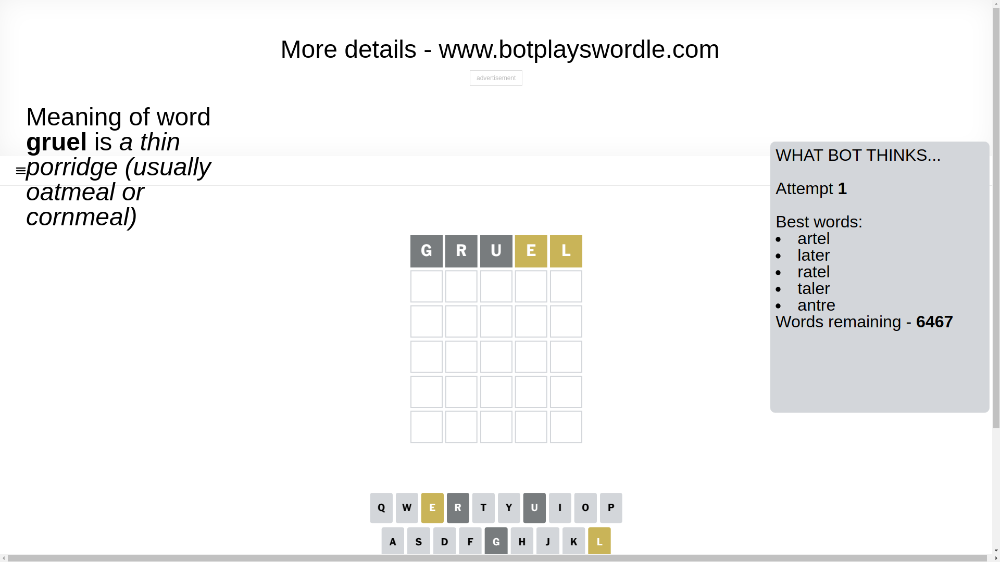
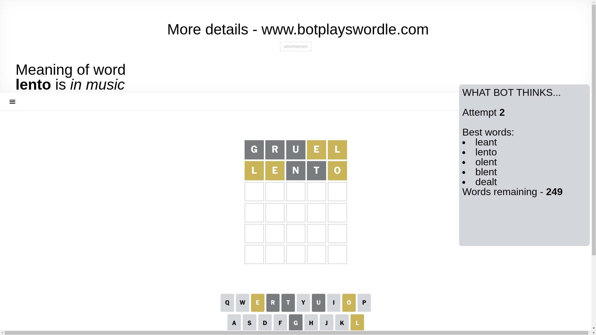
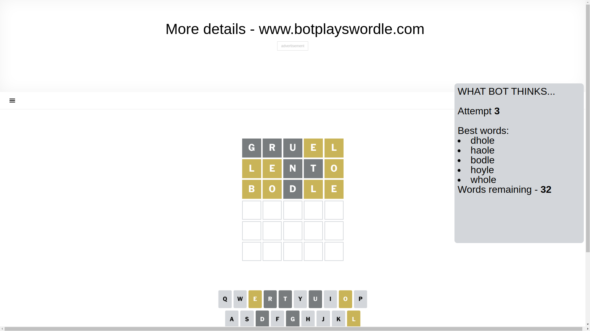
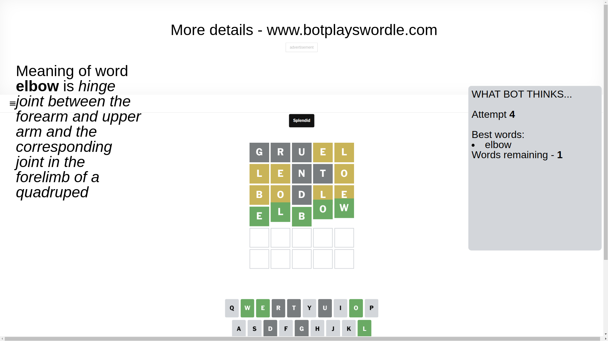

# Wordle for March 26, 2025 - \#1376

## Attempt 1

This is the first attempt and we'll choose a random word to start with.

Let's start with word `gruel`

Attempt for `gruel` gives us 0 correct letters, 2 present letters and 3 wrong letters.

If we look into details, we can see that:

Letter `g` is not present in the word and we will not use it any more

Letter `r` is not present in the word and we will not use it any more

Letter `u` is not present in the word and we will not use it any more

Letter `e` is on a different spot - this means that it cannot be at position 4

Letter `l` is on a different spot - this means that it cannot be at position 5

Some letters are missing (like `g`, `r`, `u`) but it's also important piece of information

Word should contain letters `[e l]`

That was a great guess that limited number of remaining words

## Attempt 2

Right now we have 249 words to choose from and best of them seem to be `[leant lento olent blent dealt]`

So far we know that possible letters are:

At position 1: `[a b c d e f h i j k l m n o p q s t v w x y z]`

At position 2: `[a b c d e f h i j k l m n o p q s t v w x y z]`

At position 3: `[a b c d e f h i j k l m n o p q s t v w x y z]`

At position 4: `[a b c d f h i j k l m n o p q s t v w x y z]`

At position 5: `[a b c d e f h i j k m n o p q s t v w x y z]`

Next guess is `lento`, let's see what it gives us

Attempt for `lento` gives us 0 correct letters, 3 present letters and 2 wrong letters.

If we look into details, we can see that:

Letter `l` is on a different spot - this means that it cannot be at position 1

Letter `e` is on a different spot - this means that it cannot be at position 2

Letter `n` is not present in the word and we will not use it any more

Letter `t` is not present in the word and we will not use it any more

Letter `o` is on a different spot - this means that it cannot be at position 5

Some letters are missing (like `n`, `t`) but it's also important piece of information

Word should contain letters `[e l o]`

Not a bad guess in general

## Attempt 3

Right now we have 32 words to choose from and best of them seem to be `[dhole haole bodle hoyle whole]`

So far we know that possible letters are:

At position 1: `[a b c d e f h i j k m o p q s v w x y z]`

At position 2: `[a b c d f h i j k l m o p q s v w x y z]`

At position 3: `[a b c d e f h i j k l m o p q s v w x y z]`

At position 4: `[a b c d f h i j k l m o p q s v w x y z]`

At position 5: `[a b c d e f h i j k m p q s v w x y z]`

Next guess is `bodle`, let's see what it gives us

Attempt for `bodle` gives us 0 correct letters, 4 present letters and 1 wrong letters.

If we look into details, we can see that:

Letter `b` is on a different spot - this means that it cannot be at position 1

Letter `o` is on a different spot - this means that it cannot be at position 2

Letter `d` is not present in the word and we will not use it any more

Letter `l` is on a different spot - this means that it cannot be at position 4

Letter `e` is on a different spot - this means that it cannot be at position 5

Some letters are missing (like `d`) but it's also important piece of information

Word should contain letters `[e l o b]`

That was a great guess that limited number of remaining words

## Attempt 4

Right now we have 1 words to choose from and best of them seem to be `[elbow]`

So far we know that possible letters are:

At position 1: `[a c e f h i j k m o p q s v w x y z]`

At position 2: `[a b c f h i j k l m p q s v w x y z]`

At position 3: `[a b c e f h i j k l m o p q s v w x y z]`

At position 4: `[a b c f h i j k m o p q s v w x y z]`

At position 5: `[a b c f h i j k m p q s v w x y z]`

It must be `elbow`

That's the correct answer! The word is `elbow`!

## Conclusion

Today's word is `elbow` and it took 4 attempts to guess it

