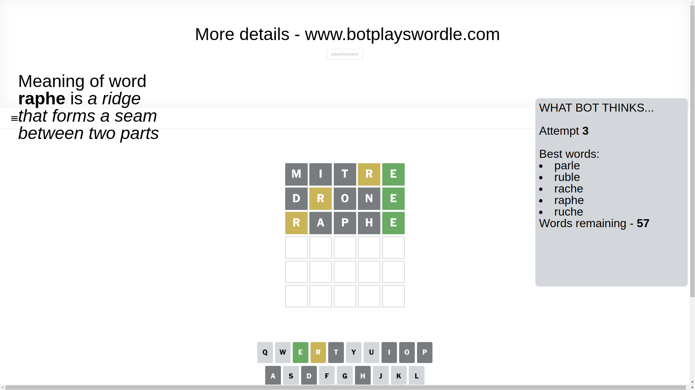

# Wordle for March 28, 2025 - \#1378

## Attempt 1

This is the first attempt and we'll choose a random word to start with.

Let's start with word `mitre`

Attempt for `mitre` gives us 1 correct letters, 1 present letters and 3 wrong letters.

If we look into details, we can see that:

Letter `m` is not present in the word and we will not use it any more

Letter `i` is not present in the word and we will not use it any more

Letter `t` is not present in the word and we will not use it any more

Letter `r` is on a different spot - this means that it cannot be at position 4

Letter `e` should be at position 5

We got information about the correct letters and it should make next attempt easier

Some letters are missing (like `m`, `i`, `t`) but it's also important piece of information

Word should contain letters `[r e]`

That was a great guess that limited number of remaining words

## Attempt 2

Right now we have 132 words to choose from and best of them seem to be `[drone ronde parle rance roble]`

So far we know that possible letters are:

At position 1: `[a b c d e f g h j k l n o p q r s u v w x y z]`

At position 2: `[a b c d e f g h j k l n o p q r s u v w x y z]`

At position 3: `[a b c d e f g h j k l n o p q r s u v w x y z]`

At position 4: `[a b c d e f g h j k l n o p q s u v w x y z]`

At position 5: `[e]`

Next guess is `drone`, let's see what it gives us

Attempt for `drone` gives us 1 correct letters, 1 present letters and 3 wrong letters.

If we look into details, we can see that:

Letter `d` is not present in the word and we will not use it any more

Letter `r` is on a different spot - this means that it cannot be at position 2

Letter `o` is not present in the word and we will not use it any more

Letter `n` is not present in the word and we will not use it any more

Some letters are missing (like `d`, `o`, `n`) but it's also important piece of information

Word should contain letters `[r e]`

Could be a better guess

## Attempt 3

Right now we have 57 words to choose from and best of them seem to be `[parle ruble rache raphe ruche]`

So far we know that possible letters are:

At position 1: `[a b c e f g h j k l p q r s u v w x y z]`

At position 2: `[a b c e f g h j k l p q s u v w x y z]`

At position 3: `[a b c e f g h j k l p q r s u v w x y z]`

At position 4: `[a b c e f g h j k l p q s u v w x y z]`

At position 5: `[e]`

Next guess is `raphe`, let's see what it gives us

Attempt for `raphe` gives us 1 correct letters, 1 present letters and 3 wrong letters.

If we look into details, we can see that:

Letter `r` is on a different spot - this means that it cannot be at position 1

Letter `a` is not present in the word and we will not use it any more

Letter `p` is not present in the word and we will not use it any more

Letter `h` is not present in the word and we will not use it any more

Some letters are missing (like `a`, `p`, `h`) but it's also important piece of information

Word should contain letters `[r e]`

Not a bad guess in general

## Attempt 4

Right now we have 12 words to choose from and best of them seem to be `[curse burse surge burke curve]`

So far we know that possible letters are:

At position 1: `[b c e f g j k l q s u v w x y z]`

At position 2: `[b c e f g j k l q s u v w x y z]`

At position 3: `[b c e f g j k l q r s u v w x y z]`

At position 4: `[b c e f g j k l q s u v w x y z]`

At position 5: `[e]`

Next guess is `curse`, let's see what it gives us

Attempt for `curse` gives us 3 correct letters, 0 present letters and 2 wrong letters.

If we look into details, we can see that:

Letter `c` is not present in the word and we will not use it any more

Letter `u` is not present in the word and we will not use it any more

Letter `r` should be at position 3

Letter `s` should be at position 4

We got information about the correct letters and it should make next attempt easier

Some letters are missing (like `c`, `u`) but it's also important piece of information

Word should contain letters `[r e s]`

That was a great guess that limited number of remaining words

## Attempt 5

Right now we have 1 words to choose from and best of them seem to be `[verse]`

So far we know that possible letters are:

At position 1: `[b e f g j k l q s v w x y z]`

At position 2: `[b e f g j k l q s v w x y z]`

At position 3: `[r]`

At position 4: `[s]`

At position 5: `[e]`

It must be `verse`

That's the correct answer! The word is `verse`!

## Conclusion

Today's word is `verse` and it took 5 attempts to guess it

