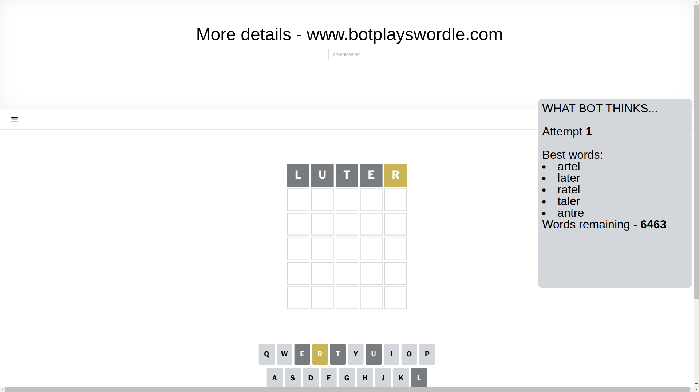
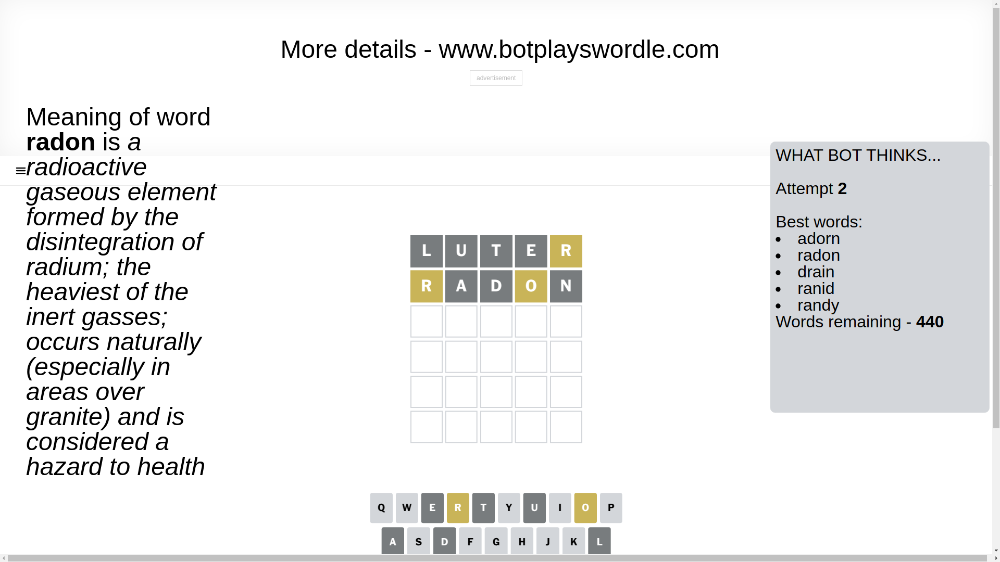
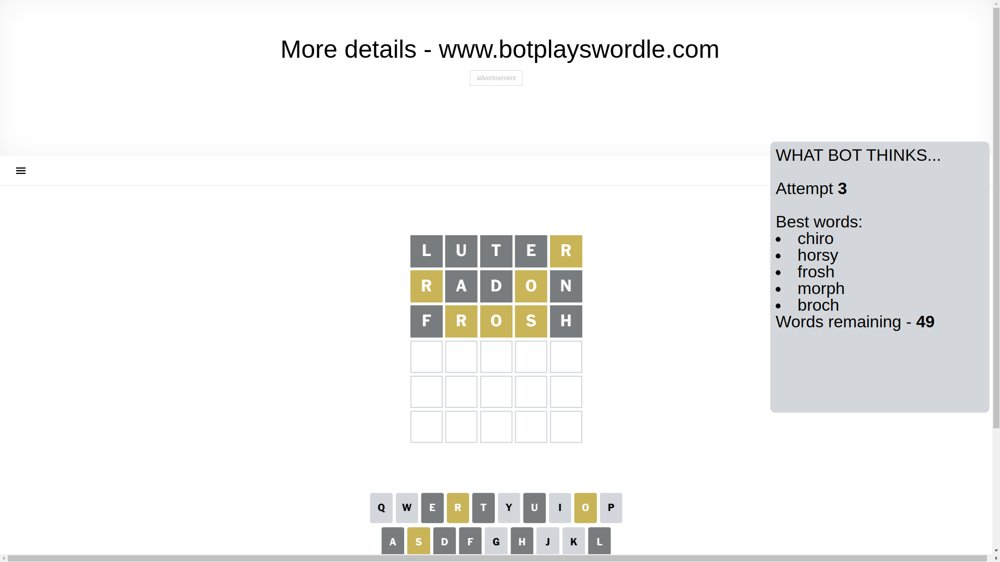
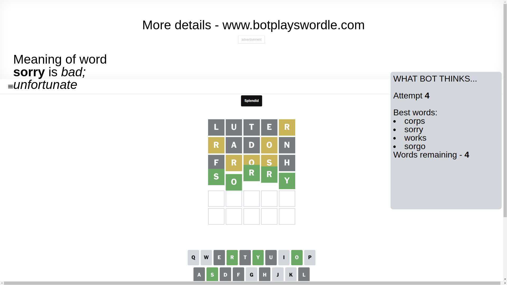

# Wordle for March 29, 2025 - \#1379

## Attempt 1

This is the first attempt and we'll choose a random word to start with.

Let's start with word `luter`

Attempt for `luter` gives us 0 correct letters, 1 present letters and 4 wrong letters.

If we look into details, we can see that:

Letter `l` is not present in the word and we will not use it any more

Letter `u` is not present in the word and we will not use it any more

Letter `t` is not present in the word and we will not use it any more

Letter `e` is not present in the word and we will not use it any more

Letter `r` is on a different spot - this means that it cannot be at position 5

Some letters are missing (like `l`, `u`, `t`, `e`) but it's also important piece of information

Word should contain letters `[r]`

That was a great guess that limited number of remaining words

## Attempt 2

Right now we have 440 words to choose from and best of them seem to be `[adorn radon drain ranid randy]`

So far we know that possible letters are:

At position 1: `[a b c d f g h i j k m n o p q r s v w x y z]`

At position 2: `[a b c d f g h i j k m n o p q r s v w x y z]`

At position 3: `[a b c d f g h i j k m n o p q r s v w x y z]`

At position 4: `[a b c d f g h i j k m n o p q r s v w x y z]`

At position 5: `[a b c d f g h i j k m n o p q s v w x y z]`

Next guess is `radon`, let's see what it gives us

Attempt for `radon` gives us 0 correct letters, 2 present letters and 3 wrong letters.

If we look into details, we can see that:

Letter `r` is on a different spot - this means that it cannot be at position 1

Letter `a` is not present in the word and we will not use it any more

Letter `d` is not present in the word and we will not use it any more

Letter `o` is on a different spot - this means that it cannot be at position 4

Letter `n` is not present in the word and we will not use it any more

Some letters are missing (like `a`, `d`, `n`) but it's also important piece of information

Word should contain letters `[r o]`

That was a great guess that limited number of remaining words

## Attempt 3

Right now we have 49 words to choose from and best of them seem to be `[chiro horsy frosh morph broch]`

So far we know that possible letters are:

At position 1: `[b c f g h i j k m o p q s v w x y z]`

At position 2: `[b c f g h i j k m o p q r s v w x y z]`

At position 3: `[b c f g h i j k m o p q r s v w x y z]`

At position 4: `[b c f g h i j k m p q r s v w x y z]`

At position 5: `[b c f g h i j k m o p q s v w x y z]`

Next guess is `frosh`, let's see what it gives us

Attempt for `frosh` gives us 0 correct letters, 3 present letters and 2 wrong letters.

If we look into details, we can see that:

Letter `f` is not present in the word and we will not use it any more

Letter `r` is on a different spot - this means that it cannot be at position 2

Letter `o` is on a different spot - this means that it cannot be at position 3

Letter `s` is on a different spot - this means that it cannot be at position 4

Letter `h` is not present in the word and we will not use it any more

Some letters are missing (like `f`, `h`) but it's also important piece of information

Word should contain letters `[r o s]`

That was a great guess that limited number of remaining words

## Attempt 4

Right now we have 4 words to choose from and best of them seem to be `[corps sorry works sorgo]`

So far we know that possible letters are:

At position 1: `[b c g i j k m o p q s v w x y z]`

At position 2: `[b c g i j k m o p q s v w x y z]`

At position 3: `[b c g i j k m p q r s v w x y z]`

At position 4: `[b c g i j k m p q r v w x y z]`

At position 5: `[b c g i j k m o p q s v w x y z]`

Next guess is `sorry`, let's see what it gives us

That's the correct answer! The word is `sorry`!

## Conclusion

Today's word is `sorry` and it took 4 attempts to guess it

