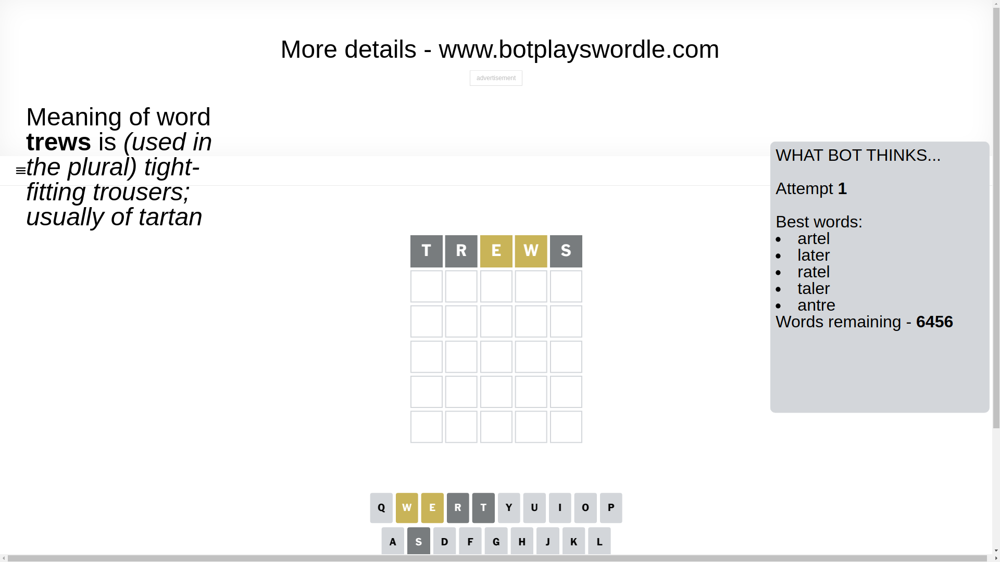

# Wordle for April 1, 2025 - \#1382

## Attempt 1

This is the first attempt and we'll choose a random word to start with.

Let's start with word `trews`

Attempt for `trews` gives us 0 correct letters, 2 present letters and 3 wrong letters.

If we look into details, we can see that:

Letter `t` is not present in the word and we will not use it any more

Letter `r` is not present in the word and we will not use it any more

Letter `e` is on a different spot - this means that it cannot be at position 3

Letter `w` is on a different spot - this means that it cannot be at position 4

Letter `s` is not present in the word and we will not use it any more

Some letters are missing (like `t`, `r`, `s`) but it's also important piece of information

Word should contain letters `[e w]`

That was a great guess that limited number of remaining words

## Attempt 2

Right now we have 74 words to choose from and best of them seem to be `[wanle nowel newly newel dwale]`

So far we know that possible letters are:

At position 1: `[a b c d e f g h i j k l m n o p q u v w x y z]`

At position 2: `[a b c d e f g h i j k l m n o p q u v w x y z]`

At position 3: `[a b c d f g h i j k l m n o p q u v w x y z]`

At position 4: `[a b c d e f g h i j k l m n o p q u v x y z]`

At position 5: `[a b c d e f g h i j k l m n o p q u v w x y z]`

Next guess is `wanle`, let's see what it gives us

Attempt for `wanle` gives us 0 correct letters, 3 present letters and 2 wrong letters.

If we look into details, we can see that:

Letter `w` is on a different spot - this means that it cannot be at position 1

Letter `a` is not present in the word and we will not use it any more

Letter `n` is not present in the word and we will not use it any more

Letter `l` is on a different spot - this means that it cannot be at position 4

Letter `e` is on a different spot - this means that it cannot be at position 5

Some letters are missing (like `a`, `n`) but it's also important piece of information

Word should contain letters `[e w l]`

That was a great guess that limited number of remaining words

## Attempt 3

Right now we have 4 words to choose from and best of them seem to be `[dowel bowel vowel jewel]`

So far we know that possible letters are:

At position 1: `[b c d e f g h i j k l m o p q u v x y z]`

At position 2: `[b c d e f g h i j k l m o p q u v w x y z]`

At position 3: `[b c d f g h i j k l m o p q u v w x y z]`

At position 4: `[b c d e f g h i j k m o p q u v x y z]`

At position 5: `[b c d f g h i j k l m o p q u v w x y z]`

Next guess is `bowel`, let's see what it gives us

Attempt for `bowel` gives us 3 correct letters, 0 present letters and 2 wrong letters.

If we look into details, we can see that:

Letter `b` is not present in the word and we will not use it any more

Letter `o` is not present in the word and we will not use it any more

Letter `w` should be at position 3

Letter `e` should be at position 4

Letter `l` should be at position 5

We got information about the correct letters and it should make next attempt easier

Some letters are missing (like `b`, `o`) but it's also important piece of information

Word should contain letters `[e w l]`

Could be a better guess

## Attempt 4

Right now we have 1 words to choose from and best of them seem to be `[jewel]`

So far we know that possible letters are:

At position 1: `[c d e f g h i j k l m p q u v x y z]`

At position 2: `[c d e f g h i j k l m p q u v w x y z]`

At position 3: `[w]`

At position 4: `[e]`

At position 5: `[l]`

It must be `jewel`

That's the correct answer! The word is `jewel`!

## Conclusion

Today's word is `jewel` and it took 4 attempts to guess it

