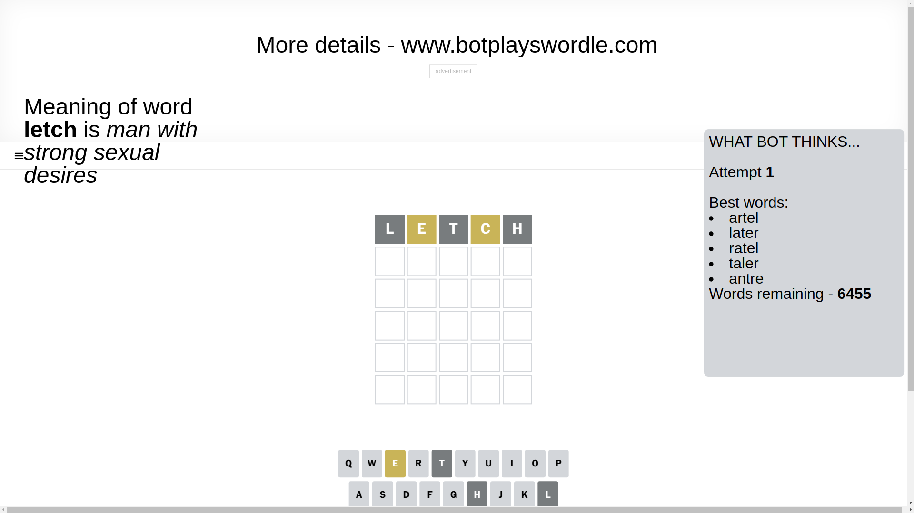
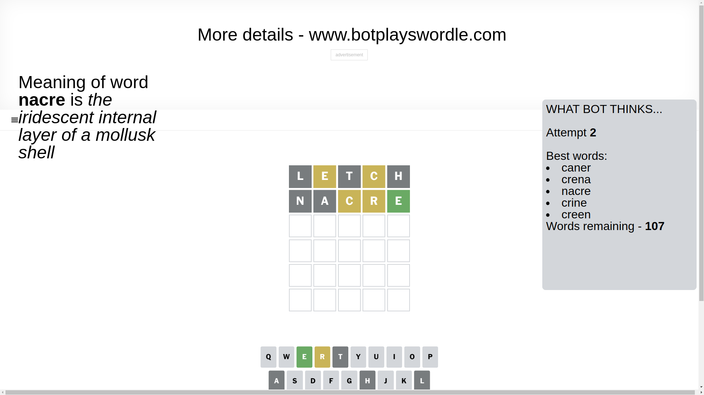
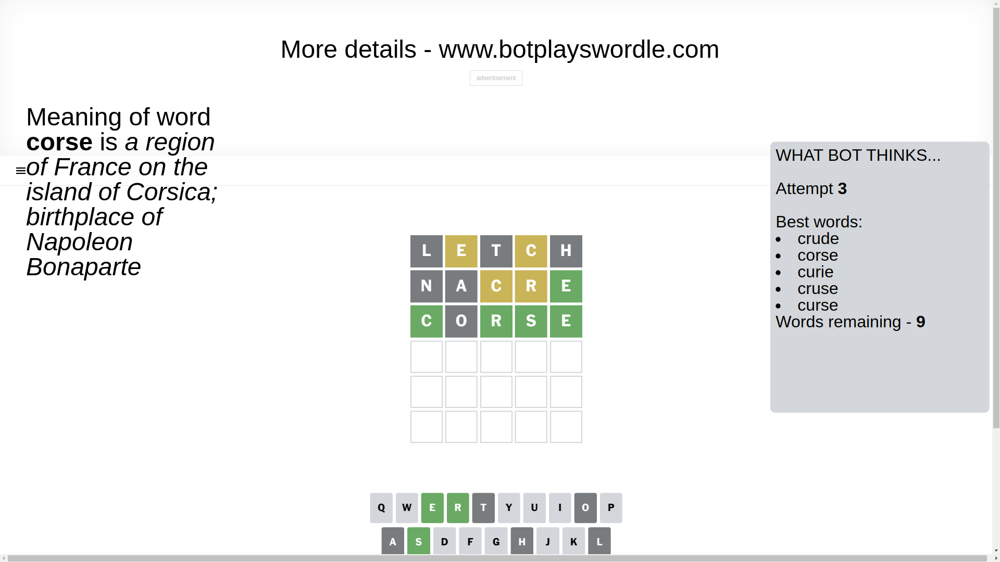
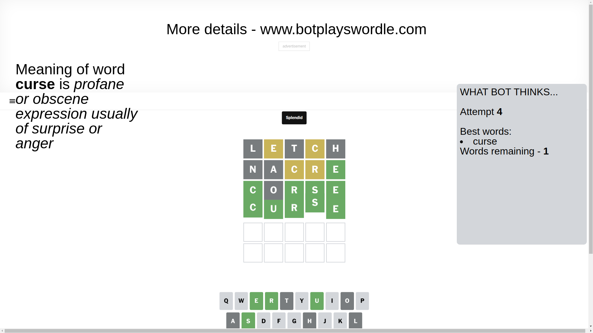

# Wordle for April 2, 2025 - \#1383

## Attempt 1

This is the first attempt and we'll choose a random word to start with.

Let's start with word `letch`

Attempt for `letch` gives us 0 correct letters, 2 present letters and 3 wrong letters.

If we look into details, we can see that:

Letter `l` is not present in the word and we will not use it any more

Letter `e` is on a different spot - this means that it cannot be at position 2

Letter `t` is not present in the word and we will not use it any more

Letter `c` is on a different spot - this means that it cannot be at position 4

Letter `h` is not present in the word and we will not use it any more

Some letters are missing (like `l`, `t`, `h`) but it's also important piece of information

Word should contain letters `[e c]`

That was a great guess that limited number of remaining words

## Attempt 2

Right now we have 107 words to choose from and best of them seem to be `[caner crena nacre crine creen]`

So far we know that possible letters are:

At position 1: `[a b c d e f g i j k m n o p q r s u v w x y z]`

At position 2: `[a b c d f g i j k m n o p q r s u v w x y z]`

At position 3: `[a b c d e f g i j k m n o p q r s u v w x y z]`

At position 4: `[a b d e f g i j k m n o p q r s u v w x y z]`

At position 5: `[a b c d e f g i j k m n o p q r s u v w x y z]`

Next guess is `nacre`, let's see what it gives us

Attempt for `nacre` gives us 1 correct letters, 2 present letters and 2 wrong letters.

If we look into details, we can see that:

Letter `n` is not present in the word and we will not use it any more

Letter `a` is not present in the word and we will not use it any more

Letter `c` is on a different spot - this means that it cannot be at position 3

Letter `r` is on a different spot - this means that it cannot be at position 4

Letter `e` should be at position 5

We got information about the correct letters and it should make next attempt easier

Some letters are missing (like `n`, `a`) but it's also important piece of information

Word should contain letters `[e c r]`

That was a great guess that limited number of remaining words

## Attempt 3

Right now we have 9 words to choose from and best of them seem to be `[crude corse curie cruse curse]`

So far we know that possible letters are:

At position 1: `[b c d e f g i j k m o p q r s u v w x y z]`

At position 2: `[b c d f g i j k m o p q r s u v w x y z]`

At position 3: `[b d e f g i j k m o p q r s u v w x y z]`

At position 4: `[b d e f g i j k m o p q s u v w x y z]`

At position 5: `[e]`

Next guess is `corse`, let's see what it gives us

Attempt for `corse` gives us 4 correct letters, 0 present letters and 1 wrong letters.

If we look into details, we can see that:

Letter `c` should be at position 1

Letter `o` is not present in the word and we will not use it any more

Letter `r` should be at position 3

Letter `s` should be at position 4

We got information about the correct letters and it should make next attempt easier

Some letters are missing (like `o`) but it's also important piece of information

Word should contain letters `[e c r s]`

That was a great guess that limited number of remaining words

## Attempt 4

Right now we have 1 words to choose from and best of them seem to be `[curse]`

So far we know that possible letters are:

At position 1: `[c]`

At position 2: `[b c d f g i j k m p q r s u v w x y z]`

At position 3: `[r]`

At position 4: `[s]`

At position 5: `[e]`

It must be `curse`

That's the correct answer! The word is `curse`!

## Conclusion

Today's word is `curse` and it took 4 attempts to guess it

