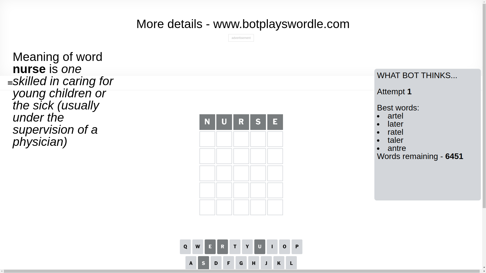
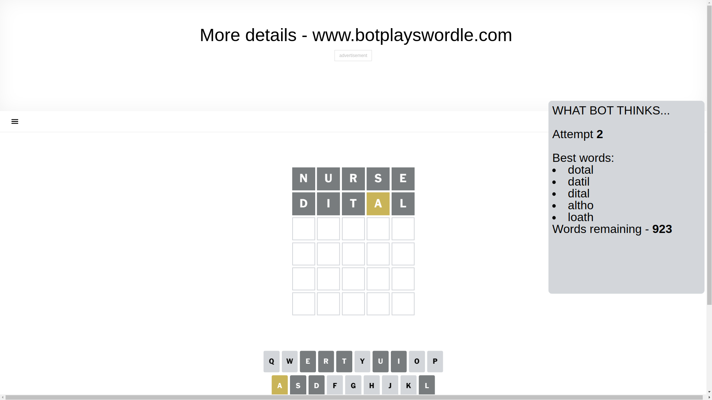
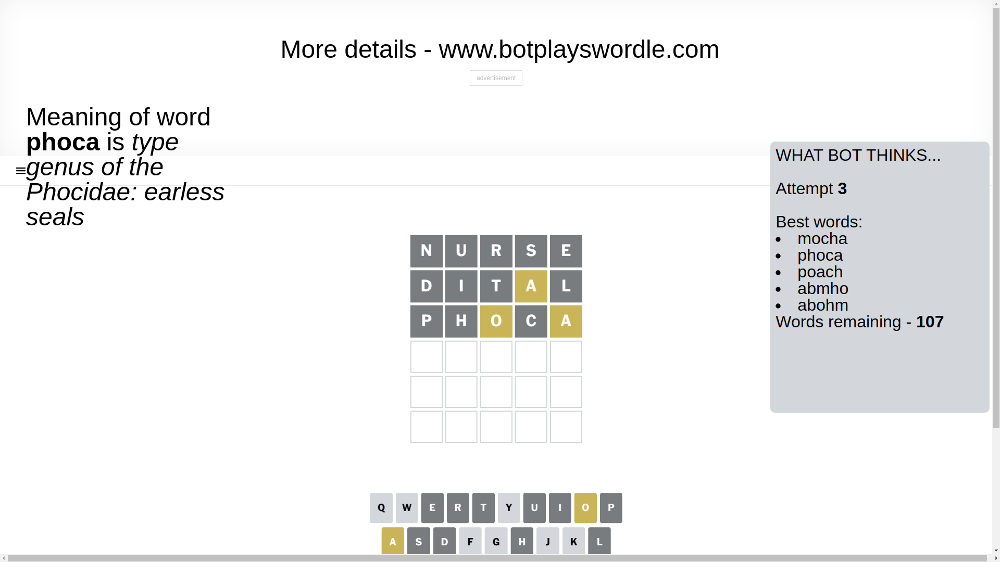
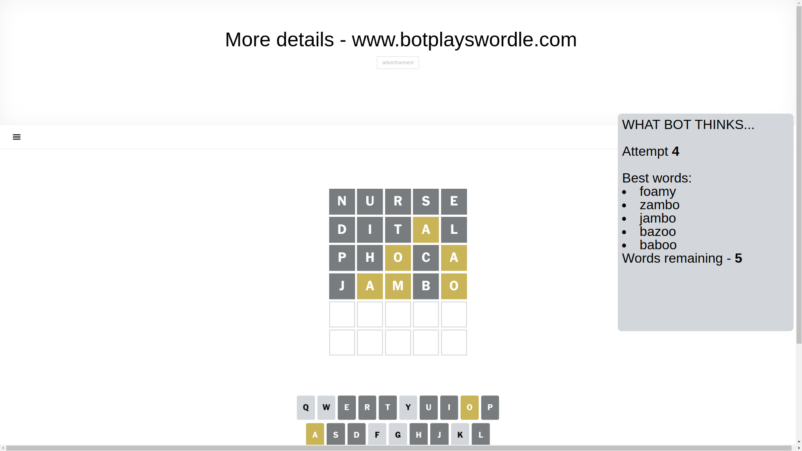
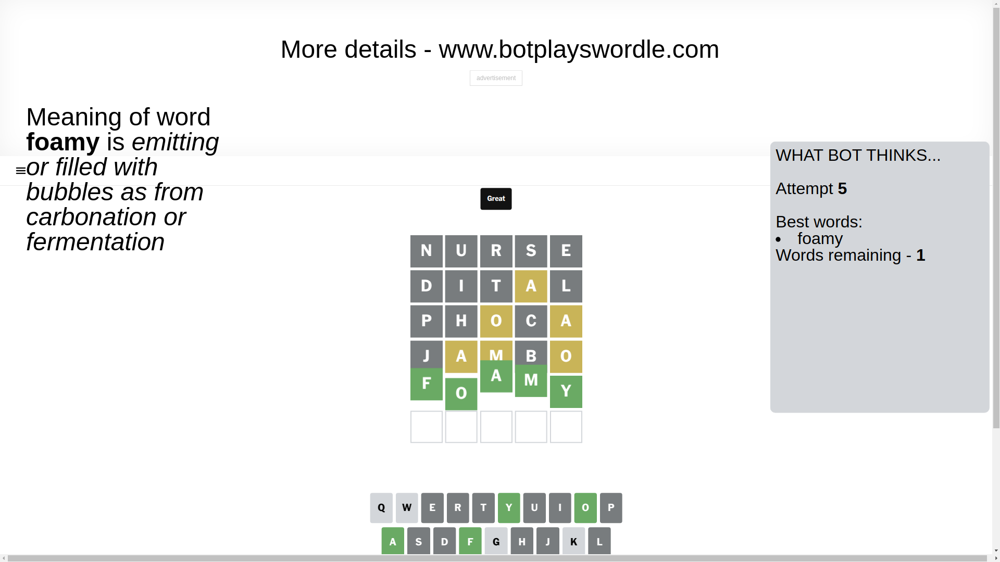

# Wordle for April 5, 2025 - \#1386

## Attempt 1

This is the first attempt and we'll choose a random word to start with.

Let's start with word `nurse`

Attempt for `nurse` gives us 0 correct letters, 0 present letters and 5 wrong letters.

If we look into details, we can see that:

Letter `n` is not present in the word and we will not use it any more

Letter `u` is not present in the word and we will not use it any more

Letter `r` is not present in the word and we will not use it any more

Letter `s` is not present in the word and we will not use it any more

Letter `e` is not present in the word and we will not use it any more

Some letters are missing (like `n`, `u`, `r`, `s`, `e`) but it's also important piece of information

So far we don't know any of the letters!

Not a bad guess in general

## Attempt 2

Right now we have 923 words to choose from and best of them seem to be `[dotal datil dital altho loath]`

So far we know that possible letters are:

At position 1: `[a b c d f g h i j k l m o p q t v w x y z]`

At position 2: `[a b c d f g h i j k l m o p q t v w x y z]`

At position 3: `[a b c d f g h i j k l m o p q t v w x y z]`

At position 4: `[a b c d f g h i j k l m o p q t v w x y z]`

At position 5: `[a b c d f g h i j k l m o p q t v w x y z]`

Next guess is `dital`, let's see what it gives us

Attempt for `dital` gives us 0 correct letters, 1 present letters and 4 wrong letters.

If we look into details, we can see that:

Letter `d` is not present in the word and we will not use it any more

Letter `i` is not present in the word and we will not use it any more

Letter `t` is not present in the word and we will not use it any more

Letter `a` is on a different spot - this means that it cannot be at position 4

Letter `l` is not present in the word and we will not use it any more

Some letters are missing (like `d`, `i`, `t`, `l`) but it's also important piece of information

Word should contain letters `[a]`

That was a great guess that limited number of remaining words

## Attempt 3

Right now we have 107 words to choose from and best of them seem to be `[mocha phoca poach abmho abohm]`

So far we know that possible letters are:

At position 1: `[a b c f g h j k m o p q v w x y z]`

At position 2: `[a b c f g h j k m o p q v w x y z]`

At position 3: `[a b c f g h j k m o p q v w x y z]`

At position 4: `[b c f g h j k m o p q v w x y z]`

At position 5: `[a b c f g h j k m o p q v w x y z]`

Next guess is `phoca`, let's see what it gives us

Attempt for `phoca` gives us 0 correct letters, 2 present letters and 3 wrong letters.

If we look into details, we can see that:

Letter `p` is not present in the word and we will not use it any more

Letter `h` is not present in the word and we will not use it any more

Letter `o` is on a different spot - this means that it cannot be at position 3

Letter `c` is not present in the word and we will not use it any more

Letter `a` is on a different spot - this means that it cannot be at position 5

Some letters are missing (like `p`, `h`, `c`) but it's also important piece of information

Word should contain letters `[a o]`

That was a great guess that limited number of remaining words

## Attempt 4

Right now we have 5 words to choose from and best of them seem to be `[foamy zambo jambo bazoo baboo]`

So far we know that possible letters are:

At position 1: `[a b f g j k m o q v w x y z]`

At position 2: `[a b f g j k m o q v w x y z]`

At position 3: `[a b f g j k m q v w x y z]`

At position 4: `[b f g j k m o q v w x y z]`

At position 5: `[b f g j k m o q v w x y z]`

Next guess is `jambo`, let's see what it gives us

Attempt for `jambo` gives us 0 correct letters, 3 present letters and 2 wrong letters.

If we look into details, we can see that:

Letter `j` is not present in the word and we will not use it any more

Letter `a` is on a different spot - this means that it cannot be at position 2

Letter `m` is on a different spot - this means that it cannot be at position 3

Letter `b` is not present in the word and we will not use it any more

Letter `o` is on a different spot - this means that it cannot be at position 5

Some letters are missing (like `j`, `b`) but it's also important piece of information

Word should contain letters `[a o m]`

Not a bad guess in general

## Attempt 5

Right now we have 1 words to choose from and best of them seem to be `[foamy]`

So far we know that possible letters are:

At position 1: `[a f g k m o q v w x y z]`

At position 2: `[f g k m o q v w x y z]`

At position 3: `[a f g k q v w x y z]`

At position 4: `[f g k m o q v w x y z]`

At position 5: `[f g k m q v w x y z]`

It must be `foamy`

That's the correct answer! The word is `foamy`!

## Conclusion

Today's word is `foamy` and it took 5 attempts to guess it

