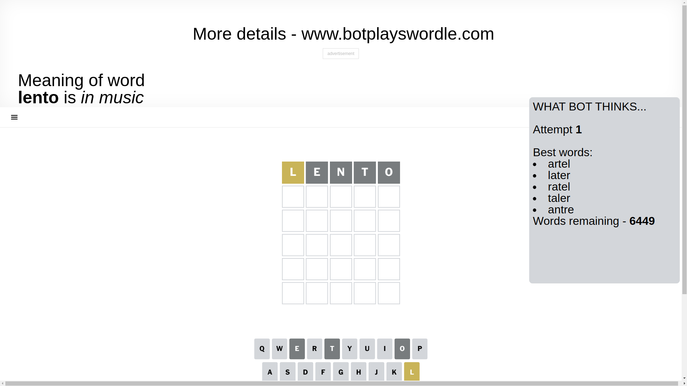
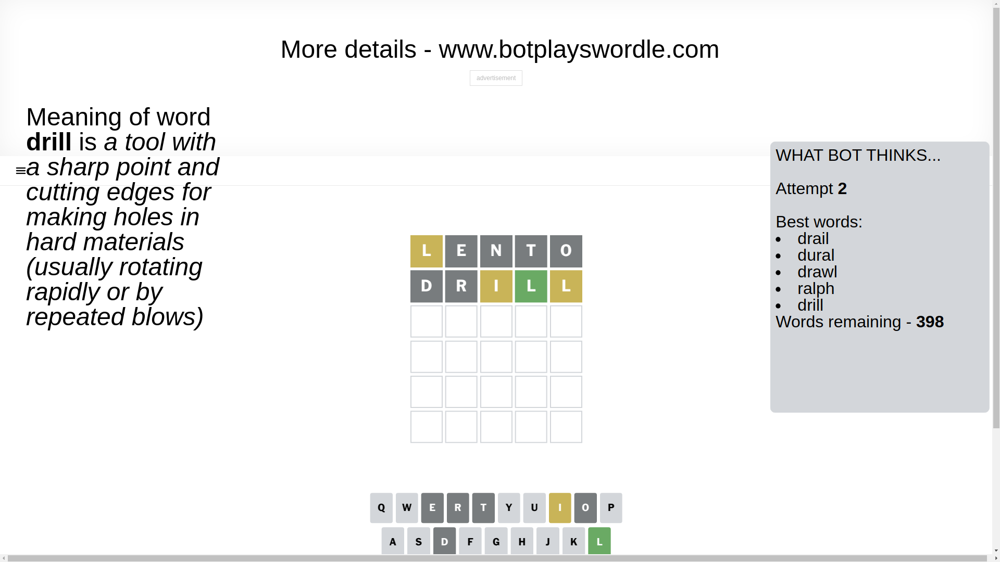
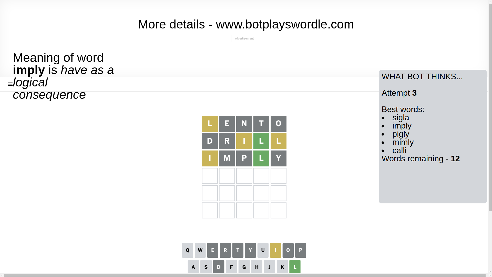
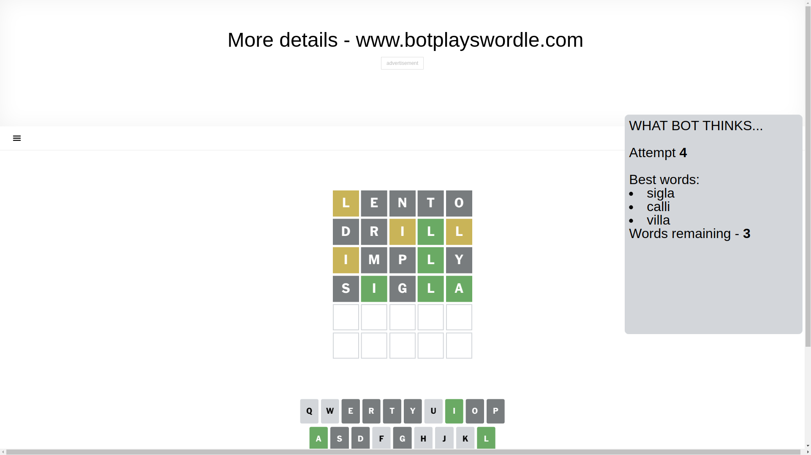
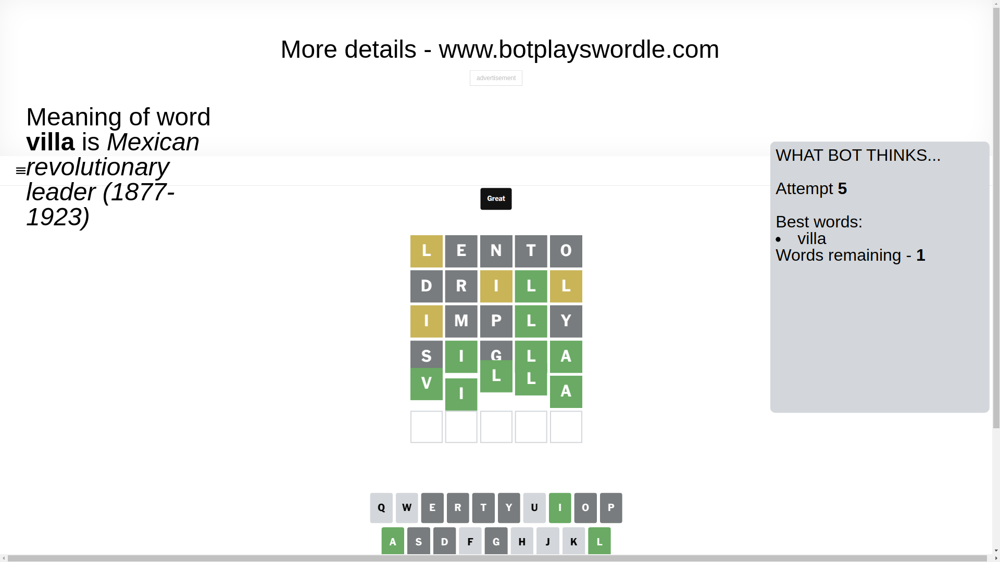

# Wordle for April 6, 2025 - \#1387

## Attempt 1

This is the first attempt and we'll choose a random word to start with.

Let's start with word `lento`

Attempt for `lento` gives us 0 correct letters, 1 present letters and 4 wrong letters.

If we look into details, we can see that:

Letter `l` is on a different spot - this means that it cannot be at position 1

Letter `e` is not present in the word and we will not use it any more

Letter `n` is not present in the word and we will not use it any more

Letter `t` is not present in the word and we will not use it any more

Letter `o` is not present in the word and we will not use it any more

Some letters are missing (like `e`, `n`, `t`, `o`) but it's also important piece of information

Word should contain letters `[l]`

That was a great guess that limited number of remaining words

## Attempt 2

Right now we have 398 words to choose from and best of them seem to be `[drail dural drawl ralph drill]`

So far we know that possible letters are:

At position 1: `[a b c d f g h i j k m p q r s u v w x y z]`

At position 2: `[a b c d f g h i j k l m p q r s u v w x y z]`

At position 3: `[a b c d f g h i j k l m p q r s u v w x y z]`

At position 4: `[a b c d f g h i j k l m p q r s u v w x y z]`

At position 5: `[a b c d f g h i j k l m p q r s u v w x y z]`

Next guess is `drill`, let's see what it gives us

Attempt for `drill` gives us 1 correct letters, 2 present letters and 2 wrong letters.

If we look into details, we can see that:

Letter `d` is not present in the word and we will not use it any more

Letter `r` is not present in the word and we will not use it any more

Letter `i` is on a different spot - this means that it cannot be at position 3

Letter `l` should be at position 4

Letter `l` is on a different spot - this means that it cannot be at position 5

We got information about the correct letters and it should make next attempt easier

Some letters are missing (like `d`, `r`) but it's also important piece of information

Word should contain letters `[l i]`

That was a great guess that limited number of remaining words

## Attempt 3

Right now we have 12 words to choose from and best of them seem to be `[sigla imply pigly mimly calli]`

So far we know that possible letters are:

At position 1: `[a b c f g h i j k m p q s u v w x y z]`

At position 2: `[a b c f g h i j k l m p q s u v w x y z]`

At position 3: `[a b c f g h j k l m p q s u v w x y z]`

At position 4: `[l]`

At position 5: `[a b c f g h i j k m p q s u v w x y z]`

Next guess is `imply`, let's see what it gives us

Attempt for `imply` gives us 1 correct letters, 1 present letters and 3 wrong letters.

If we look into details, we can see that:

Letter `i` is on a different spot - this means that it cannot be at position 1

Letter `m` is not present in the word and we will not use it any more

Letter `p` is not present in the word and we will not use it any more

Letter `y` is not present in the word and we will not use it any more

Some letters are missing (like `m`, `p`, `y`) but it's also important piece of information

Word should contain letters `[l i]`

Could be a better guess

## Attempt 4

Right now we have 3 words to choose from and best of them seem to be `[sigla calli villa]`

So far we know that possible letters are:

At position 1: `[a b c f g h j k q s u v w x z]`

At position 2: `[a b c f g h i j k l q s u v w x z]`

At position 3: `[a b c f g h j k l q s u v w x z]`

At position 4: `[l]`

At position 5: `[a b c f g h i j k q s u v w x z]`

Next guess is `sigla`, let's see what it gives us

Attempt for `sigla` gives us 3 correct letters, 0 present letters and 2 wrong letters.

If we look into details, we can see that:

Letter `s` is not present in the word and we will not use it any more

Letter `i` should be at position 2

Letter `g` is not present in the word and we will not use it any more

Letter `a` should be at position 5

We got information about the correct letters and it should make next attempt easier

Some letters are missing (like `s`, `g`) but it's also important piece of information

Word should contain letters `[l i a]`

Could be a better guess

## Attempt 5

Right now we have 1 words to choose from and best of them seem to be `[villa]`

So far we know that possible letters are:

At position 1: `[a b c f h j k q u v w x z]`

At position 2: `[i]`

At position 3: `[a b c f h j k l q u v w x z]`

At position 4: `[l]`

At position 5: `[a]`

It must be `villa`

That's the correct answer! The word is `villa`!

## Conclusion

Today's word is `villa` and it took 5 attempts to guess it

