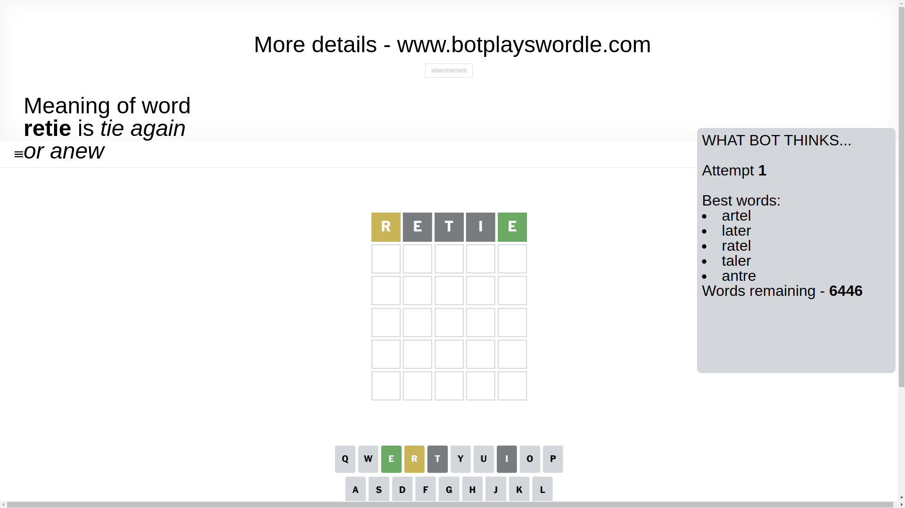
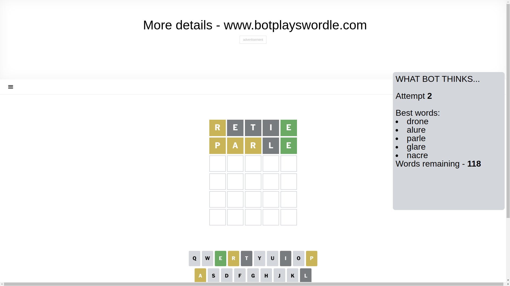
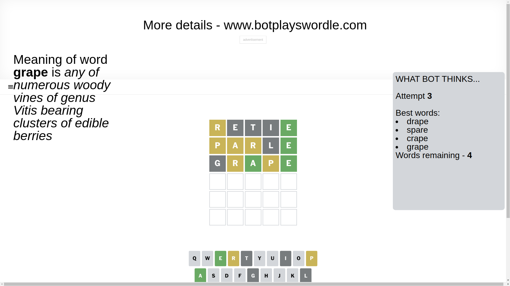
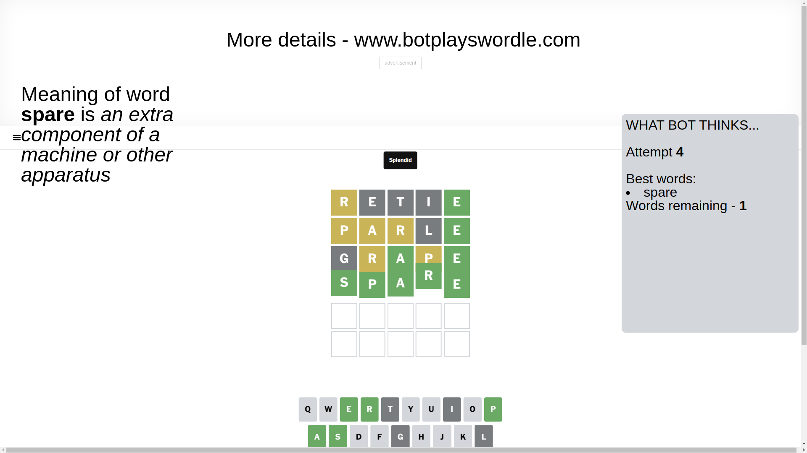

# Wordle for April 8, 2025 - \#1389

## Attempt 1

This is the first attempt and we'll choose a random word to start with.

Let's start with word `retie`

Attempt for `retie` gives us 1 correct letters, 1 present letters and 3 wrong letters.

If we look into details, we can see that:

Letter `r` is on a different spot - this means that it cannot be at position 1

Letter `e` is not present in the word and we will not use it any more

Letter `t` is not present in the word and we will not use it any more

Letter `i` is not present in the word and we will not use it any more

Letter `e` should be at position 5

We got information about the correct letters and it should make next attempt easier

Some letters are missing (like `e`, `t`, `i`) but it's also important piece of information

Word should contain letters `[r e]`

That was a great guess that limited number of remaining words

## Attempt 2

Right now we have 118 words to choose from and best of them seem to be `[drone alure parle glare nacre]`

So far we know that possible letters are:

At position 1: `[a b c d f g h j k l m n o p q s u v w x y z]`

At position 2: `[a b c d f g h j k l m n o p q r s u v w x y z]`

At position 3: `[a b c d f g h j k l m n o p q r s u v w x y z]`

At position 4: `[a b c d f g h j k l m n o p q r s u v w x y z]`

At position 5: `[e]`

Next guess is `parle`, let's see what it gives us

Attempt for `parle` gives us 1 correct letters, 3 present letters and 1 wrong letters.

If we look into details, we can see that:

Letter `p` is on a different spot - this means that it cannot be at position 1

Letter `a` is on a different spot - this means that it cannot be at position 2

Letter `r` is on a different spot - this means that it cannot be at position 3

Letter `l` is not present in the word and we will not use it any more

Some letters are missing (like `l`) but it's also important piece of information

Word should contain letters `[r e p a]`

That was a great guess that limited number of remaining words

## Attempt 3

Right now we have 4 words to choose from and best of them seem to be `[drape spare crape grape]`

So far we know that possible letters are:

At position 1: `[a b c d f g h j k m n o q s u v w x y z]`

At position 2: `[b c d f g h j k m n o p q r s u v w x y z]`

At position 3: `[a b c d f g h j k m n o p q s u v w x y z]`

At position 4: `[a b c d f g h j k m n o p q r s u v w x y z]`

At position 5: `[e]`

Next guess is `grape`, let's see what it gives us

Attempt for `grape` gives us 2 correct letters, 2 present letters and 1 wrong letters.

If we look into details, we can see that:

Letter `g` is not present in the word and we will not use it any more

Letter `r` is on a different spot - this means that it cannot be at position 2

Letter `a` should be at position 3

Letter `p` is on a different spot - this means that it cannot be at position 4

We got information about the correct letters and it should make next attempt easier

Some letters are missing (like `g`) but it's also important piece of information

Word should contain letters `[r e p a]`

Could be a better guess

## Attempt 4

Right now we have 1 words to choose from and best of them seem to be `[spare]`

So far we know that possible letters are:

At position 1: `[a b c d f h j k m n o q s u v w x y z]`

At position 2: `[b c d f h j k m n o p q s u v w x y z]`

At position 3: `[a]`

At position 4: `[a b c d f h j k m n o q r s u v w x y z]`

At position 5: `[e]`

It must be `spare`

That's the correct answer! The word is `spare`!

## Conclusion

Today's word is `spare` and it took 4 attempts to guess it

