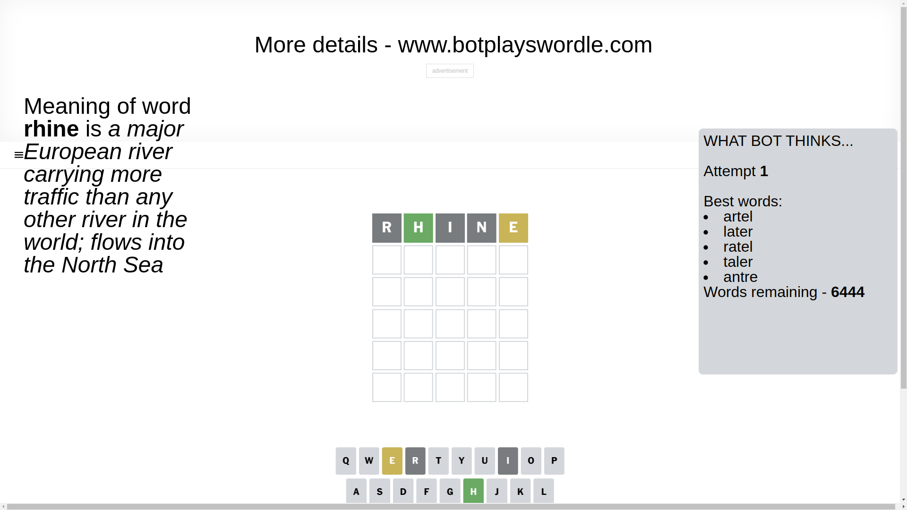
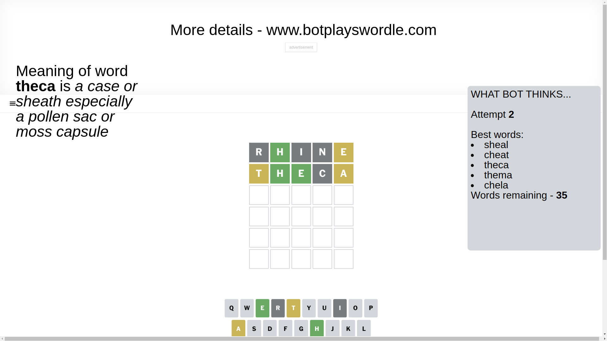
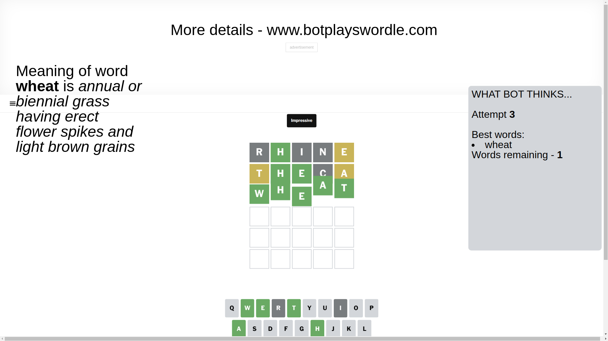

# Wordle for April 9, 2025 - \#1390

## Attempt 1

This is the first attempt and we'll choose a random word to start with.

Let's start with word `rhine`

Attempt for `rhine` gives us 1 correct letters, 1 present letters and 3 wrong letters.

If we look into details, we can see that:

Letter `r` is not present in the word and we will not use it any more

Letter `h` should be at position 2

Letter `i` is not present in the word and we will not use it any more

Letter `n` is not present in the word and we will not use it any more

Letter `e` is on a different spot - this means that it cannot be at position 5

We got information about the correct letters and it should make next attempt easier

Some letters are missing (like `r`, `i`, `n`) but it's also important piece of information

Word should contain letters `[h e]`

That was a great guess that limited number of remaining words

## Attempt 2

Right now we have 35 words to choose from and best of them seem to be `[sheal cheat theca thema chela]`

So far we know that possible letters are:

At position 1: `[a b c d e f g h j k l m o p q s t u v w x y z]`

At position 2: `[h]`

At position 3: `[a b c d e f g h j k l m o p q s t u v w x y z]`

At position 4: `[a b c d e f g h j k l m o p q s t u v w x y z]`

At position 5: `[a b c d f g h j k l m o p q s t u v w x y z]`

Next guess is `theca`, let's see what it gives us

Attempt for `theca` gives us 2 correct letters, 2 present letters and 1 wrong letters.

If we look into details, we can see that:

Letter `t` is on a different spot - this means that it cannot be at position 1

Letter `e` should be at position 3

Letter `c` is not present in the word and we will not use it any more

Letter `a` is on a different spot - this means that it cannot be at position 5

We got information about the correct letters and it should make next attempt easier

Some letters are missing (like `c`) but it's also important piece of information

Word should contain letters `[h e t a]`

That was a great guess that limited number of remaining words

## Attempt 3

Right now we have 1 words to choose from and best of them seem to be `[wheat]`

So far we know that possible letters are:

At position 1: `[a b d e f g h j k l m o p q s u v w x y z]`

At position 2: `[h]`

At position 3: `[e]`

At position 4: `[a b d e f g h j k l m o p q s t u v w x y z]`

At position 5: `[b d f g h j k l m o p q s t u v w x y z]`

It must be `wheat`

That's the correct answer! The word is `wheat`!

## Conclusion

Today's word is `wheat` and it took 3 attempts to guess it

