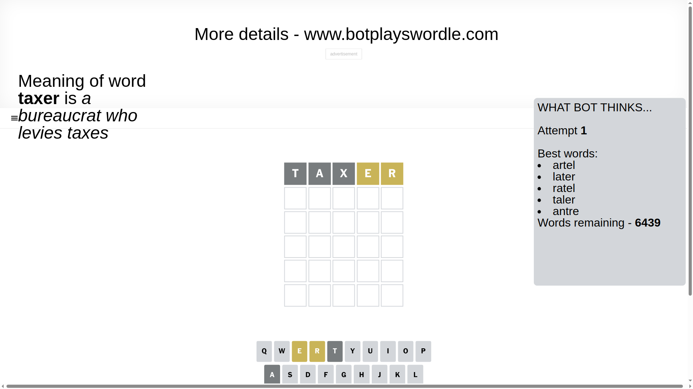
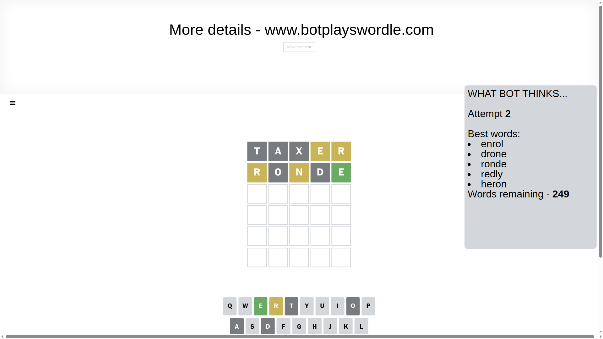
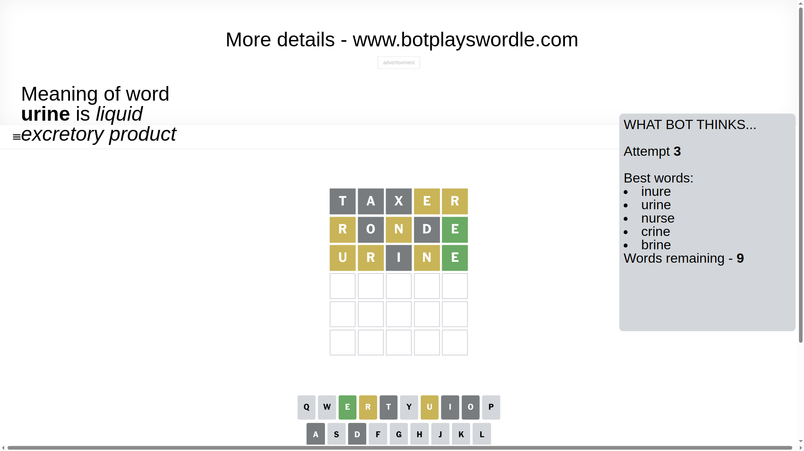
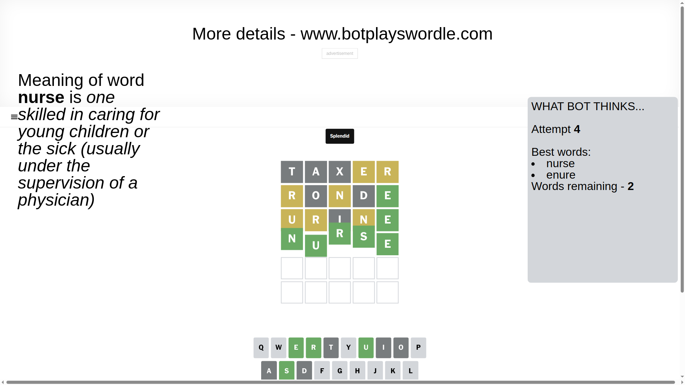

# Wordle for April 12, 2025 - \#1393

## Attempt 1

This is the first attempt and we'll choose a random word to start with.

Let's start with word `taxer`

Attempt for `taxer` gives us 0 correct letters, 2 present letters and 3 wrong letters.

If we look into details, we can see that:

Letter `t` is not present in the word and we will not use it any more

Letter `a` is not present in the word and we will not use it any more

Letter `x` is not present in the word and we will not use it any more

Letter `e` is on a different spot - this means that it cannot be at position 4

Letter `r` is on a different spot - this means that it cannot be at position 5

Some letters are missing (like `t`, `a`, `x`) but it's also important piece of information

Word should contain letters `[e r]`

That was a great guess that limited number of remaining words

## Attempt 2

Right now we have 249 words to choose from and best of them seem to be `[enrol drone ronde redly heron]`

So far we know that possible letters are:

At position 1: `[b c d e f g h i j k l m n o p q r s u v w y z]`

At position 2: `[b c d e f g h i j k l m n o p q r s u v w y z]`

At position 3: `[b c d e f g h i j k l m n o p q r s u v w y z]`

At position 4: `[b c d f g h i j k l m n o p q r s u v w y z]`

At position 5: `[b c d e f g h i j k l m n o p q s u v w y z]`

Next guess is `ronde`, let's see what it gives us

Attempt for `ronde` gives us 1 correct letters, 2 present letters and 2 wrong letters.

If we look into details, we can see that:

Letter `r` is on a different spot - this means that it cannot be at position 1

Letter `o` is not present in the word and we will not use it any more

Letter `n` is on a different spot - this means that it cannot be at position 3

Letter `d` is not present in the word and we will not use it any more

Letter `e` should be at position 5

We got information about the correct letters and it should make next attempt easier

Some letters are missing (like `o`, `d`) but it's also important piece of information

Word should contain letters `[e r n]`

That was a great guess that limited number of remaining words

## Attempt 3

Right now we have 9 words to choose from and best of them seem to be `[inure urine nurse crine brine]`

So far we know that possible letters are:

At position 1: `[b c e f g h i j k l m n p q s u v w y z]`

At position 2: `[b c e f g h i j k l m n p q r s u v w y z]`

At position 3: `[b c e f g h i j k l m p q r s u v w y z]`

At position 4: `[b c f g h i j k l m n p q r s u v w y z]`

At position 5: `[e]`

Next guess is `urine`, let's see what it gives us

Attempt for `urine` gives us 1 correct letters, 3 present letters and 1 wrong letters.

If we look into details, we can see that:

Letter `u` is on a different spot - this means that it cannot be at position 1

Letter `r` is on a different spot - this means that it cannot be at position 2

Letter `i` is not present in the word and we will not use it any more

Letter `n` is on a different spot - this means that it cannot be at position 4

Some letters are missing (like `i`) but it's also important piece of information

Word should contain letters `[e r n u]`

Not a bad guess in general

## Attempt 4

Right now we have 2 words to choose from and best of them seem to be `[nurse enure]`

So far we know that possible letters are:

At position 1: `[b c e f g h j k l m n p q s v w y z]`

At position 2: `[b c e f g h j k l m n p q s u v w y z]`

At position 3: `[b c e f g h j k l m p q r s u v w y z]`

At position 4: `[b c f g h j k l m p q r s u v w y z]`

At position 5: `[e]`

Next guess is `nurse`, let's see what it gives us

That's the correct answer! The word is `nurse`!

## Conclusion

Today's word is `nurse` and it took 4 attempts to guess it

