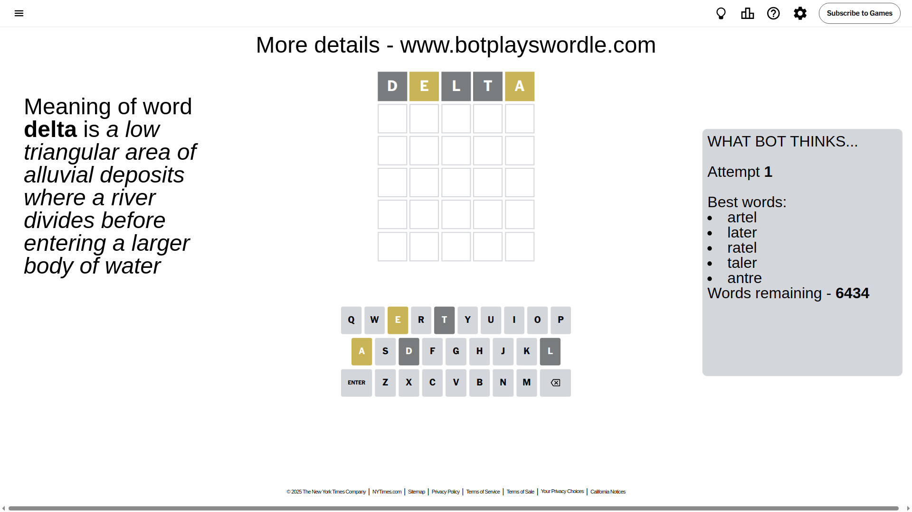
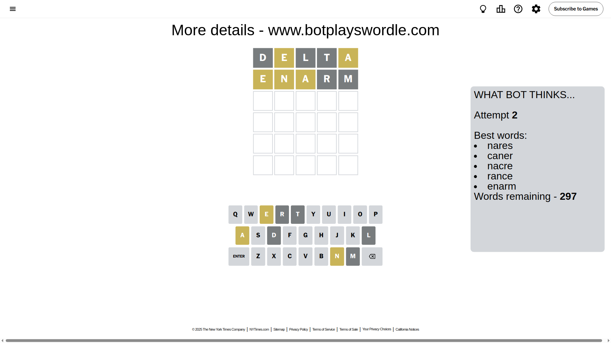
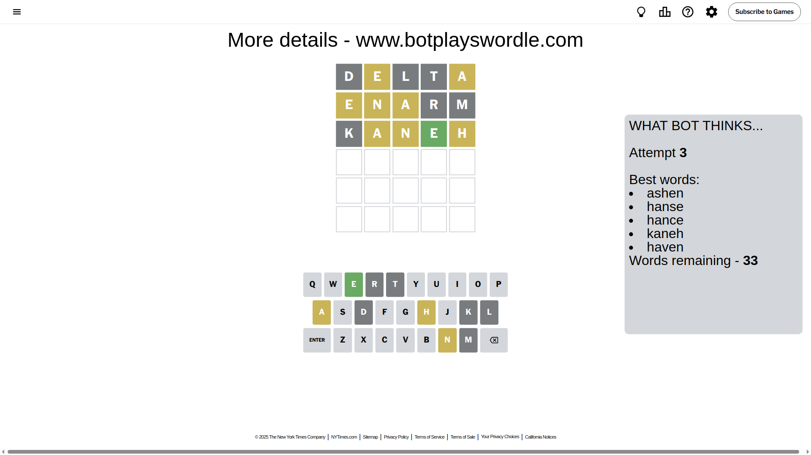
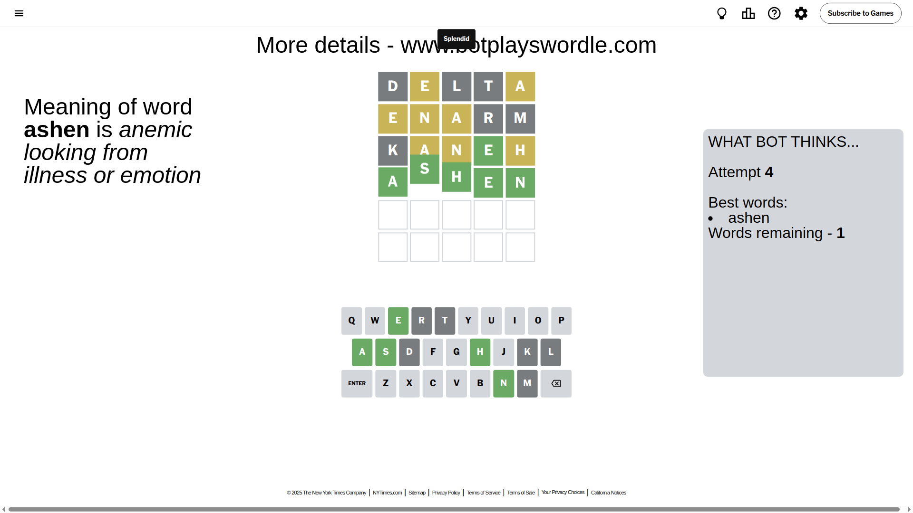

# Wordle for April 15, 2025 - \#1396

## Attempt 1

This is the first attempt and we'll choose a random word to start with.

Let's start with word `delta`

Attempt for `delta` gives us 0 correct letters, 2 present letters and 3 wrong letters.

If we look into details, we can see that:

Letter `d` is not present in the word and we will not use it any more

Letter `e` is on a different spot - this means that it cannot be at position 2

Letter `l` is not present in the word and we will not use it any more

Letter `t` is not present in the word and we will not use it any more

Letter `a` is on a different spot - this means that it cannot be at position 5

Some letters are missing (like `d`, `l`, `t`) but it's also important piece of information

Word should contain letters `[e a]`

That was a great guess that limited number of remaining words

## Attempt 2

Right now we have 297 words to choose from and best of them seem to be `[nares caner nacre rance enarm]`

So far we know that possible letters are:

At position 1: `[a b c e f g h i j k m n o p q r s u v w x y z]`

At position 2: `[a b c f g h i j k m n o p q r s u v w x y z]`

At position 3: `[a b c e f g h i j k m n o p q r s u v w x y z]`

At position 4: `[a b c e f g h i j k m n o p q r s u v w x y z]`

At position 5: `[b c e f g h i j k m n o p q r s u v w x y z]`

Next guess is `enarm`, let's see what it gives us

Attempt for `enarm` gives us 0 correct letters, 3 present letters and 2 wrong letters.

If we look into details, we can see that:

Letter `e` is on a different spot - this means that it cannot be at position 1

Letter `n` is on a different spot - this means that it cannot be at position 2

Letter `a` is on a different spot - this means that it cannot be at position 3

Letter `r` is not present in the word and we will not use it any more

Letter `m` is not present in the word and we will not use it any more

Some letters are missing (like `r`, `m`) but it's also important piece of information

Word should contain letters `[e a n]`

That was a great guess that limited number of remaining words

## Attempt 3

Right now we have 33 words to choose from and best of them seem to be `[ashen hanse hance kaneh haven]`

So far we know that possible letters are:

At position 1: `[a b c f g h i j k n o p q s u v w x y z]`

At position 2: `[a b c f g h i j k o p q s u v w x y z]`

At position 3: `[b c e f g h i j k n o p q s u v w x y z]`

At position 4: `[a b c e f g h i j k n o p q s u v w x y z]`

At position 5: `[b c e f g h i j k n o p q s u v w x y z]`

Next guess is `kaneh`, let's see what it gives us

Attempt for `kaneh` gives us 1 correct letters, 3 present letters and 1 wrong letters.

If we look into details, we can see that:

Letter `k` is not present in the word and we will not use it any more

Letter `a` is on a different spot - this means that it cannot be at position 2

Letter `n` is on a different spot - this means that it cannot be at position 3

Letter `e` should be at position 4

Letter `h` is on a different spot - this means that it cannot be at position 5

We got information about the correct letters and it should make next attempt easier

Some letters are missing (like `k`) but it's also important piece of information

Word should contain letters `[e a n h]`

That was a great guess that limited number of remaining words

## Attempt 4

Right now we have 1 words to choose from and best of them seem to be `[ashen]`

So far we know that possible letters are:

At position 1: `[a b c f g h i j n o p q s u v w x y z]`

At position 2: `[b c f g h i j o p q s u v w x y z]`

At position 3: `[b c e f g h i j o p q s u v w x y z]`

At position 4: `[e]`

At position 5: `[b c e f g i j n o p q s u v w x y z]`

It must be `ashen`

That's the correct answer! The word is `ashen`!

## Conclusion

Today's word is `ashen` and it took 4 attempts to guess it

