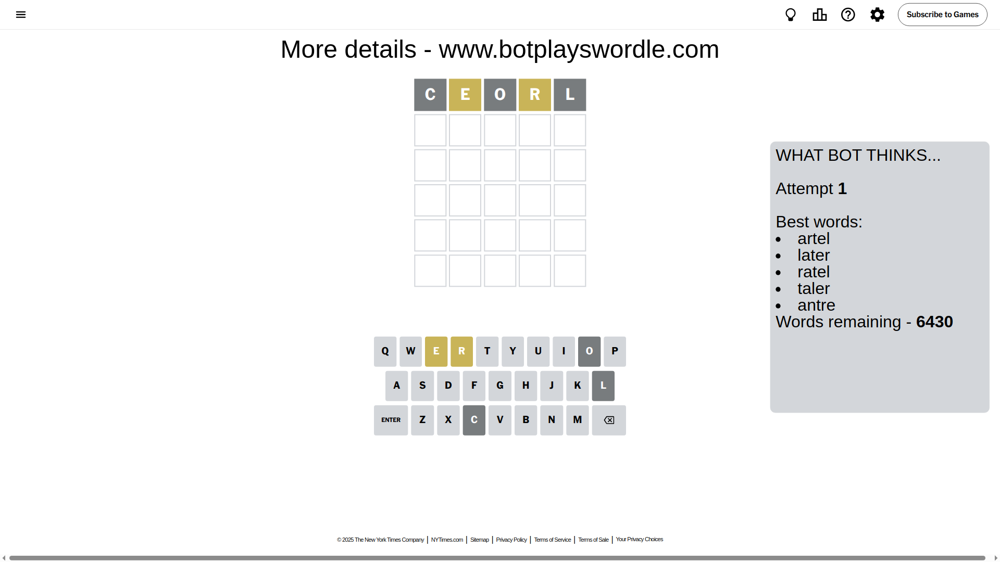
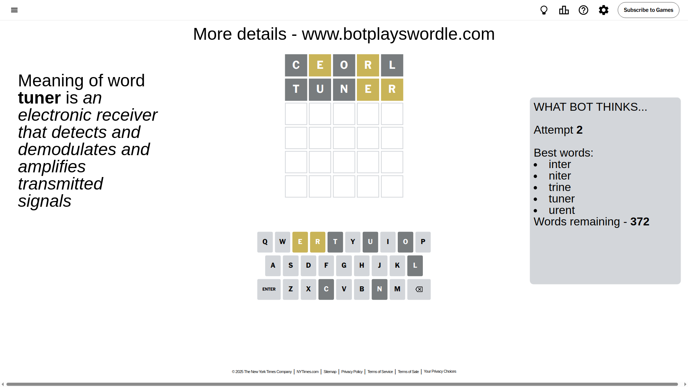
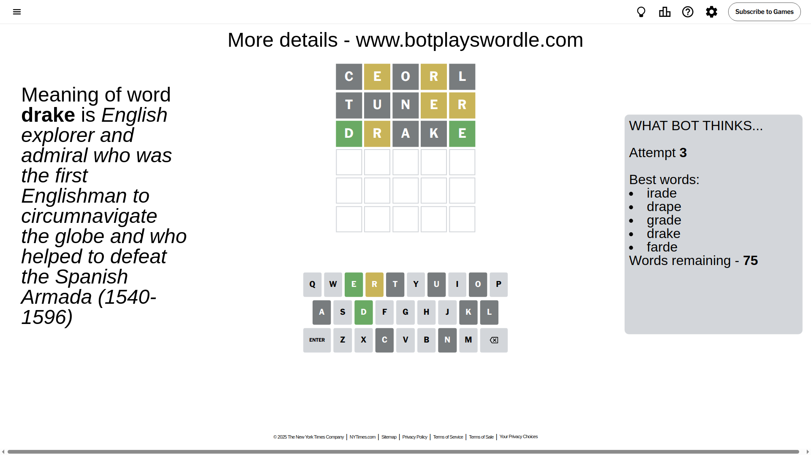
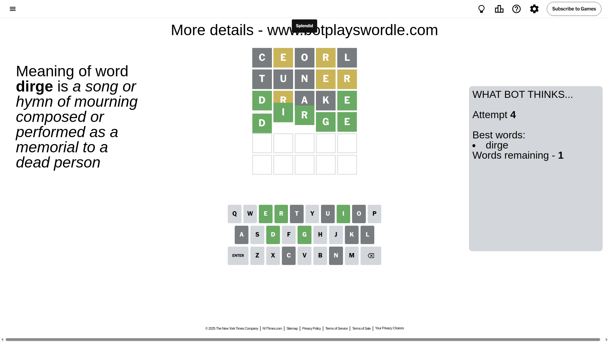

# Wordle for April 18, 2025 - \#1399

## Attempt 1

This is the first attempt and we'll choose a random word to start with.

Let's start with word `ceorl`

Attempt for `ceorl` gives us 0 correct letters, 2 present letters and 3 wrong letters.

If we look into details, we can see that:

Letter `c` is not present in the word and we will not use it any more

Letter `e` is on a different spot - this means that it cannot be at position 2

Letter `o` is not present in the word and we will not use it any more

Letter `r` is on a different spot - this means that it cannot be at position 4

Letter `l` is not present in the word and we will not use it any more

Some letters are missing (like `c`, `o`, `l`) but it's also important piece of information

Word should contain letters `[e r]`

That was a great guess that limited number of remaining words

## Attempt 2

Right now we have 372 words to choose from and best of them seem to be `[inter niter trine tuner urent]`

So far we know that possible letters are:

At position 1: `[a b d e f g h i j k m n p q r s t u v w x y z]`

At position 2: `[a b d f g h i j k m n p q r s t u v w x y z]`

At position 3: `[a b d e f g h i j k m n p q r s t u v w x y z]`

At position 4: `[a b d e f g h i j k m n p q s t u v w x y z]`

At position 5: `[a b d e f g h i j k m n p q r s t u v w x y z]`

Next guess is `tuner`, let's see what it gives us

Attempt for `tuner` gives us 0 correct letters, 2 present letters and 3 wrong letters.

If we look into details, we can see that:

Letter `t` is not present in the word and we will not use it any more

Letter `u` is not present in the word and we will not use it any more

Letter `n` is not present in the word and we will not use it any more

Letter `e` is on a different spot - this means that it cannot be at position 4

Letter `r` is on a different spot - this means that it cannot be at position 5

Some letters are missing (like `t`, `u`, `n`) but it's also important piece of information

Word should contain letters `[e r]`

Not a bad guess in general

## Attempt 3

Right now we have 75 words to choose from and best of them seem to be `[irade drape grade drake farde]`

So far we know that possible letters are:

At position 1: `[a b d e f g h i j k m p q r s v w x y z]`

At position 2: `[a b d f g h i j k m p q r s v w x y z]`

At position 3: `[a b d e f g h i j k m p q r s v w x y z]`

At position 4: `[a b d f g h i j k m p q s v w x y z]`

At position 5: `[a b d e f g h i j k m p q s v w x y z]`

Next guess is `drake`, let's see what it gives us

Attempt for `drake` gives us 2 correct letters, 1 present letters and 2 wrong letters.

If we look into details, we can see that:

Letter `d` should be at position 1

Letter `r` is on a different spot - this means that it cannot be at position 2

Letter `a` is not present in the word and we will not use it any more

Letter `k` is not present in the word and we will not use it any more

Letter `e` should be at position 5

We got information about the correct letters and it should make next attempt easier

Some letters are missing (like `a`, `k`) but it's also important piece of information

Word should contain letters `[e r d]`

That was a great guess that limited number of remaining words

## Attempt 4

Right now we have 1 words to choose from and best of them seem to be `[dirge]`

So far we know that possible letters are:

At position 1: `[d]`

At position 2: `[b d f g h i j m p q s v w x y z]`

At position 3: `[b d e f g h i j m p q r s v w x y z]`

At position 4: `[b d f g h i j m p q s v w x y z]`

At position 5: `[e]`

It must be `dirge`

That's the correct answer! The word is `dirge`!

## Conclusion

Today's word is `dirge` and it took 4 attempts to guess it

