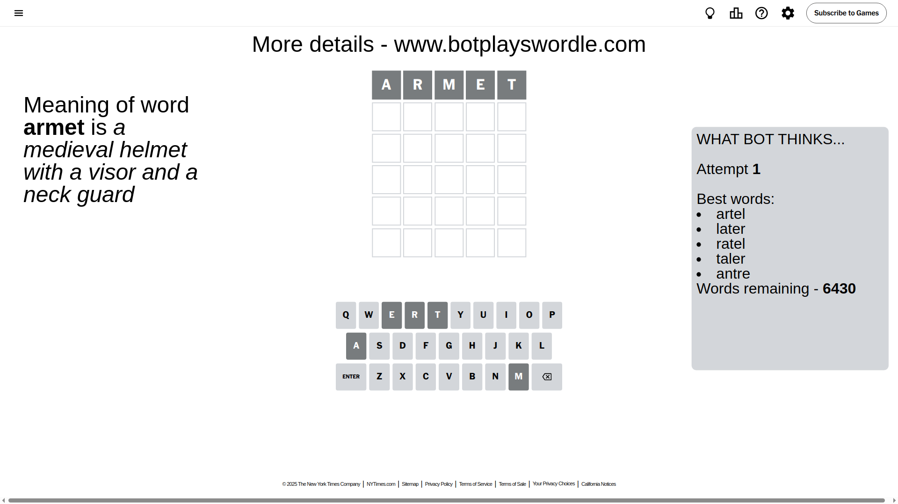
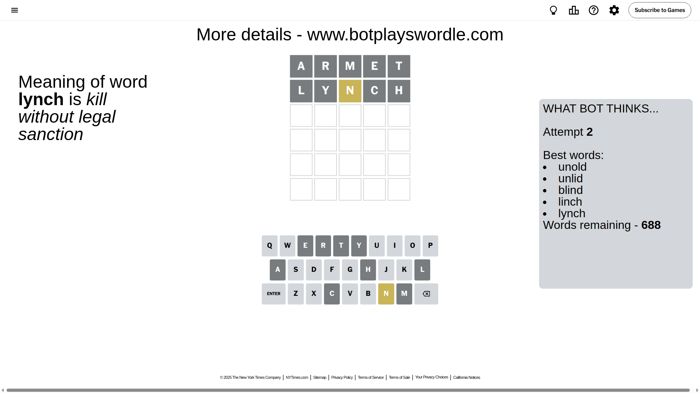
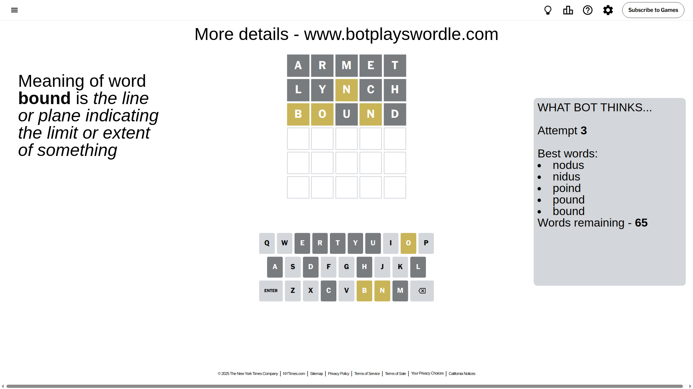
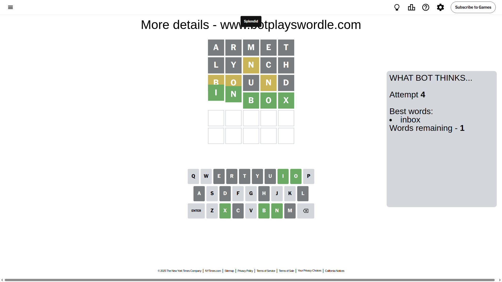

# Wordle for April 19, 2025 - \#1400

## Attempt 1

This is the first attempt and we'll choose a random word to start with.

Let's start with word `armet`

Attempt for `armet` gives us 0 correct letters, 0 present letters and 5 wrong letters.

If we look into details, we can see that:

Letter `a` is not present in the word and we will not use it any more

Letter `r` is not present in the word and we will not use it any more

Letter `m` is not present in the word and we will not use it any more

Letter `e` is not present in the word and we will not use it any more

Letter `t` is not present in the word and we will not use it any more

Some letters are missing (like `a`, `r`, `m`, `e`, `t`) but it's also important piece of information

So far we don't know any of the letters!

That was a great guess that limited number of remaining words

## Attempt 2

Right now we have 688 words to choose from and best of them seem to be `[unold unlid blind linch lynch]`

So far we know that possible letters are:

At position 1: `[b c d f g h i j k l n o p q s u v w x y z]`

At position 2: `[b c d f g h i j k l n o p q s u v w x y z]`

At position 3: `[b c d f g h i j k l n o p q s u v w x y z]`

At position 4: `[b c d f g h i j k l n o p q s u v w x y z]`

At position 5: `[b c d f g h i j k l n o p q s u v w x y z]`

Next guess is `lynch`, let's see what it gives us

Attempt for `lynch` gives us 0 correct letters, 1 present letters and 4 wrong letters.

If we look into details, we can see that:

Letter `l` is not present in the word and we will not use it any more

Letter `y` is not present in the word and we will not use it any more

Letter `n` is on a different spot - this means that it cannot be at position 3

Letter `c` is not present in the word and we will not use it any more

Letter `h` is not present in the word and we will not use it any more

Some letters are missing (like `l`, `y`, `c`, `h`) but it's also important piece of information

Word should contain letters `[n]`

That was a great guess that limited number of remaining words

## Attempt 3

Right now we have 65 words to choose from and best of them seem to be `[nodus nidus poind pound bound]`

So far we know that possible letters are:

At position 1: `[b d f g i j k n o p q s u v w x z]`

At position 2: `[b d f g i j k n o p q s u v w x z]`

At position 3: `[b d f g i j k o p q s u v w x z]`

At position 4: `[b d f g i j k n o p q s u v w x z]`

At position 5: `[b d f g i j k n o p q s u v w x z]`

Next guess is `bound`, let's see what it gives us

Attempt for `bound` gives us 0 correct letters, 3 present letters and 2 wrong letters.

If we look into details, we can see that:

Letter `b` is on a different spot - this means that it cannot be at position 1

Letter `o` is on a different spot - this means that it cannot be at position 2

Letter `u` is not present in the word and we will not use it any more

Letter `n` is on a different spot - this means that it cannot be at position 4

Letter `d` is not present in the word and we will not use it any more

Some letters are missing (like `u`, `d`) but it's also important piece of information

Word should contain letters `[n b o]`

That was a great guess that limited number of remaining words

## Attempt 4

Right now we have 1 words to choose from and best of them seem to be `[inbox]`

So far we know that possible letters are:

At position 1: `[f g i j k n o p q s v w x z]`

At position 2: `[b f g i j k n p q s v w x z]`

At position 3: `[b f g i j k o p q s v w x z]`

At position 4: `[b f g i j k o p q s v w x z]`

At position 5: `[b f g i j k n o p q s v w x z]`

It must be `inbox`

That's the correct answer! The word is `inbox`!

## Conclusion

Today's word is `inbox` and it took 4 attempts to guess it

