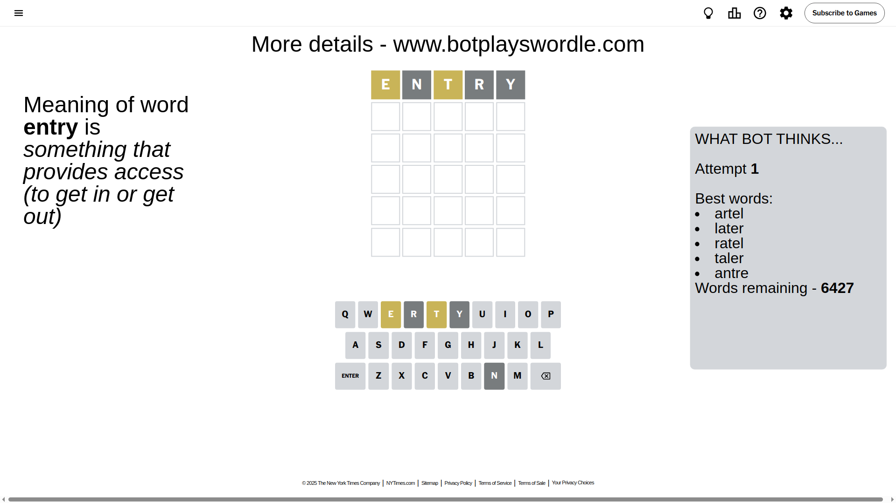
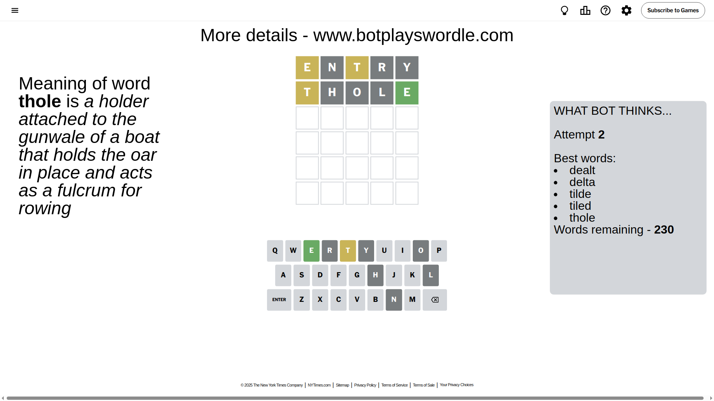
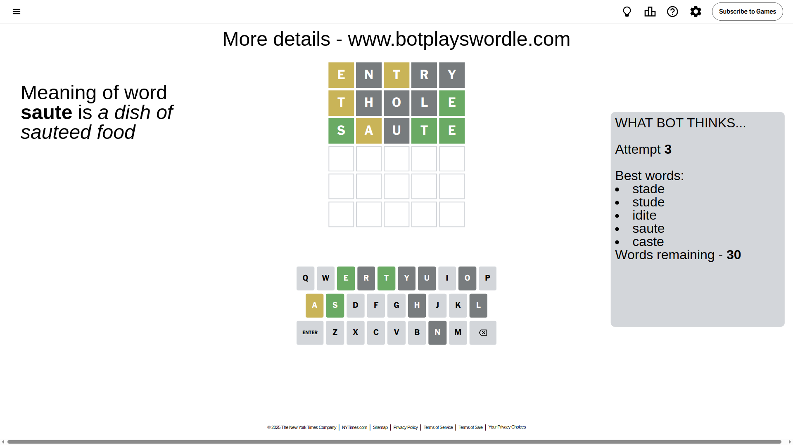
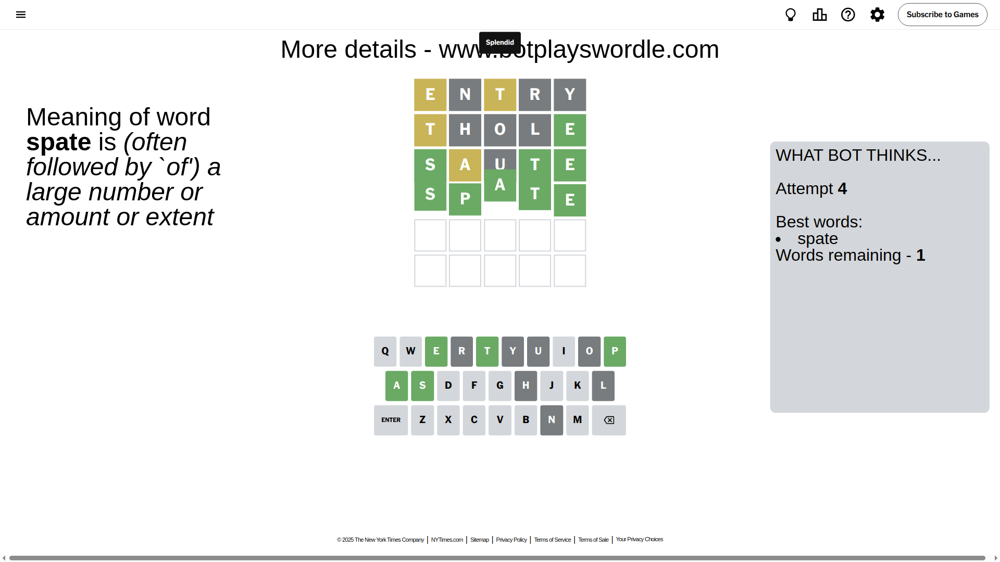

# Wordle for April 21, 2025 - \#1402

## Attempt 1

This is the first attempt and we'll choose a random word to start with.

Let's start with word `entry`

Attempt for `entry` gives us 0 correct letters, 2 present letters and 3 wrong letters.

If we look into details, we can see that:

Letter `e` is on a different spot - this means that it cannot be at position 1

Letter `n` is not present in the word and we will not use it any more

Letter `t` is on a different spot - this means that it cannot be at position 3

Letter `r` is not present in the word and we will not use it any more

Letter `y` is not present in the word and we will not use it any more

Some letters are missing (like `n`, `r`, `y`) but it's also important piece of information

Word should contain letters `[e t]`

That was a great guess that limited number of remaining words

## Attempt 2

Right now we have 230 words to choose from and best of them seem to be `[dealt delta tilde tiled thole]`

So far we know that possible letters are:

At position 1: `[a b c d f g h i j k l m o p q s t u v w x z]`

At position 2: `[a b c d e f g h i j k l m o p q s t u v w x z]`

At position 3: `[a b c d e f g h i j k l m o p q s u v w x z]`

At position 4: `[a b c d e f g h i j k l m o p q s t u v w x z]`

At position 5: `[a b c d e f g h i j k l m o p q s t u v w x z]`

Next guess is `thole`, let's see what it gives us

Attempt for `thole` gives us 1 correct letters, 1 present letters and 3 wrong letters.

If we look into details, we can see that:

Letter `t` is on a different spot - this means that it cannot be at position 1

Letter `h` is not present in the word and we will not use it any more

Letter `o` is not present in the word and we will not use it any more

Letter `l` is not present in the word and we will not use it any more

Letter `e` should be at position 5

We got information about the correct letters and it should make next attempt easier

Some letters are missing (like `h`, `o`, `l`) but it's also important piece of information

Word should contain letters `[e t]`

Not a bad guess in general

## Attempt 3

Right now we have 30 words to choose from and best of them seem to be `[stade stude idite saute caste]`

So far we know that possible letters are:

At position 1: `[a b c d f g i j k m p q s u v w x z]`

At position 2: `[a b c d e f g i j k m p q s t u v w x z]`

At position 3: `[a b c d e f g i j k m p q s u v w x z]`

At position 4: `[a b c d e f g i j k m p q s t u v w x z]`

At position 5: `[e]`

Next guess is `saute`, let's see what it gives us

Attempt for `saute` gives us 3 correct letters, 1 present letters and 1 wrong letters.

If we look into details, we can see that:

Letter `s` should be at position 1

Letter `a` is on a different spot - this means that it cannot be at position 2

Letter `u` is not present in the word and we will not use it any more

Letter `t` should be at position 4

We got information about the correct letters and it should make next attempt easier

Some letters are missing (like `u`) but it's also important piece of information

Word should contain letters `[e t s a]`

That was a great guess that limited number of remaining words

## Attempt 4

Right now we have 1 words to choose from and best of them seem to be `[spate]`

So far we know that possible letters are:

At position 1: `[s]`

At position 2: `[b c d e f g i j k m p q s t v w x z]`

At position 3: `[a b c d e f g i j k m p q s v w x z]`

At position 4: `[t]`

At position 5: `[e]`

It must be `spate`

That's the correct answer! The word is `spate`!

## Conclusion

Today's word is `spate` and it took 4 attempts to guess it

