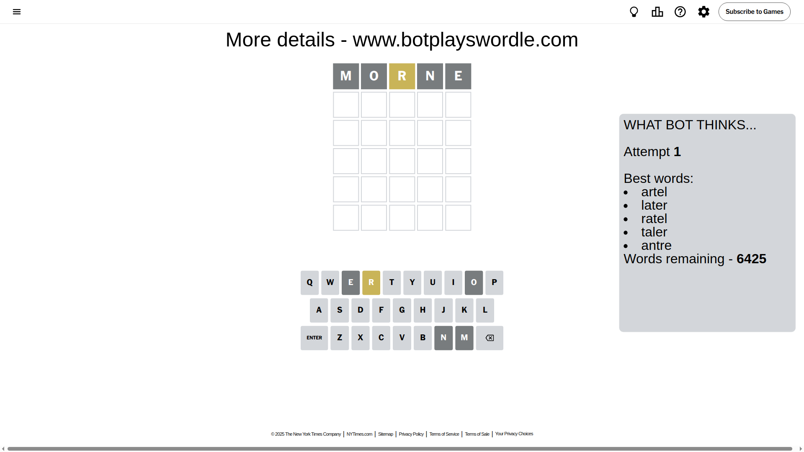
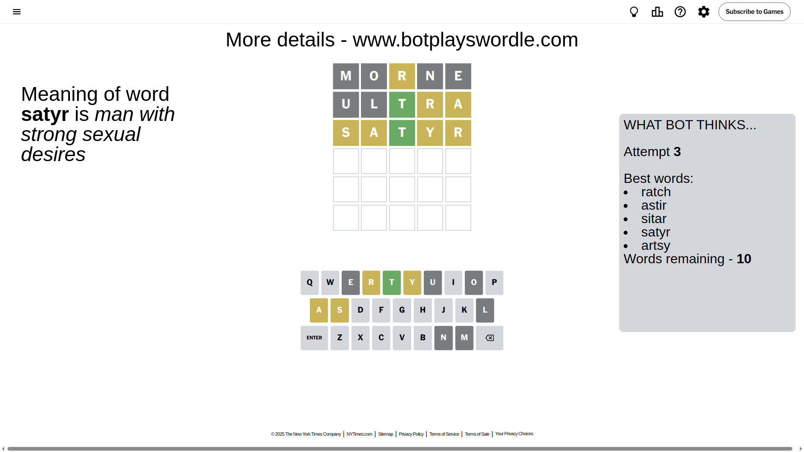
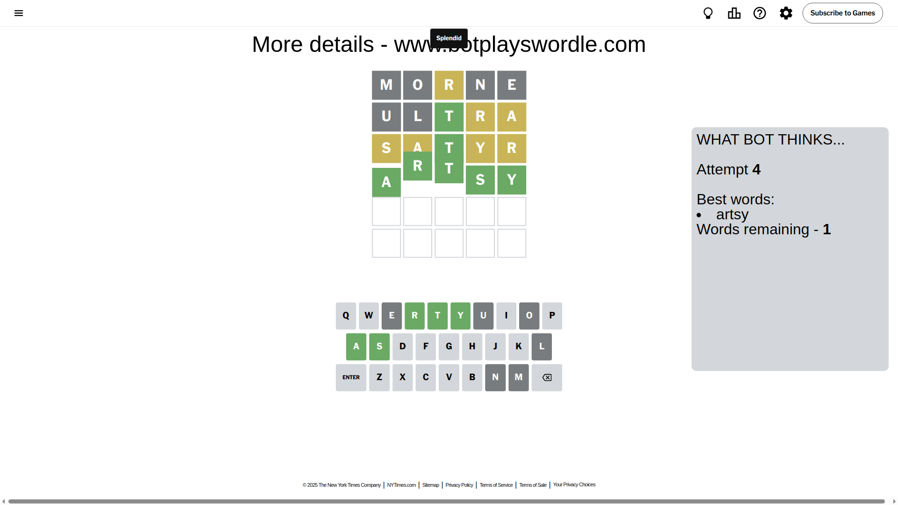

# Wordle for April 22, 2025 - \#1403

## Attempt 1

This is the first attempt and we'll choose a random word to start with.

Let's start with word `morne`

Attempt for `morne` gives us 0 correct letters, 1 present letters and 4 wrong letters.

If we look into details, we can see that:

Letter `m` is not present in the word and we will not use it any more

Letter `o` is not present in the word and we will not use it any more

Letter `r` is on a different spot - this means that it cannot be at position 3

Letter `n` is not present in the word and we will not use it any more

Letter `e` is not present in the word and we will not use it any more

Some letters are missing (like `m`, `o`, `n`, `e`) but it's also important piece of information

Word should contain letters `[r]`

That was a great guess that limited number of remaining words

## Attempt 2

Right now we have 336 words to choose from and best of them seem to be `[thirl thurl trial slart ultra]`

So far we know that possible letters are:

At position 1: `[a b c d f g h i j k l p q r s t u v w x y z]`

At position 2: `[a b c d f g h i j k l p q r s t u v w x y z]`

At position 3: `[a b c d f g h i j k l p q s t u v w x y z]`

At position 4: `[a b c d f g h i j k l p q r s t u v w x y z]`

At position 5: `[a b c d f g h i j k l p q r s t u v w x y z]`

Next guess is `ultra`, let's see what it gives us

Attempt for `ultra` gives us 1 correct letters, 2 present letters and 2 wrong letters.

If we look into details, we can see that:

Letter `u` is not present in the word and we will not use it any more

Letter `l` is not present in the word and we will not use it any more

Letter `t` should be at position 3

Letter `r` is on a different spot - this means that it cannot be at position 4

Letter `a` is on a different spot - this means that it cannot be at position 5

We got information about the correct letters and it should make next attempt easier

Some letters are missing (like `u`, `l`) but it's also important piece of information

Word should contain letters `[r t a]`

That was a great guess that limited number of remaining words

## Attempt 3

Right now we have 10 words to choose from and best of them seem to be `[ratch astir sitar satyr artsy]`

So far we know that possible letters are:

At position 1: `[a b c d f g h i j k p q r s t v w x y z]`

At position 2: `[a b c d f g h i j k p q r s t v w x y z]`

At position 3: `[t]`

At position 4: `[a b c d f g h i j k p q s t v w x y z]`

At position 5: `[b c d f g h i j k p q r s t v w x y z]`

Next guess is `satyr`, let's see what it gives us

Attempt for `satyr` gives us 1 correct letters, 4 present letters and 0 wrong letters.

If we look into details, we can see that:

Letter `s` is on a different spot - this means that it cannot be at position 1

Letter `a` is on a different spot - this means that it cannot be at position 2

Letter `y` is on a different spot - this means that it cannot be at position 4

Letter `r` is on a different spot - this means that it cannot be at position 5

Word should contain letters `[r t a s y]`

That was a great guess that limited number of remaining words

## Attempt 4

Right now we have 1 words to choose from and best of them seem to be `[artsy]`

So far we know that possible letters are:

At position 1: `[a b c d f g h i j k p q r t v w x y z]`

At position 2: `[b c d f g h i j k p q r s t v w x y z]`

At position 3: `[t]`

At position 4: `[a b c d f g h i j k p q s t v w x z]`

At position 5: `[b c d f g h i j k p q s t v w x y z]`

It must be `artsy`

That's the correct answer! The word is `artsy`!

## Conclusion

Today's word is `artsy` and it took 4 attempts to guess it

