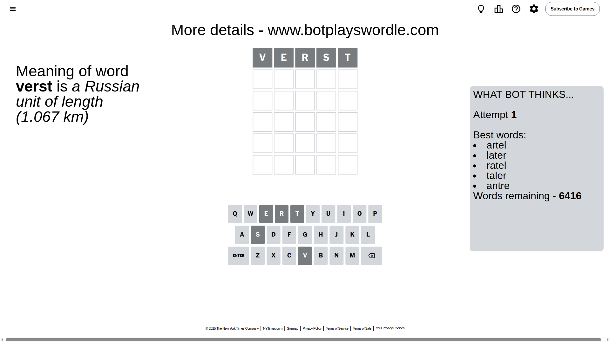
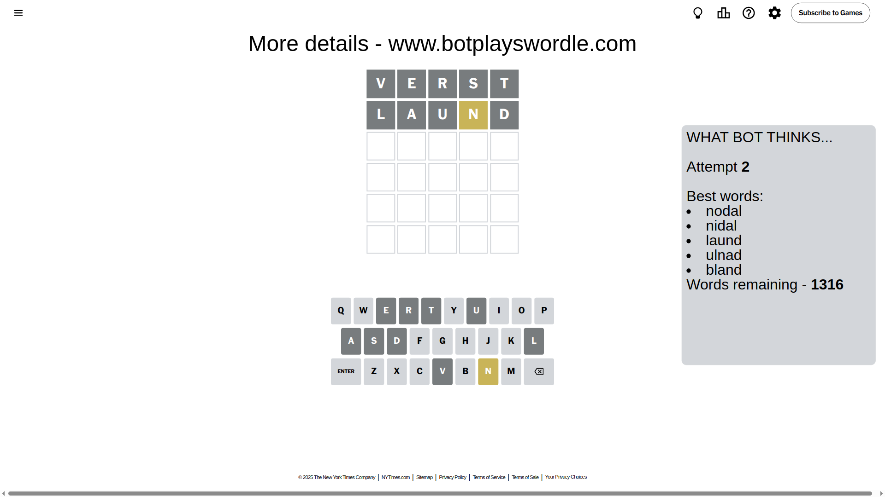
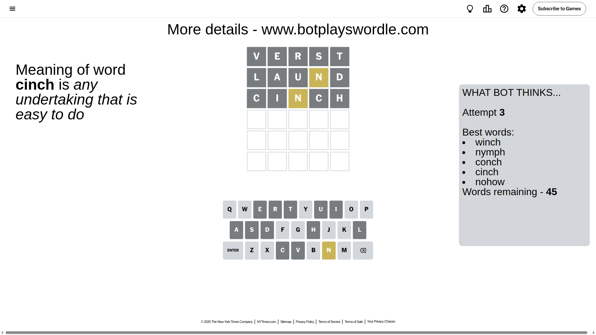
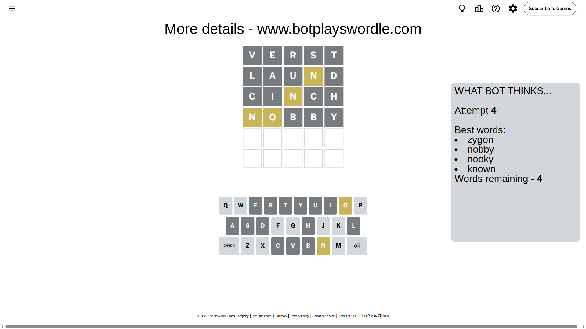
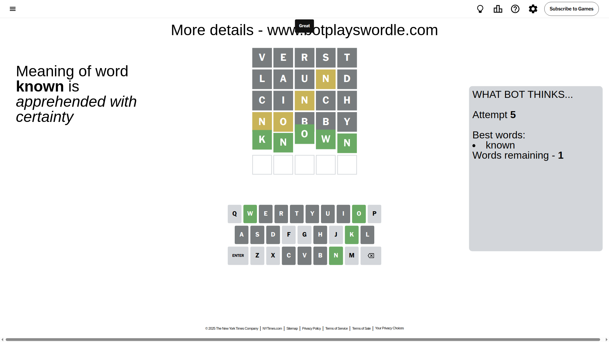

# Wordle for April 25, 2025 - \#1406

## Attempt 1

This is the first attempt and we'll choose a random word to start with.

Let's start with word `verst`

Attempt for `verst` gives us 0 correct letters, 0 present letters and 5 wrong letters.

If we look into details, we can see that:

Letter `v` is not present in the word and we will not use it any more

Letter `e` is not present in the word and we will not use it any more

Letter `r` is not present in the word and we will not use it any more

Letter `s` is not present in the word and we will not use it any more

Letter `t` is not present in the word and we will not use it any more

Some letters are missing (like `v`, `e`, `r`, `s`, `t`) but it's also important piece of information

So far we don't know any of the letters!

Not a bad guess in general

## Attempt 2

Right now we have 1316 words to choose from and best of them seem to be `[nodal nidal laund ulnad bland]`

So far we know that possible letters are:

At position 1: `[a b c d f g h i j k l m n o p q u w x y z]`

At position 2: `[a b c d f g h i j k l m n o p q u w x y z]`

At position 3: `[a b c d f g h i j k l m n o p q u w x y z]`

At position 4: `[a b c d f g h i j k l m n o p q u w x y z]`

At position 5: `[a b c d f g h i j k l m n o p q u w x y z]`

Next guess is `laund`, let's see what it gives us

Attempt for `laund` gives us 0 correct letters, 1 present letters and 4 wrong letters.

If we look into details, we can see that:

Letter `l` is not present in the word and we will not use it any more

Letter `a` is not present in the word and we will not use it any more

Letter `u` is not present in the word and we will not use it any more

Letter `n` is on a different spot - this means that it cannot be at position 4

Letter `d` is not present in the word and we will not use it any more

Some letters are missing (like `l`, `a`, `u`, `d`) but it's also important piece of information

Word should contain letters `[n]`

That was a great guess that limited number of remaining words

## Attempt 3

Right now we have 45 words to choose from and best of them seem to be `[winch nymph conch cinch nohow]`

So far we know that possible letters are:

At position 1: `[b c f g h i j k m n o p q w x y z]`

At position 2: `[b c f g h i j k m n o p q w x y z]`

At position 3: `[b c f g h i j k m n o p q w x y z]`

At position 4: `[b c f g h i j k m o p q w x y z]`

At position 5: `[b c f g h i j k m n o p q w x y z]`

Next guess is `cinch`, let's see what it gives us

Attempt for `cinch` gives us 0 correct letters, 1 present letters and 4 wrong letters.

If we look into details, we can see that:

Letter `c` is not present in the word and we will not use it any more

Letter `i` is not present in the word and we will not use it any more

Letter `n` is on a different spot - this means that it cannot be at position 3

Letter `c` is not present in the word and we will not use it any more

Letter `h` is not present in the word and we will not use it any more

Some letters are missing (like `c`, `i`, `h`) but it's also important piece of information

Word should contain letters `[n]`

That was a great guess that limited number of remaining words

## Attempt 4

Right now we have 4 words to choose from and best of them seem to be `[zygon nobby nooky known]`

So far we know that possible letters are:

At position 1: `[b f g j k m n o p q w x y z]`

At position 2: `[b f g j k m n o p q w x y z]`

At position 3: `[b f g j k m o p q w x y z]`

At position 4: `[b f g j k m o p q w x y z]`

At position 5: `[b f g j k m n o p q w x y z]`

Next guess is `nobby`, let's see what it gives us

Attempt for `nobby` gives us 0 correct letters, 2 present letters and 3 wrong letters.

If we look into details, we can see that:

Letter `n` is on a different spot - this means that it cannot be at position 1

Letter `o` is on a different spot - this means that it cannot be at position 2

Letter `b` is not present in the word and we will not use it any more

Letter `b` is not present in the word and we will not use it any more

Letter `y` is not present in the word and we will not use it any more

Some letters are missing (like `b`, `y`) but it's also important piece of information

Word should contain letters `[n o]`

Could be a better guess

## Attempt 5

Right now we have 1 words to choose from and best of them seem to be `[known]`

So far we know that possible letters are:

At position 1: `[f g j k m o p q w x z]`

At position 2: `[f g j k m n p q w x z]`

At position 3: `[f g j k m o p q w x z]`

At position 4: `[f g j k m o p q w x z]`

At position 5: `[f g j k m n o p q w x z]`

It must be `known`

That's the correct answer! The word is `known`!

## Conclusion

Today's word is `known` and it took 5 attempts to guess it

