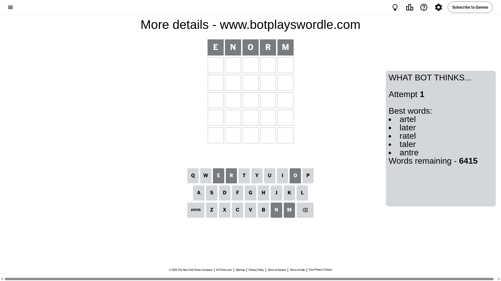
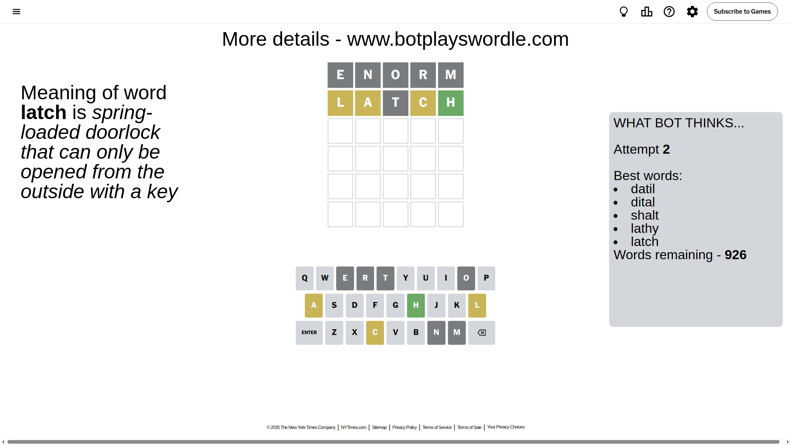
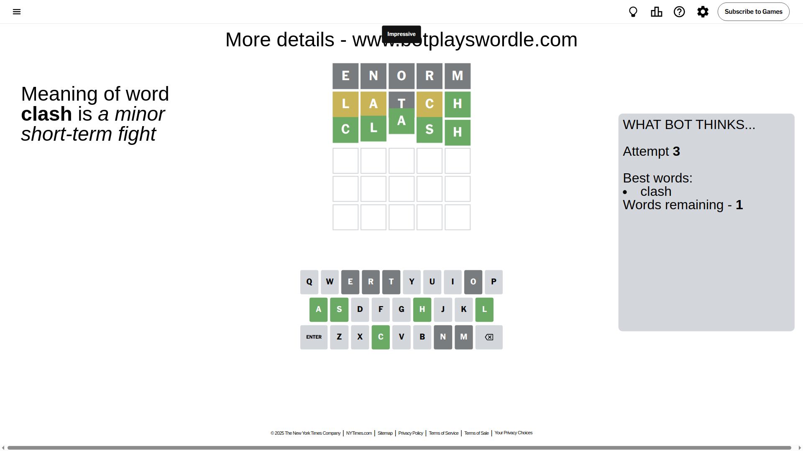

# Wordle for April 26, 2025 - \#1407

## Attempt 1

This is the first attempt and we'll choose a random word to start with.

Let's start with word `enorm`

Attempt for `enorm` gives us 0 correct letters, 0 present letters and 5 wrong letters.

If we look into details, we can see that:

Letter `e` is not present in the word and we will not use it any more

Letter `n` is not present in the word and we will not use it any more

Letter `o` is not present in the word and we will not use it any more

Letter `r` is not present in the word and we will not use it any more

Letter `m` is not present in the word and we will not use it any more

Some letters are missing (like `e`, `n`, `o`, `r`, `m`) but it's also important piece of information

So far we don't know any of the letters!

Not a bad guess in general

## Attempt 2

Right now we have 926 words to choose from and best of them seem to be `[datil dital shalt lathy latch]`

So far we know that possible letters are:

At position 1: `[a b c d f g h i j k l p q s t u v w x y z]`

At position 2: `[a b c d f g h i j k l p q s t u v w x y z]`

At position 3: `[a b c d f g h i j k l p q s t u v w x y z]`

At position 4: `[a b c d f g h i j k l p q s t u v w x y z]`

At position 5: `[a b c d f g h i j k l p q s t u v w x y z]`

Next guess is `latch`, let's see what it gives us

Attempt for `latch` gives us 1 correct letters, 3 present letters and 1 wrong letters.

If we look into details, we can see that:

Letter `l` is on a different spot - this means that it cannot be at position 1

Letter `a` is on a different spot - this means that it cannot be at position 2

Letter `t` is not present in the word and we will not use it any more

Letter `c` is on a different spot - this means that it cannot be at position 4

Letter `h` should be at position 5

We got information about the correct letters and it should make next attempt easier

Some letters are missing (like `t`) but it's also important piece of information

Word should contain letters `[l a c h]`

That was a great guess that limited number of remaining words

## Attempt 3

Right now we have 1 words to choose from and best of them seem to be `[clash]`

So far we know that possible letters are:

At position 1: `[a b c d f g h i j k p q s u v w x y z]`

At position 2: `[b c d f g h i j k l p q s u v w x y z]`

At position 3: `[a b c d f g h i j k l p q s u v w x y z]`

At position 4: `[a b d f g h i j k l p q s u v w x y z]`

At position 5: `[h]`

It must be `clash`

That's the correct answer! The word is `clash`!

## Conclusion

Today's word is `clash` and it took 3 attempts to guess it

