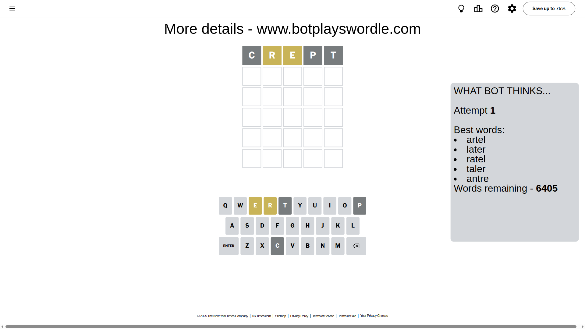
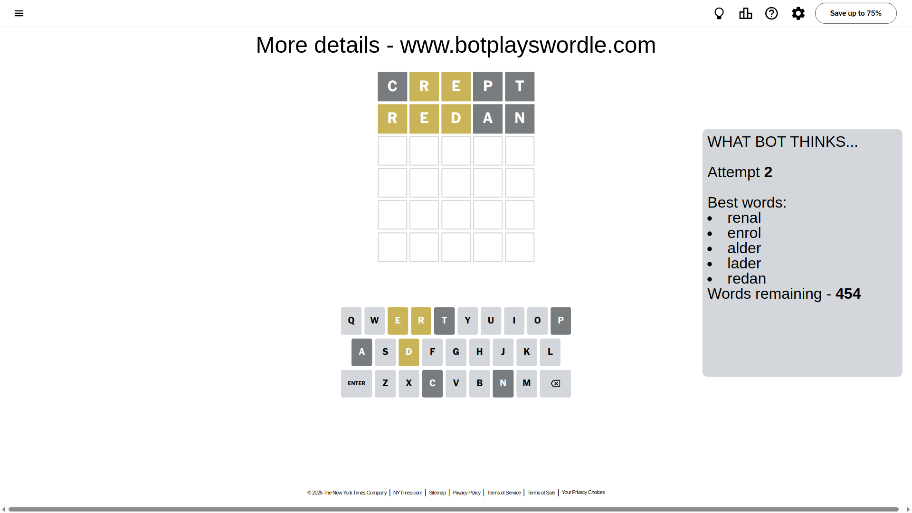
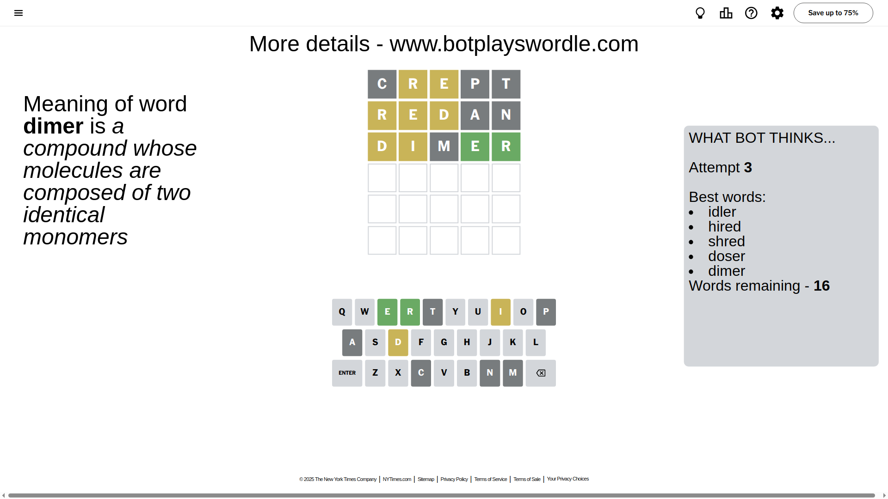
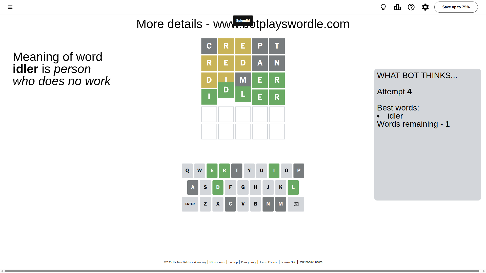

# Wordle for April 30, 2025 - \#1411

## Attempt 1

This is the first attempt and we'll choose a random word to start with.

Let's start with word `crept`

Attempt for `crept` gives us 0 correct letters, 2 present letters and 3 wrong letters.

If we look into details, we can see that:

Letter `c` is not present in the word and we will not use it any more

Letter `r` is on a different spot - this means that it cannot be at position 2

Letter `e` is on a different spot - this means that it cannot be at position 3

Letter `p` is not present in the word and we will not use it any more

Letter `t` is not present in the word and we will not use it any more

Some letters are missing (like `c`, `p`, `t`) but it's also important piece of information

Word should contain letters `[r e]`

That was a great guess that limited number of remaining words

## Attempt 2

Right now we have 454 words to choose from and best of them seem to be `[renal enrol alder lader redan]`

So far we know that possible letters are:

At position 1: `[a b d e f g h i j k l m n o q r s u v w x y z]`

At position 2: `[a b d e f g h i j k l m n o q s u v w x y z]`

At position 3: `[a b d f g h i j k l m n o q r s u v w x y z]`

At position 4: `[a b d e f g h i j k l m n o q r s u v w x y z]`

At position 5: `[a b d e f g h i j k l m n o q r s u v w x y z]`

Next guess is `redan`, let's see what it gives us

Attempt for `redan` gives us 0 correct letters, 3 present letters and 2 wrong letters.

If we look into details, we can see that:

Letter `r` is on a different spot - this means that it cannot be at position 1

Letter `e` is on a different spot - this means that it cannot be at position 2

Letter `d` is on a different spot - this means that it cannot be at position 3

Letter `a` is not present in the word and we will not use it any more

Letter `n` is not present in the word and we will not use it any more

Some letters are missing (like `a`, `n`) but it's also important piece of information

Word should contain letters `[r e d]`

That was a great guess that limited number of remaining words

## Attempt 3

Right now we have 16 words to choose from and best of them seem to be `[idler hired shred doser dimer]`

So far we know that possible letters are:

At position 1: `[b d e f g h i j k l m o q s u v w x y z]`

At position 2: `[b d f g h i j k l m o q s u v w x y z]`

At position 3: `[b f g h i j k l m o q r s u v w x y z]`

At position 4: `[b d e f g h i j k l m o q r s u v w x y z]`

At position 5: `[b d e f g h i j k l m o q r s u v w x y z]`

Next guess is `dimer`, let's see what it gives us

Attempt for `dimer` gives us 2 correct letters, 2 present letters and 1 wrong letters.

If we look into details, we can see that:

Letter `d` is on a different spot - this means that it cannot be at position 1

Letter `i` is on a different spot - this means that it cannot be at position 2

Letter `m` is not present in the word and we will not use it any more

Letter `e` should be at position 4

Letter `r` should be at position 5

We got information about the correct letters and it should make next attempt easier

Some letters are missing (like `m`) but it's also important piece of information

Word should contain letters `[r e d i]`

That was a great guess that limited number of remaining words

## Attempt 4

Right now we have 1 words to choose from and best of them seem to be `[idler]`

So far we know that possible letters are:

At position 1: `[b e f g h i j k l o q s u v w x y z]`

At position 2: `[b d f g h j k l o q s u v w x y z]`

At position 3: `[b f g h i j k l o q r s u v w x y z]`

At position 4: `[e]`

At position 5: `[r]`

It must be `idler`

That's the correct answer! The word is `idler`!

## Conclusion

Today's word is `idler` and it took 4 attempts to guess it

