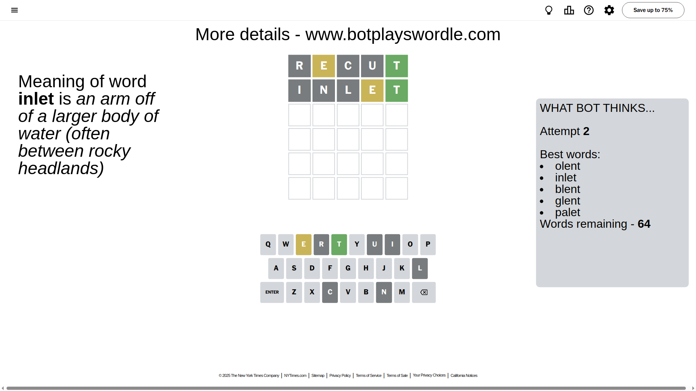

# Wordle for May 1, 2025 - \#1412

## Attempt 1

This is the first attempt and we'll choose a random word to start with.

Let's start with word `recut`

Attempt for `recut` gives us 1 correct letters, 1 present letters and 3 wrong letters.

If we look into details, we can see that:

Letter `r` is not present in the word and we will not use it any more

Letter `e` is on a different spot - this means that it cannot be at position 2

Letter `c` is not present in the word and we will not use it any more

Letter `u` is not present in the word and we will not use it any more

Letter `t` should be at position 5

We got information about the correct letters and it should make next attempt easier

Some letters are missing (like `r`, `c`, `u`) but it's also important piece of information

Word should contain letters `[e t]`

That was a great guess that limited number of remaining words

## Attempt 2

Right now we have 64 words to choose from and best of them seem to be `[olent inlet blent glent palet]`

So far we know that possible letters are:

At position 1: `[a b d e f g h i j k l m n o p q s t v w x y z]`

At position 2: `[a b d f g h i j k l m n o p q s t v w x y z]`

At position 3: `[a b d e f g h i j k l m n o p q s t v w x y z]`

At position 4: `[a b d e f g h i j k l m n o p q s t v w x y z]`

At position 5: `[t]`

Next guess is `inlet`, let's see what it gives us

Attempt for `inlet` gives us 1 correct letters, 1 present letters and 3 wrong letters.

If we look into details, we can see that:

Letter `i` is not present in the word and we will not use it any more

Letter `n` is not present in the word and we will not use it any more

Letter `l` is not present in the word and we will not use it any more

Letter `e` is on a different spot - this means that it cannot be at position 4

Some letters are missing (like `i`, `n`, `l`) but it's also important piece of information

Word should contain letters `[e t]`

Not a bad guess in general

## Attempt 3

Right now we have 12 words to choose from and best of them seem to be `[adept doest wheft whewt awest]`

So far we know that possible letters are:

At position 1: `[a b d e f g h j k m o p q s t v w x y z]`

At position 2: `[a b d f g h j k m o p q s t v w x y z]`

At position 3: `[a b d e f g h j k m o p q s t v w x y z]`

At position 4: `[a b d f g h j k m o p q s t v w x y z]`

At position 5: `[t]`

Next guess is `adept`, let's see what it gives us

That's the correct answer! The word is `adept`!

To be honest that was a pretty lucky guess, but it worked out well.

## Conclusion

Today's word is `adept` and it took 3 attempts to guess it

