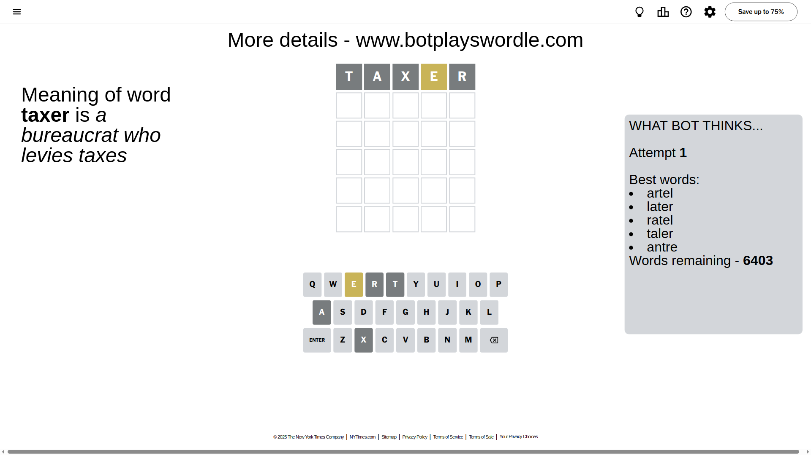
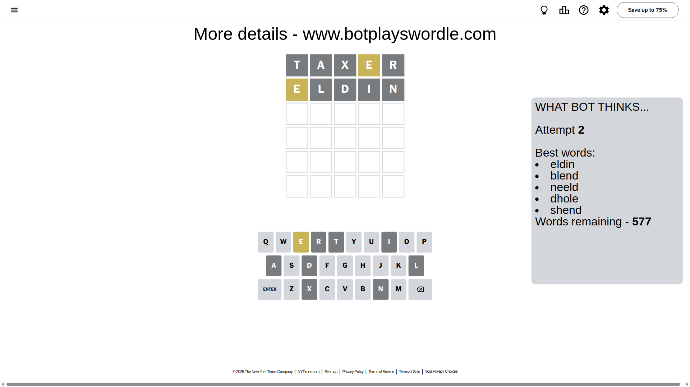
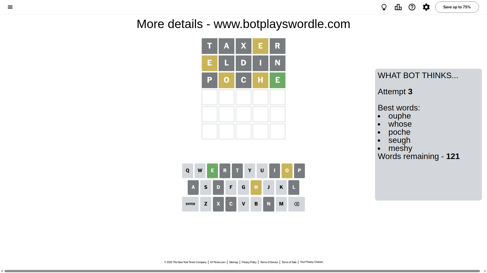
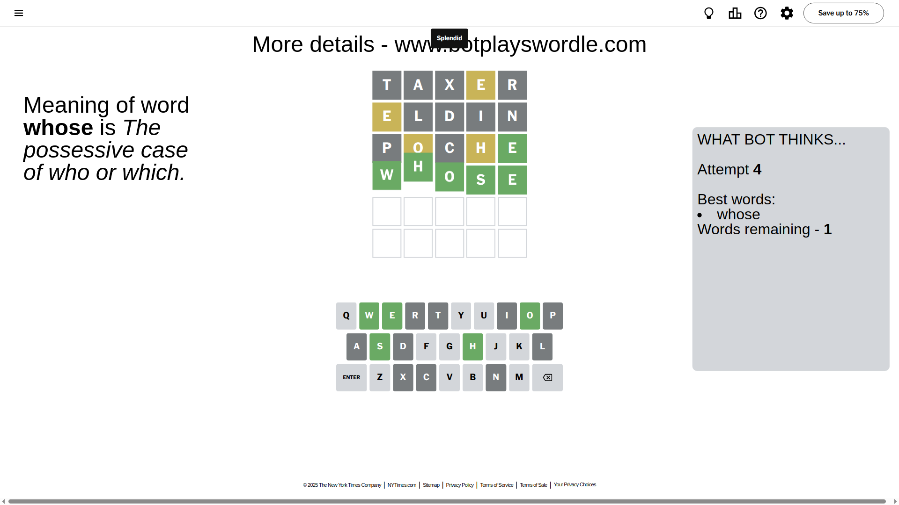

# Wordle for May 2, 2025 - \#1413

## Attempt 1

This is the first attempt and we'll choose a random word to start with.

Let's start with word `taxer`

Attempt for `taxer` gives us 0 correct letters, 1 present letters and 4 wrong letters.

If we look into details, we can see that:

Letter `t` is not present in the word and we will not use it any more

Letter `a` is not present in the word and we will not use it any more

Letter `x` is not present in the word and we will not use it any more

Letter `e` is on a different spot - this means that it cannot be at position 4

Letter `r` is not present in the word and we will not use it any more

Some letters are missing (like `t`, `a`, `x`, `r`) but it's also important piece of information

Word should contain letters `[e]`

That was a great guess that limited number of remaining words

## Attempt 2

Right now we have 577 words to choose from and best of them seem to be `[eldin blend neeld dhole shend]`

So far we know that possible letters are:

At position 1: `[b c d e f g h i j k l m n o p q s u v w y z]`

At position 2: `[b c d e f g h i j k l m n o p q s u v w y z]`

At position 3: `[b c d e f g h i j k l m n o p q s u v w y z]`

At position 4: `[b c d f g h i j k l m n o p q s u v w y z]`

At position 5: `[b c d e f g h i j k l m n o p q s u v w y z]`

Next guess is `eldin`, let's see what it gives us

Attempt for `eldin` gives us 0 correct letters, 1 present letters and 4 wrong letters.

If we look into details, we can see that:

Letter `e` is on a different spot - this means that it cannot be at position 1

Letter `l` is not present in the word and we will not use it any more

Letter `d` is not present in the word and we will not use it any more

Letter `i` is not present in the word and we will not use it any more

Letter `n` is not present in the word and we will not use it any more

Some letters are missing (like `l`, `d`, `i`, `n`) but it's also important piece of information

Word should contain letters `[e]`

Not a bad guess in general

## Attempt 3

Right now we have 121 words to choose from and best of them seem to be `[ouphe whose poche seugh meshy]`

So far we know that possible letters are:

At position 1: `[b c f g h j k m o p q s u v w y z]`

At position 2: `[b c e f g h j k m o p q s u v w y z]`

At position 3: `[b c e f g h j k m o p q s u v w y z]`

At position 4: `[b c f g h j k m o p q s u v w y z]`

At position 5: `[b c e f g h j k m o p q s u v w y z]`

Next guess is `poche`, let's see what it gives us

Attempt for `poche` gives us 1 correct letters, 2 present letters and 2 wrong letters.

If we look into details, we can see that:

Letter `p` is not present in the word and we will not use it any more

Letter `o` is on a different spot - this means that it cannot be at position 2

Letter `c` is not present in the word and we will not use it any more

Letter `h` is on a different spot - this means that it cannot be at position 4

Letter `e` should be at position 5

We got information about the correct letters and it should make next attempt easier

Some letters are missing (like `p`, `c`) but it's also important piece of information

Word should contain letters `[e o h]`

That was a great guess that limited number of remaining words

## Attempt 4

Right now we have 1 words to choose from and best of them seem to be `[whose]`

So far we know that possible letters are:

At position 1: `[b f g h j k m o q s u v w y z]`

At position 2: `[b e f g h j k m q s u v w y z]`

At position 3: `[b e f g h j k m o q s u v w y z]`

At position 4: `[b f g j k m o q s u v w y z]`

At position 5: `[e]`

It must be `whose`

That's the correct answer! The word is `whose`!

## Conclusion

Today's word is `whose` and it took 4 attempts to guess it

