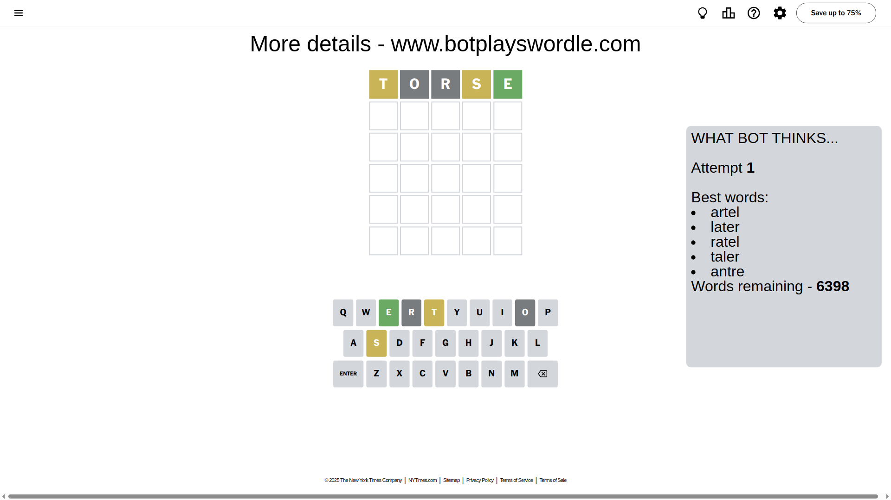
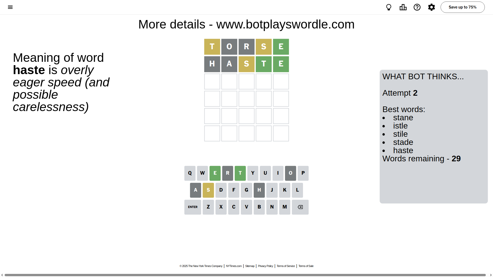
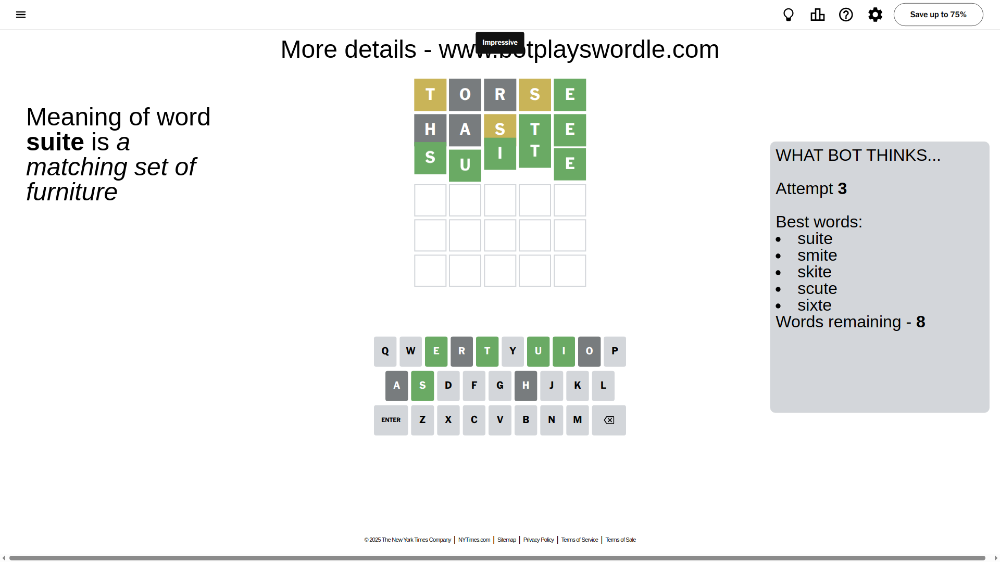

# Wordle for May 6, 2025 - \#1417

## Attempt 1

This is the first attempt and we'll choose a random word to start with.

Let's start with word `torse`

Attempt for `torse` gives us 1 correct letters, 2 present letters and 2 wrong letters.

If we look into details, we can see that:

Letter `t` is on a different spot - this means that it cannot be at position 1

Letter `o` is not present in the word and we will not use it any more

Letter `r` is not present in the word and we will not use it any more

Letter `s` is on a different spot - this means that it cannot be at position 4

Letter `e` should be at position 5

We got information about the correct letters and it should make next attempt easier

Some letters are missing (like `o`, `r`) but it's also important piece of information

Word should contain letters `[t s e]`

That was a great guess that limited number of remaining words

## Attempt 2

Right now we have 29 words to choose from and best of them seem to be `[stane istle stile stade haste]`

So far we know that possible letters are:

At position 1: `[a b c d e f g h i j k l m n p q s u v w x y z]`

At position 2: `[a b c d e f g h i j k l m n p q s t u v w x y z]`

At position 3: `[a b c d e f g h i j k l m n p q s t u v w x y z]`

At position 4: `[a b c d e f g h i j k l m n p q t u v w x y z]`

At position 5: `[e]`

Next guess is `haste`, let's see what it gives us

Attempt for `haste` gives us 2 correct letters, 1 present letters and 2 wrong letters.

If we look into details, we can see that:

Letter `h` is not present in the word and we will not use it any more

Letter `a` is not present in the word and we will not use it any more

Letter `s` is on a different spot - this means that it cannot be at position 3

Letter `t` should be at position 4

We got information about the correct letters and it should make next attempt easier

Some letters are missing (like `h`, `a`) but it's also important piece of information

Word should contain letters `[t s e]`

Could be a better guess

## Attempt 3

Right now we have 8 words to choose from and best of them seem to be `[suite smite skite scute sixte]`

So far we know that possible letters are:

At position 1: `[b c d e f g i j k l m n p q s u v w x y z]`

At position 2: `[b c d e f g i j k l m n p q s t u v w x y z]`

At position 3: `[b c d e f g i j k l m n p q t u v w x y z]`

At position 4: `[t]`

At position 5: `[e]`

Next guess is `suite`, let's see what it gives us

That's the correct answer! The word is `suite`!

## Conclusion

Today's word is `suite` and it took 3 attempts to guess it

