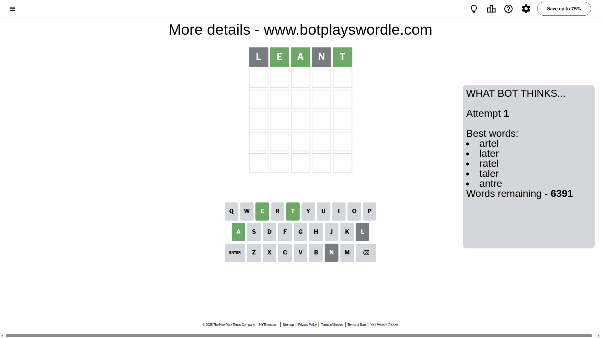
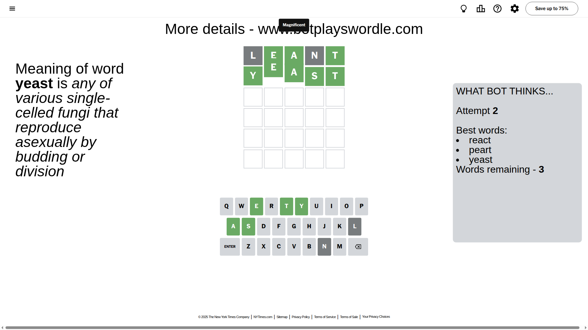

# Wordle for May 10, 2025 - \#1421

## Attempt 1

This is the first attempt and we'll choose a random word to start with.

Let's start with word `leant`

Attempt for `leant` gives us 3 correct letters, 0 present letters and 2 wrong letters.

If we look into details, we can see that:

Letter `l` is not present in the word and we will not use it any more

Letter `e` should be at position 2

Letter `a` should be at position 3

Letter `n` is not present in the word and we will not use it any more

Letter `t` should be at position 5

We got information about the correct letters and it should make next attempt easier

Some letters are missing (like `l`, `n`) but it's also important piece of information

Word should contain letters `[e a t]`

That was a great guess that limited number of remaining words

## Attempt 2

Right now we have 3 words to choose from and best of them seem to be `[react peart yeast]`

So far we know that possible letters are:

At position 1: `[a b c d e f g h i j k m o p q r s t u v w x y z]`

At position 2: `[e]`

At position 3: `[a]`

At position 4: `[a b c d e f g h i j k m o p q r s t u v w x y z]`

At position 5: `[t]`

Next guess is `yeast`, let's see what it gives us

That's the correct answer! The word is `yeast`!

## Conclusion

Today's word is `yeast` and it took 2 attempts to guess it

