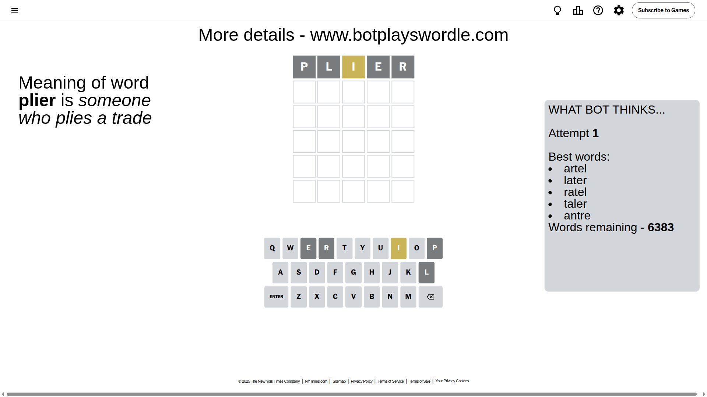
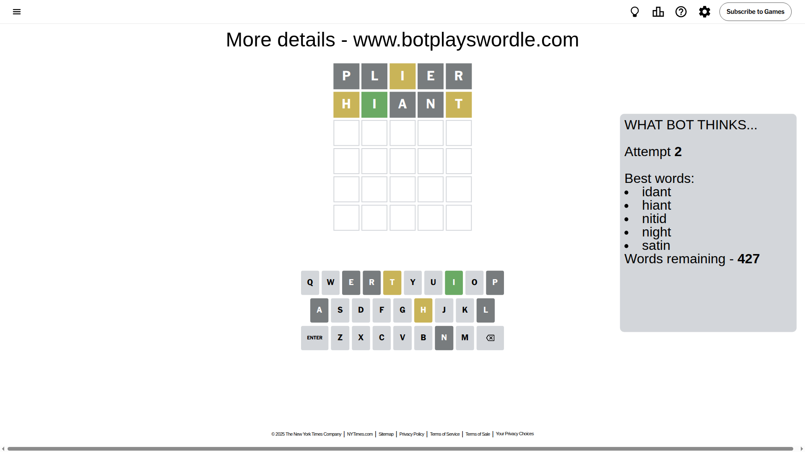
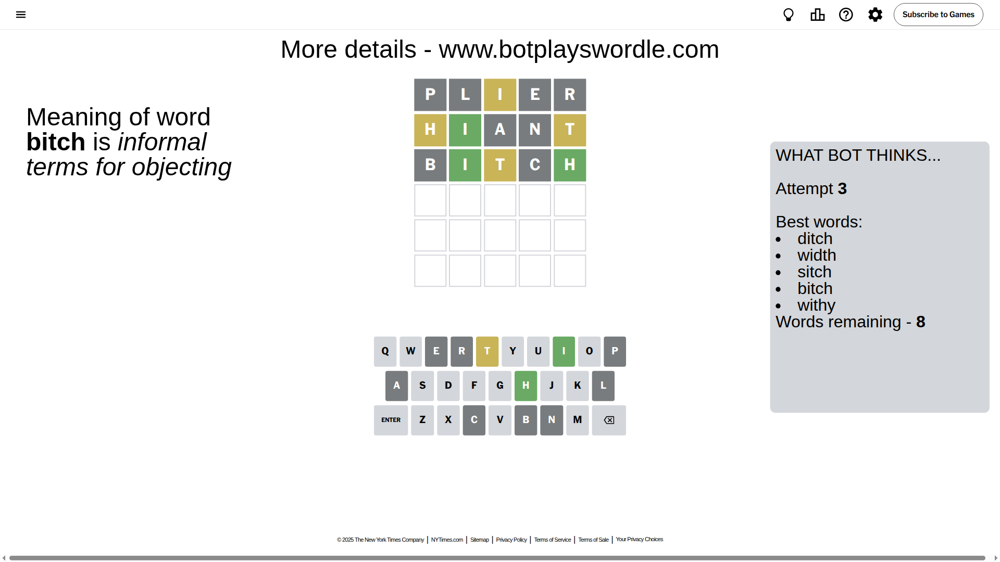
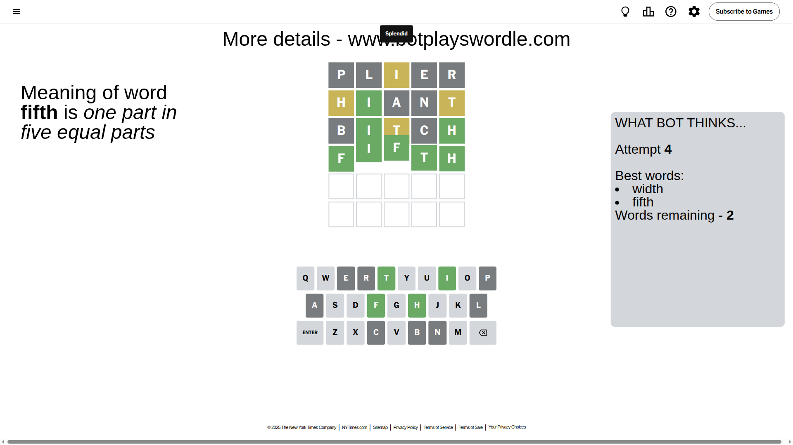

# Wordle for May 16, 2025 - \#1427

## Attempt 1

This is the first attempt and we'll choose a random word to start with.

Let's start with word `plier`

Attempt for `plier` gives us 0 correct letters, 1 present letters and 4 wrong letters.

If we look into details, we can see that:

Letter `p` is not present in the word and we will not use it any more

Letter `l` is not present in the word and we will not use it any more

Letter `i` is on a different spot - this means that it cannot be at position 3

Letter `e` is not present in the word and we will not use it any more

Letter `r` is not present in the word and we will not use it any more

Some letters are missing (like `p`, `l`, `e`, `r`) but it's also important piece of information

Word should contain letters `[i]`

That was a great guess that limited number of remaining words

## Attempt 2

Right now we have 427 words to choose from and best of them seem to be `[idant hiant nitid night satin]`

So far we know that possible letters are:

At position 1: `[a b c d f g h i j k m n o q s t u v w x y z]`

At position 2: `[a b c d f g h i j k m n o q s t u v w x y z]`

At position 3: `[a b c d f g h j k m n o q s t u v w x y z]`

At position 4: `[a b c d f g h i j k m n o q s t u v w x y z]`

At position 5: `[a b c d f g h i j k m n o q s t u v w x y z]`

Next guess is `hiant`, let's see what it gives us

Attempt for `hiant` gives us 1 correct letters, 2 present letters and 2 wrong letters.

If we look into details, we can see that:

Letter `h` is on a different spot - this means that it cannot be at position 1

Letter `i` should be at position 2

Letter `a` is not present in the word and we will not use it any more

Letter `n` is not present in the word and we will not use it any more

Letter `t` is on a different spot - this means that it cannot be at position 5

We got information about the correct letters and it should make next attempt easier

Some letters are missing (like `a`, `n`) but it's also important piece of information

Word should contain letters `[i h t]`

That was a great guess that limited number of remaining words

## Attempt 3

Right now we have 8 words to choose from and best of them seem to be `[ditch width sitch bitch withy]`

So far we know that possible letters are:

At position 1: `[b c d f g i j k m o q s t u v w x y z]`

At position 2: `[i]`

At position 3: `[b c d f g h j k m o q s t u v w x y z]`

At position 4: `[b c d f g h i j k m o q s t u v w x y z]`

At position 5: `[b c d f g h i j k m o q s u v w x y z]`

Next guess is `bitch`, let's see what it gives us

Attempt for `bitch` gives us 2 correct letters, 1 present letters and 2 wrong letters.

If we look into details, we can see that:

Letter `b` is not present in the word and we will not use it any more

Letter `t` is on a different spot - this means that it cannot be at position 3

Letter `c` is not present in the word and we will not use it any more

Letter `h` should be at position 5

We got information about the correct letters and it should make next attempt easier

Some letters are missing (like `b`, `c`) but it's also important piece of information

Word should contain letters `[i h t]`

Could be a better guess

## Attempt 4

Right now we have 2 words to choose from and best of them seem to be `[width fifth]`

So far we know that possible letters are:

At position 1: `[d f g i j k m o q s t u v w x y z]`

At position 2: `[i]`

At position 3: `[d f g h j k m o q s u v w x y z]`

At position 4: `[d f g h i j k m o q s t u v w x y z]`

At position 5: `[h]`

Next guess is `fifth`, let's see what it gives us

That's the correct answer! The word is `fifth`!

## Conclusion

Today's word is `fifth` and it took 4 attempts to guess it

