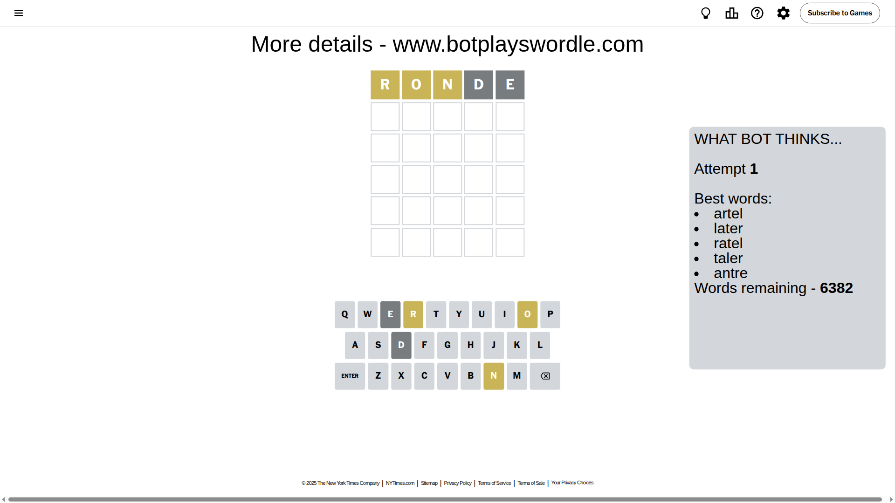
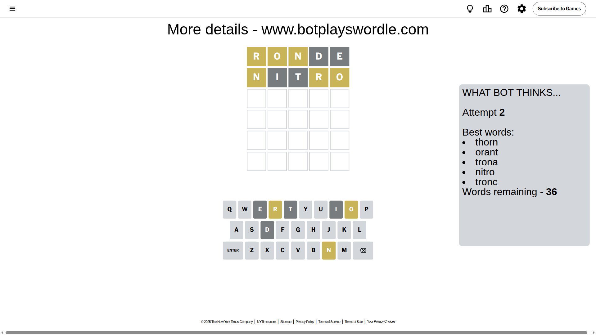
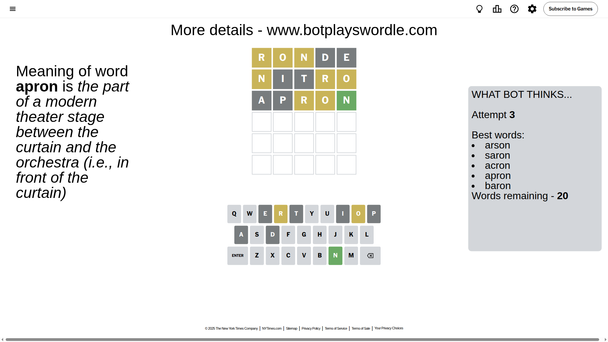
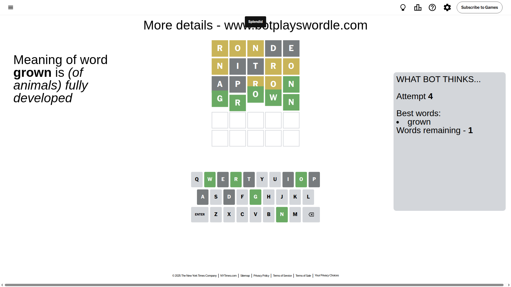

# Wordle for May 17, 2025 - \#1428

## Attempt 1

This is the first attempt and we'll choose a random word to start with.

Let's start with word `ronde`

Attempt for `ronde` gives us 0 correct letters, 3 present letters and 2 wrong letters.

If we look into details, we can see that:

Letter `r` is on a different spot - this means that it cannot be at position 1

Letter `o` is on a different spot - this means that it cannot be at position 2

Letter `n` is on a different spot - this means that it cannot be at position 3

Letter `d` is not present in the word and we will not use it any more

Letter `e` is not present in the word and we will not use it any more

Some letters are missing (like `d`, `e`) but it's also important piece of information

Word should contain letters `[r o n]`

That was a great guess that limited number of remaining words

## Attempt 2

Right now we have 36 words to choose from and best of them seem to be `[thorn orant trona nitro tronc]`

So far we know that possible letters are:

At position 1: `[a b c f g h i j k l m n o p q s t u v w x y z]`

At position 2: `[a b c f g h i j k l m n p q r s t u v w x y z]`

At position 3: `[a b c f g h i j k l m o p q r s t u v w x y z]`

At position 4: `[a b c f g h i j k l m n o p q r s t u v w x y z]`

At position 5: `[a b c f g h i j k l m n o p q r s t u v w x y z]`

Next guess is `nitro`, let's see what it gives us

Attempt for `nitro` gives us 0 correct letters, 3 present letters and 2 wrong letters.

If we look into details, we can see that:

Letter `n` is on a different spot - this means that it cannot be at position 1

Letter `i` is not present in the word and we will not use it any more

Letter `t` is not present in the word and we will not use it any more

Letter `r` is on a different spot - this means that it cannot be at position 4

Letter `o` is on a different spot - this means that it cannot be at position 5

Some letters are missing (like `i`, `t`) but it's also important piece of information

Word should contain letters `[r o n]`

This was a waste, almost no valuable information...

## Attempt 3

Right now we have 20 words to choose from and best of them seem to be `[arson saron acron apron baron]`

So far we know that possible letters are:

At position 1: `[a b c f g h j k l m o p q s u v w x y z]`

At position 2: `[a b c f g h j k l m n p q r s u v w x y z]`

At position 3: `[a b c f g h j k l m o p q r s u v w x y z]`

At position 4: `[a b c f g h j k l m n o p q s u v w x y z]`

At position 5: `[a b c f g h j k l m n p q r s u v w x y z]`

Next guess is `apron`, let's see what it gives us

Attempt for `apron` gives us 1 correct letters, 2 present letters and 2 wrong letters.

If we look into details, we can see that:

Letter `a` is not present in the word and we will not use it any more

Letter `p` is not present in the word and we will not use it any more

Letter `r` is on a different spot - this means that it cannot be at position 3

Letter `o` is on a different spot - this means that it cannot be at position 4

Letter `n` should be at position 5

We got information about the correct letters and it should make next attempt easier

Some letters are missing (like `a`, `p`) but it's also important piece of information

Word should contain letters `[r o n]`

That was a great guess that limited number of remaining words

## Attempt 4

Right now we have 1 words to choose from and best of them seem to be `[grown]`

So far we know that possible letters are:

At position 1: `[b c f g h j k l m o q s u v w x y z]`

At position 2: `[b c f g h j k l m n q r s u v w x y z]`

At position 3: `[b c f g h j k l m o q s u v w x y z]`

At position 4: `[b c f g h j k l m n q s u v w x y z]`

At position 5: `[n]`

It must be `grown`

That's the correct answer! The word is `grown`!

## Conclusion

Today's word is `grown` and it took 4 attempts to guess it

