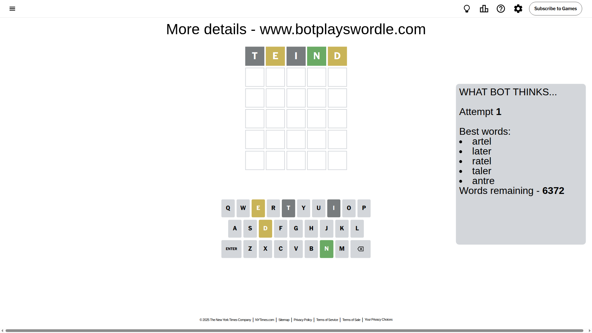
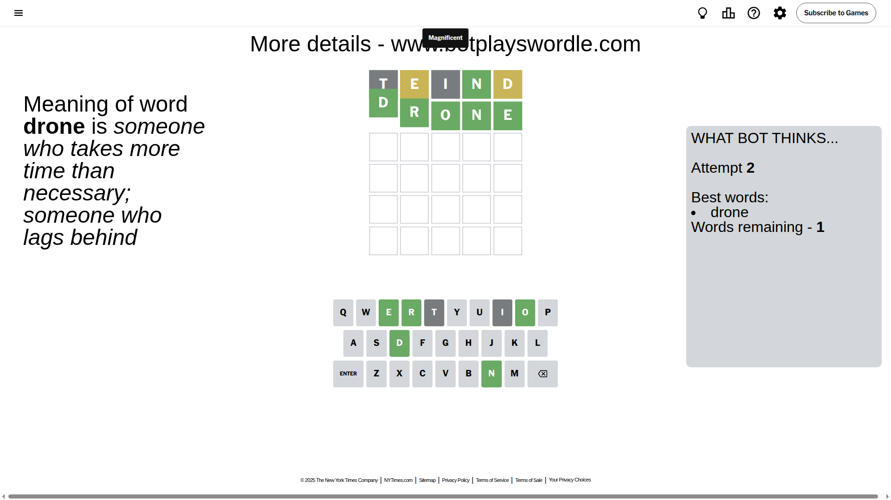

# Wordle for May 26, 2025 - \#1437

## Attempt 1

This is the first attempt and we'll choose a random word to start with.

Let's start with word `teind`

Attempt for `teind` gives us 1 correct letters, 2 present letters and 2 wrong letters.

If we look into details, we can see that:

Letter `t` is not present in the word and we will not use it any more

Letter `e` is on a different spot - this means that it cannot be at position 2

Letter `i` is not present in the word and we will not use it any more

Letter `n` should be at position 4

Letter `d` is on a different spot - this means that it cannot be at position 5

We got information about the correct letters and it should make next attempt easier

Some letters are missing (like `t`, `i`) but it's also important piece of information

Word should contain letters `[e n d]`

That was a great guess that limited number of remaining words

## Attempt 2

Right now we have 1 words to choose from and best of them seem to be `[drone]`

So far we know that possible letters are:

At position 1: `[a b c d e f g h j k l m n o p q r s u v w x y z]`

At position 2: `[a b c d f g h j k l m n o p q r s u v w x y z]`

At position 3: `[a b c d e f g h j k l m n o p q r s u v w x y z]`

At position 4: `[n]`

At position 5: `[a b c e f g h j k l m n o p q r s u v w x y z]`

It must be `drone`

That's the correct answer! The word is `drone`!

## Conclusion

Today's word is `drone` and it took 2 attempts to guess it

