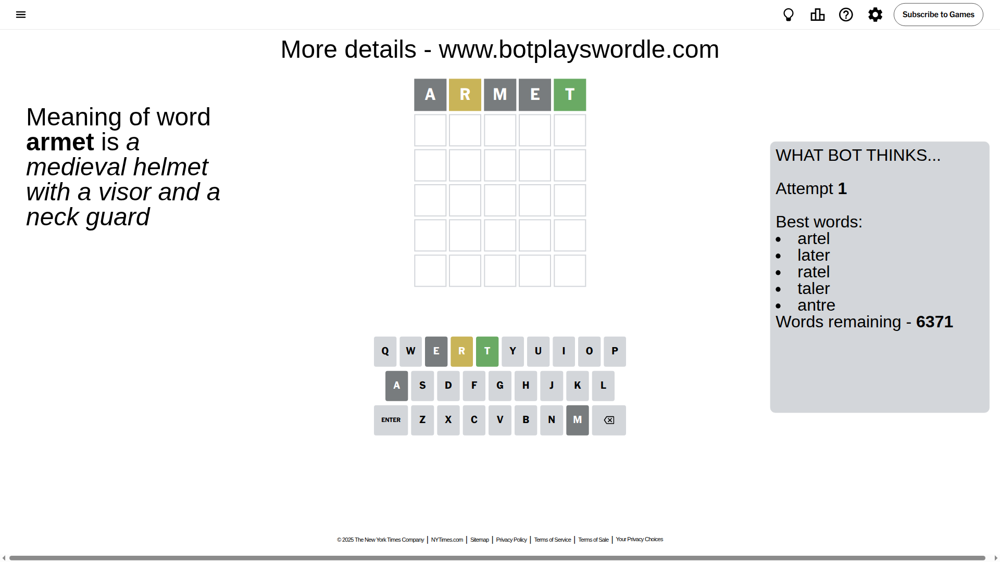
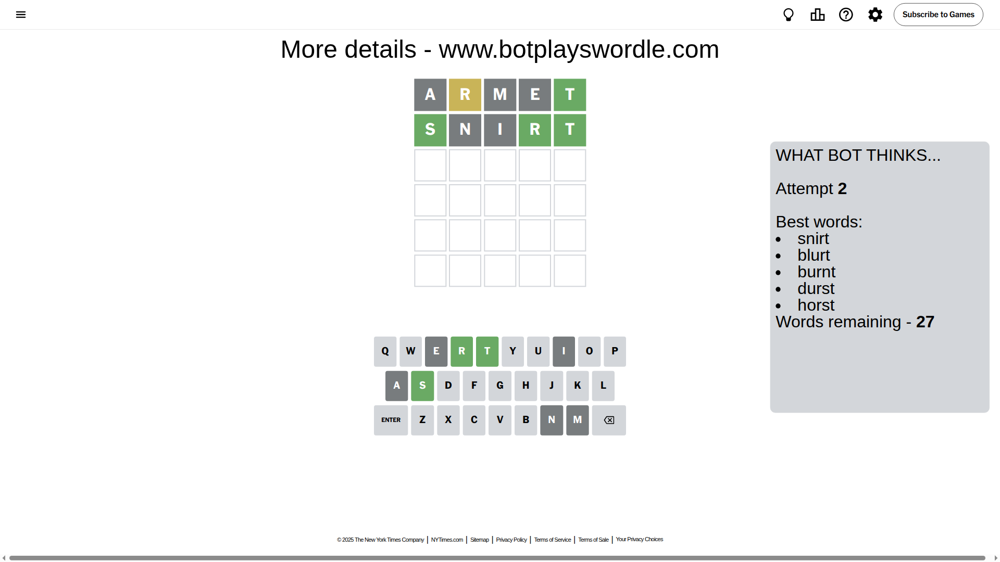
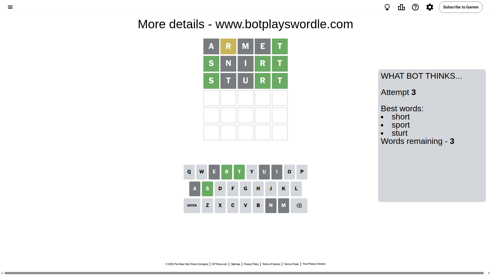
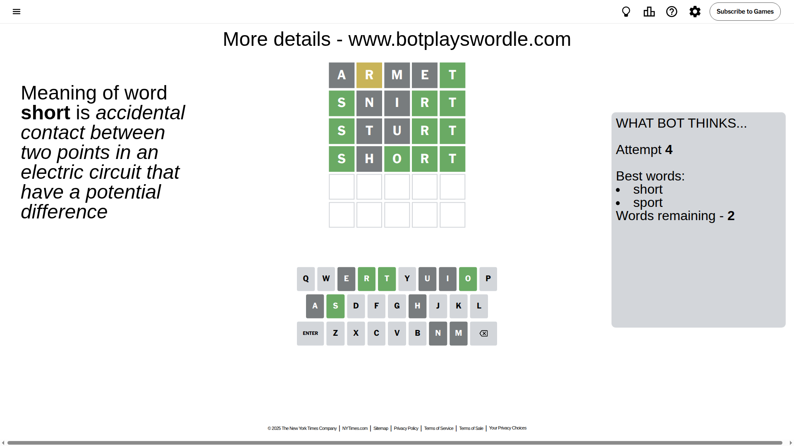
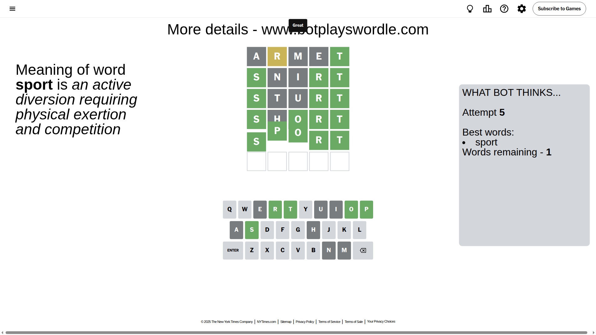

# Wordle for May 27, 2025 - \#1438

## Attempt 1

This is the first attempt and we'll choose a random word to start with.

Let's start with word `armet`

Attempt for `armet` gives us 1 correct letters, 1 present letters and 3 wrong letters.

If we look into details, we can see that:

Letter `a` is not present in the word and we will not use it any more

Letter `r` is on a different spot - this means that it cannot be at position 2

Letter `m` is not present in the word and we will not use it any more

Letter `e` is not present in the word and we will not use it any more

Letter `t` should be at position 5

We got information about the correct letters and it should make next attempt easier

Some letters are missing (like `a`, `m`, `e`) but it's also important piece of information

Word should contain letters `[r t]`

That was a great guess that limited number of remaining words

## Attempt 2

Right now we have 27 words to choose from and best of them seem to be `[snirt blurt burnt durst horst]`

So far we know that possible letters are:

At position 1: `[b c d f g h i j k l n o p q r s t u v w x y z]`

At position 2: `[b c d f g h i j k l n o p q s t u v w x y z]`

At position 3: `[b c d f g h i j k l n o p q r s t u v w x y z]`

At position 4: `[b c d f g h i j k l n o p q r s t u v w x y z]`

At position 5: `[t]`

Next guess is `snirt`, let's see what it gives us

Attempt for `snirt` gives us 3 correct letters, 0 present letters and 2 wrong letters.

If we look into details, we can see that:

Letter `s` should be at position 1

Letter `n` is not present in the word and we will not use it any more

Letter `i` is not present in the word and we will not use it any more

Letter `r` should be at position 4

We got information about the correct letters and it should make next attempt easier

Some letters are missing (like `n`, `i`) but it's also important piece of information

Word should contain letters `[r t s]`

That was a great guess that limited number of remaining words

## Attempt 3

Right now we have 3 words to choose from and best of them seem to be `[short sport sturt]`

So far we know that possible letters are:

At position 1: `[s]`

At position 2: `[b c d f g h j k l o p q s t u v w x y z]`

At position 3: `[b c d f g h j k l o p q r s t u v w x y z]`

At position 4: `[r]`

At position 5: `[t]`

Next guess is `sturt`, let's see what it gives us

Attempt for `sturt` gives us 3 correct letters, 0 present letters and 2 wrong letters.

If we look into details, we can see that:

Letter `t` is not present in the word and we will not use it any more

Letter `u` is not present in the word and we will not use it any more

Some letters are missing (like `t`, `u`) but it's also important piece of information

Word should contain letters `[r t s]`

This was a waste, almost no valuable information...

## Attempt 4

Right now we have 2 words to choose from and best of them seem to be `[short sport]`

So far we know that possible letters are:

At position 1: `[s]`

At position 2: `[b c d f g h j k l o p q s v w x y z]`

At position 3: `[b c d f g h j k l o p q r s v w x y z]`

At position 4: `[r]`

At position 5: `[t]`

Next guess is `short`, let's see what it gives us

Attempt for `short` gives us 4 correct letters, 0 present letters and 1 wrong letters.

If we look into details, we can see that:

Letter `h` is not present in the word and we will not use it any more

Letter `o` should be at position 3

We got information about the correct letters and it should make next attempt easier

Some letters are missing (like `h`) but it's also important piece of information

Word should contain letters `[r t s o]`

This was a waste, almost no valuable information...

## Attempt 5

Right now we have 1 words to choose from and best of them seem to be `[sport]`

So far we know that possible letters are:

At position 1: `[s]`

At position 2: `[b c d f g j k l o p q s v w x y z]`

At position 3: `[o]`

At position 4: `[r]`

At position 5: `[t]`

It must be `sport`

That's the correct answer! The word is `sport`!

## Conclusion

Today's word is `sport` and it took 5 attempts to guess it

