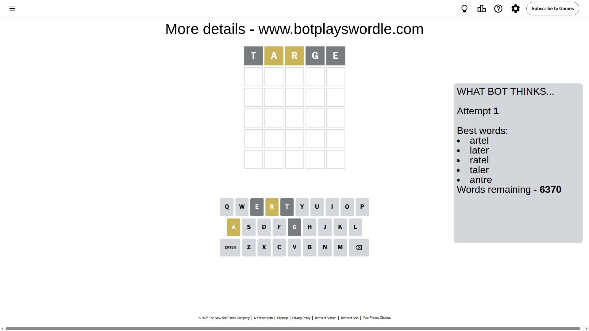

# Wordle for May 28, 2025 - \#1439

## Attempt 1

This is the first attempt and we'll choose a random word to start with.

Let's start with word `targe`

Attempt for `targe` gives us 0 correct letters, 2 present letters and 3 wrong letters.

If we look into details, we can see that:

Letter `t` is not present in the word and we will not use it any more

Letter `a` is on a different spot - this means that it cannot be at position 2

Letter `r` is on a different spot - this means that it cannot be at position 3

Letter `g` is not present in the word and we will not use it any more

Letter `e` is not present in the word and we will not use it any more

Some letters are missing (like `t`, `g`, `e`) but it's also important piece of information

Word should contain letters `[a r]`

That was a great guess that limited number of remaining words

## Attempt 2

Right now we have 204 words to choose from and best of them seem to be `[ulnar urnal drail liard adorn]`

So far we know that possible letters are:

At position 1: `[a b c d f h i j k l m n o p q r s u v w x y z]`

At position 2: `[b c d f h i j k l m n o p q r s u v w x y z]`

At position 3: `[a b c d f h i j k l m n o p q s u v w x y z]`

At position 4: `[a b c d f h i j k l m n o p q r s u v w x y z]`

At position 5: `[a b c d f h i j k l m n o p q r s u v w x y z]`

Next guess is `ulnar`, let's see what it gives us

Attempt for `ulnar` gives us 2 correct letters, 1 present letters and 2 wrong letters.

If we look into details, we can see that:

Letter `u` is not present in the word and we will not use it any more

Letter `l` is on a different spot - this means that it cannot be at position 2

Letter `n` is not present in the word and we will not use it any more

Letter `a` should be at position 4

Letter `r` should be at position 5

We got information about the correct letters and it should make next attempt easier

Some letters are missing (like `u`, `n`) but it's also important piece of information

Word should contain letters `[a r l]`

That was a great guess that limited number of remaining words

## Attempt 3

Right now we have 8 words to choose from and best of them seem to be `[solar polar bolar lobar pilar]`

So far we know that possible letters are:

At position 1: `[a b c d f h i j k l m o p q r s v w x y z]`

At position 2: `[b c d f h i j k m o p q r s v w x y z]`

At position 3: `[a b c d f h i j k l m o p q s v w x y z]`

At position 4: `[a]`

At position 5: `[r]`

Next guess is `solar`, let's see what it gives us

Attempt for `solar` gives us 4 correct letters, 0 present letters and 1 wrong letters.

If we look into details, we can see that:

Letter `s` is not present in the word and we will not use it any more

Letter `o` should be at position 2

Letter `l` should be at position 3

We got information about the correct letters and it should make next attempt easier

Some letters are missing (like `s`) but it's also important piece of information

Word should contain letters `[a r l o]`

Could be a better guess

## Attempt 4

Right now we have 3 words to choose from and best of them seem to be `[polar bolar volar]`

So far we know that possible letters are:

At position 1: `[a b c d f h i j k l m o p q r v w x y z]`

At position 2: `[o]`

At position 3: `[l]`

At position 4: `[a]`

At position 5: `[r]`

Next guess is `bolar`, let's see what it gives us

Attempt for `bolar` gives us 4 correct letters, 0 present letters and 1 wrong letters.

If we look into details, we can see that:

Letter `b` is not present in the word and we will not use it any more

Some letters are missing (like `b`) but it's also important piece of information

Word should contain letters `[a r l o]`

This was a waste, almost no valuable information...

## Attempt 5

Right now we have 2 words to choose from and best of them seem to be `[polar volar]`

So far we know that possible letters are:

At position 1: `[a c d f h i j k l m o p q r v w x y z]`

At position 2: `[o]`

At position 3: `[l]`

At position 4: `[a]`

At position 5: `[r]`

Next guess is `polar`, let's see what it gives us

That's the correct answer! The word is `polar`!

## Conclusion

Today's word is `polar` and it took 5 attempts to guess it

