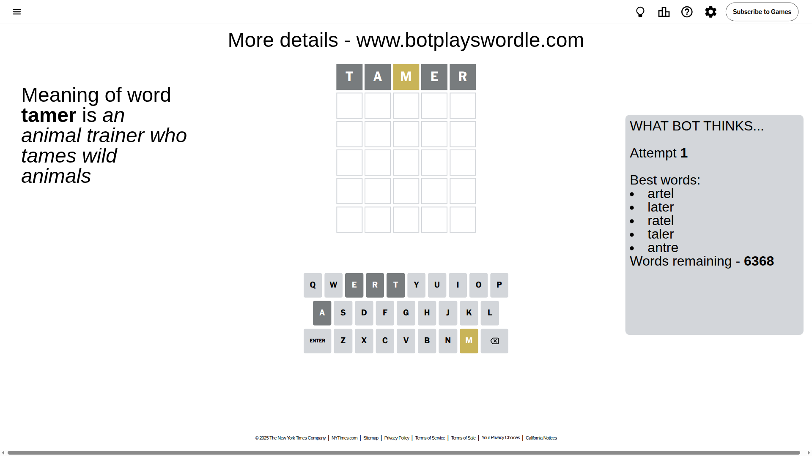
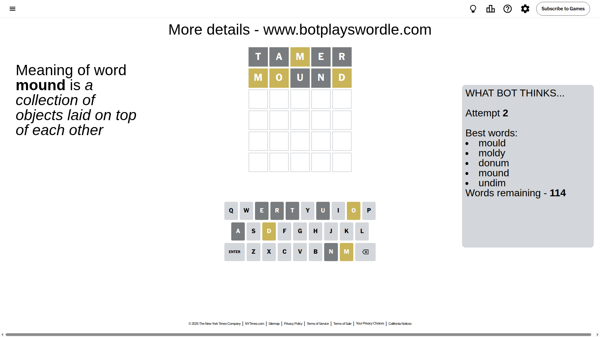
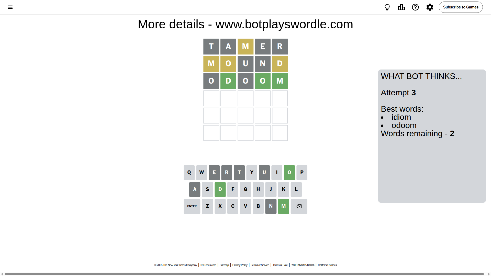
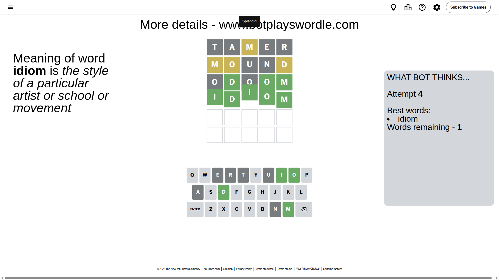

# Wordle for May 30, 2025 - \#1441

## Attempt 1

This is the first attempt and we'll choose a random word to start with.

Let's start with word `tamer`

Attempt for `tamer` gives us 0 correct letters, 1 present letters and 4 wrong letters.

If we look into details, we can see that:

Letter `t` is not present in the word and we will not use it any more

Letter `a` is not present in the word and we will not use it any more

Letter `m` is on a different spot - this means that it cannot be at position 3

Letter `e` is not present in the word and we will not use it any more

Letter `r` is not present in the word and we will not use it any more

Some letters are missing (like `t`, `a`, `e`, `r`) but it's also important piece of information

Word should contain letters `[m]`

That was a great guess that limited number of remaining words

## Attempt 2

Right now we have 114 words to choose from and best of them seem to be `[mould moldy donum mound undim]`

So far we know that possible letters are:

At position 1: `[b c d f g h i j k l m n o p q s u v w x y z]`

At position 2: `[b c d f g h i j k l m n o p q s u v w x y z]`

At position 3: `[b c d f g h i j k l n o p q s u v w x y z]`

At position 4: `[b c d f g h i j k l m n o p q s u v w x y z]`

At position 5: `[b c d f g h i j k l m n o p q s u v w x y z]`

Next guess is `mound`, let's see what it gives us

Attempt for `mound` gives us 0 correct letters, 3 present letters and 2 wrong letters.

If we look into details, we can see that:

Letter `m` is on a different spot - this means that it cannot be at position 1

Letter `o` is on a different spot - this means that it cannot be at position 2

Letter `u` is not present in the word and we will not use it any more

Letter `n` is not present in the word and we will not use it any more

Letter `d` is on a different spot - this means that it cannot be at position 5

Some letters are missing (like `u`, `n`) but it's also important piece of information

Word should contain letters `[m o d]`

That was a great guess that limited number of remaining words

## Attempt 3

Right now we have 2 words to choose from and best of them seem to be `[idiom odoom]`

So far we know that possible letters are:

At position 1: `[b c d f g h i j k l o p q s v w x y z]`

At position 2: `[b c d f g h i j k l m p q s v w x y z]`

At position 3: `[b c d f g h i j k l o p q s v w x y z]`

At position 4: `[b c d f g h i j k l m o p q s v w x y z]`

At position 5: `[b c f g h i j k l m o p q s v w x y z]`

Next guess is `odoom`, let's see what it gives us

Attempt for `odoom` gives us 3 correct letters, 0 present letters and 2 wrong letters.

If we look into details, we can see that:

Letter `o` is not present in the word and we will not use it any more

Letter `d` should be at position 2

Letter `o` is not present in the word and we will not use it any more

Letter `o` should be at position 4

Letter `m` should be at position 5

We got information about the correct letters and it should make next attempt easier

Some letters are missing (like `o`) but it's also important piece of information

Word should contain letters `[m o d]`

This was a waste, almost no valuable information...

## Attempt 4

Right now we have 1 words to choose from and best of them seem to be `[idiom]`

So far we know that possible letters are:

At position 1: `[b c d f g h i j k l p q s v w x y z]`

At position 2: `[d]`

At position 3: `[b c d f g h i j k l p q s v w x y z]`

At position 4: `[o]`

At position 5: `[m]`

It must be `idiom`

That's the correct answer! The word is `idiom`!

## Conclusion

Today's word is `idiom` and it took 4 attempts to guess it

