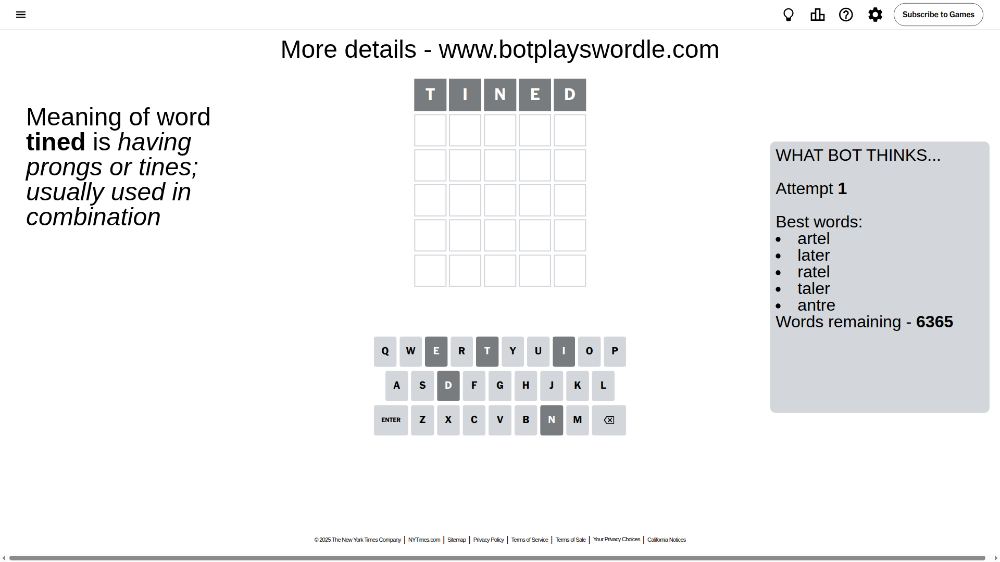
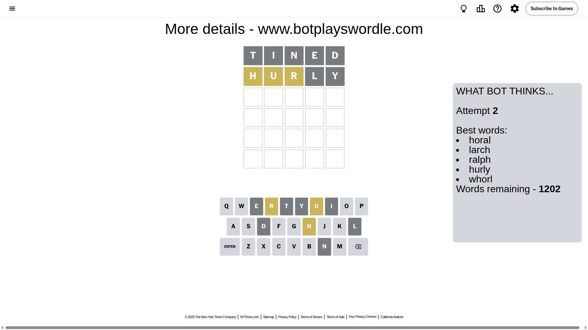
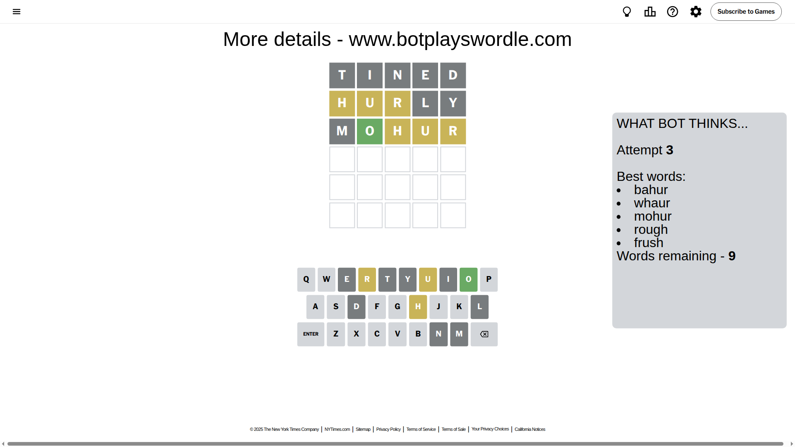
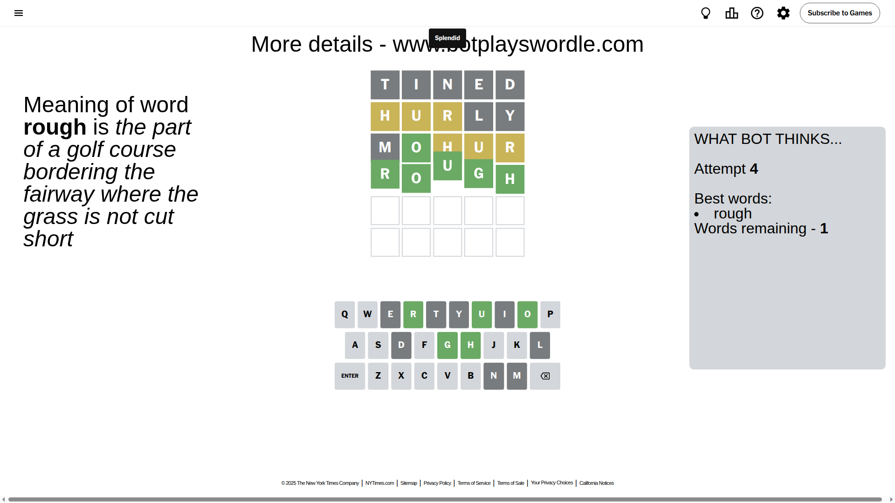

# Wordle for June 1, 2025 - \#1443

## Attempt 1

This is the first attempt and we'll choose a random word to start with.

Let's start with word `tined`

Attempt for `tined` gives us 0 correct letters, 0 present letters and 5 wrong letters.

If we look into details, we can see that:

Letter `t` is not present in the word and we will not use it any more

Letter `i` is not present in the word and we will not use it any more

Letter `n` is not present in the word and we will not use it any more

Letter `e` is not present in the word and we will not use it any more

Letter `d` is not present in the word and we will not use it any more

Some letters are missing (like `t`, `i`, `n`, `e`, `d`) but it's also important piece of information

So far we don't know any of the letters!

Not a bad guess in general

## Attempt 2

Right now we have 1202 words to choose from and best of them seem to be `[horal larch ralph hurly whorl]`

So far we know that possible letters are:

At position 1: `[a b c f g h j k l m o p q r s u v w x y z]`

At position 2: `[a b c f g h j k l m o p q r s u v w x y z]`

At position 3: `[a b c f g h j k l m o p q r s u v w x y z]`

At position 4: `[a b c f g h j k l m o p q r s u v w x y z]`

At position 5: `[a b c f g h j k l m o p q r s u v w x y z]`

Next guess is `hurly`, let's see what it gives us

Attempt for `hurly` gives us 0 correct letters, 3 present letters and 2 wrong letters.

If we look into details, we can see that:

Letter `h` is on a different spot - this means that it cannot be at position 1

Letter `u` is on a different spot - this means that it cannot be at position 2

Letter `r` is on a different spot - this means that it cannot be at position 3

Letter `l` is not present in the word and we will not use it any more

Letter `y` is not present in the word and we will not use it any more

Some letters are missing (like `l`, `y`) but it's also important piece of information

Word should contain letters `[h u r]`

That was a great guess that limited number of remaining words

## Attempt 3

Right now we have 9 words to choose from and best of them seem to be `[bahur whaur mohur rough frush]`

So far we know that possible letters are:

At position 1: `[a b c f g j k m o p q r s u v w x z]`

At position 2: `[a b c f g h j k m o p q r s v w x z]`

At position 3: `[a b c f g h j k m o p q s u v w x z]`

At position 4: `[a b c f g h j k m o p q r s u v w x z]`

At position 5: `[a b c f g h j k m o p q r s u v w x z]`

Next guess is `mohur`, let's see what it gives us

Attempt for `mohur` gives us 1 correct letters, 3 present letters and 1 wrong letters.

If we look into details, we can see that:

Letter `m` is not present in the word and we will not use it any more

Letter `o` should be at position 2

Letter `h` is on a different spot - this means that it cannot be at position 3

Letter `u` is on a different spot - this means that it cannot be at position 4

Letter `r` is on a different spot - this means that it cannot be at position 5

We got information about the correct letters and it should make next attempt easier

Some letters are missing (like `m`) but it's also important piece of information

Word should contain letters `[h u r o]`

That was a great guess that limited number of remaining words

## Attempt 4

Right now we have 1 words to choose from and best of them seem to be `[rough]`

So far we know that possible letters are:

At position 1: `[a b c f g j k o p q r s u v w x z]`

At position 2: `[o]`

At position 3: `[a b c f g j k o p q s u v w x z]`

At position 4: `[a b c f g h j k o p q r s v w x z]`

At position 5: `[a b c f g h j k o p q s u v w x z]`

It must be `rough`

That's the correct answer! The word is `rough`!

## Conclusion

Today's word is `rough` and it took 4 attempts to guess it

